+++
date = '2010-05-16'
title = 'Silicon Valley Judo clinic with Shintaro Nakano'
author = 'David Multer'
authors = ['David Multer']
tags = ['story']

[cover]
image = "01.jpg"
+++

I'm headed over to San Jose today for an awesome Judo clinic at [Silicon Valley
Judo](https://www.svjudo.com). Japanese champion Shintaro Nakano is explaining
his outstanding Seoi Nage technique to a big group of eager Judoka, including
myself. Unfortunately Peel hurt himself and couldn't participate, but my
Sensei from Aptos Judo is my very capable partner.

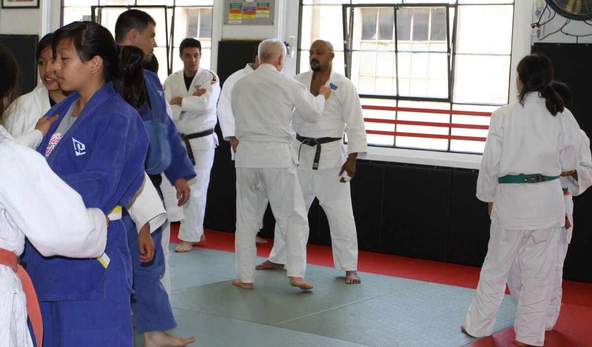
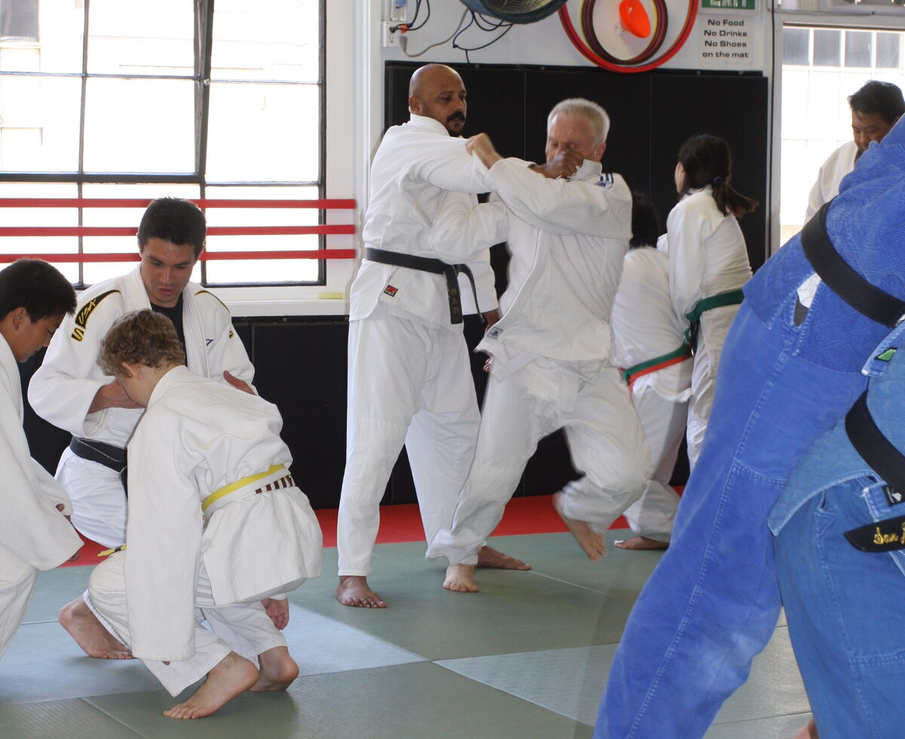
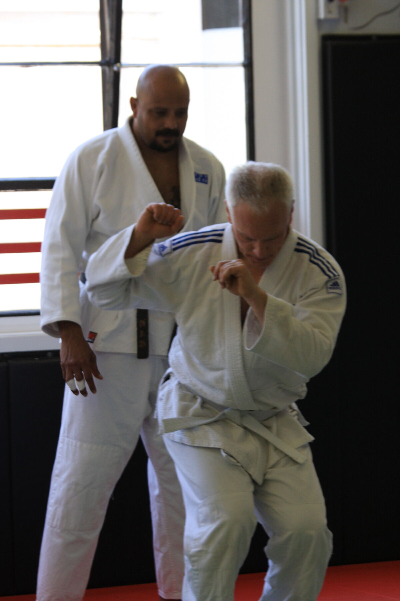
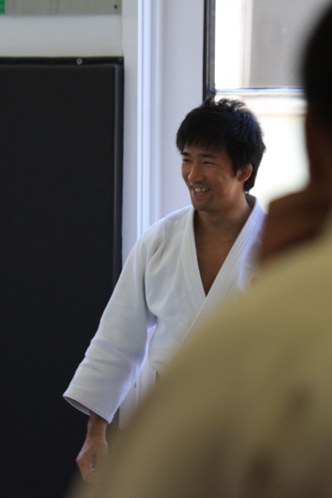
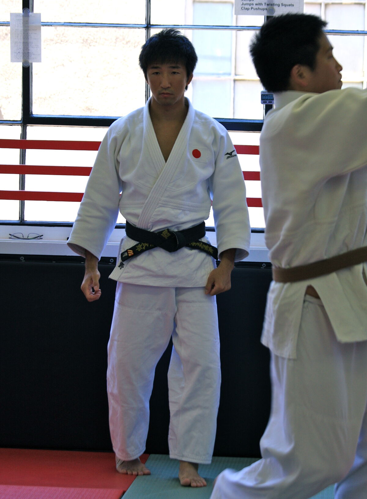
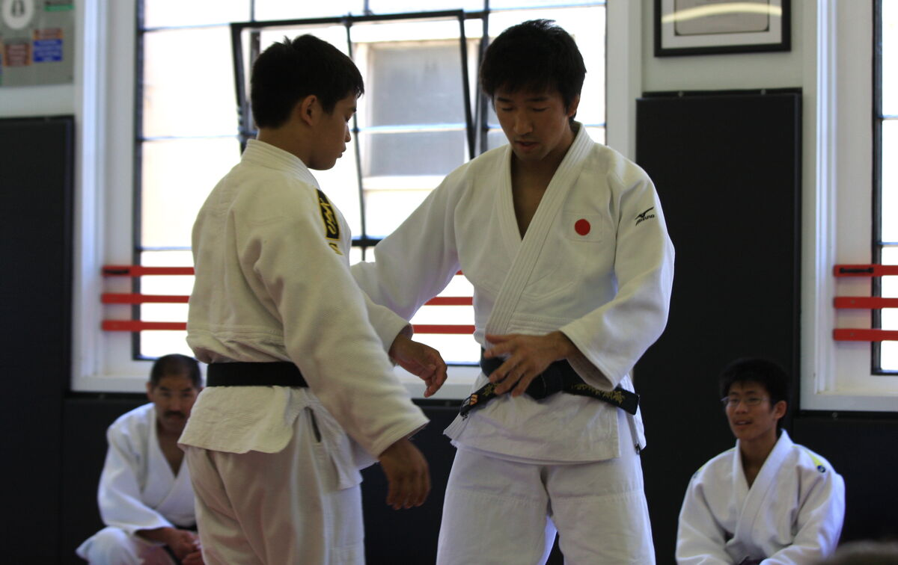
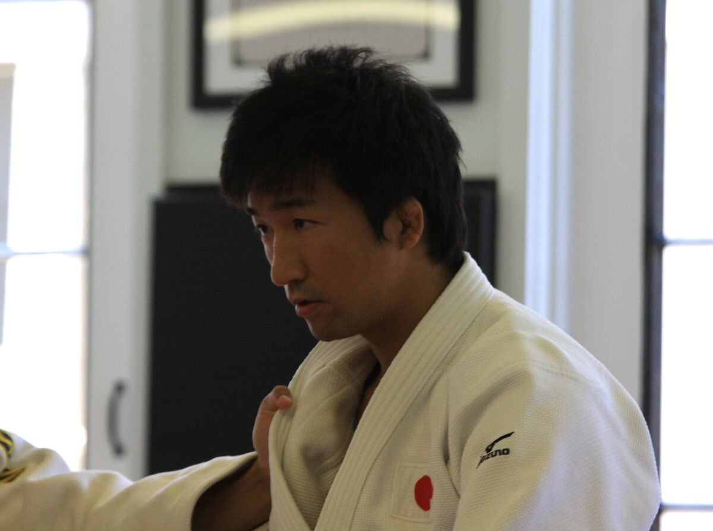
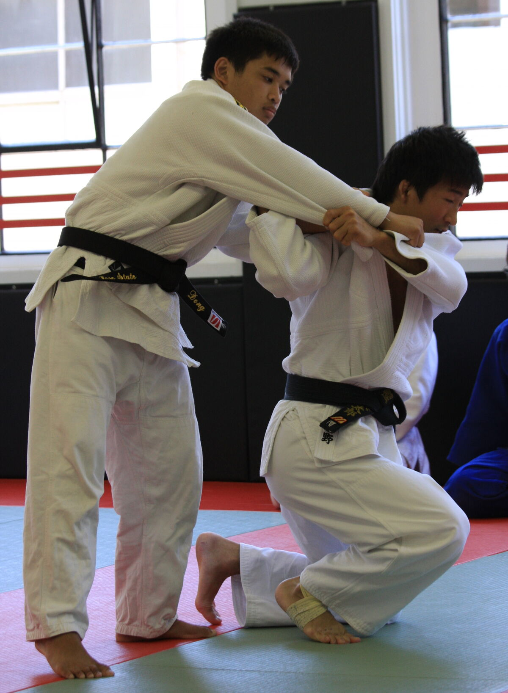
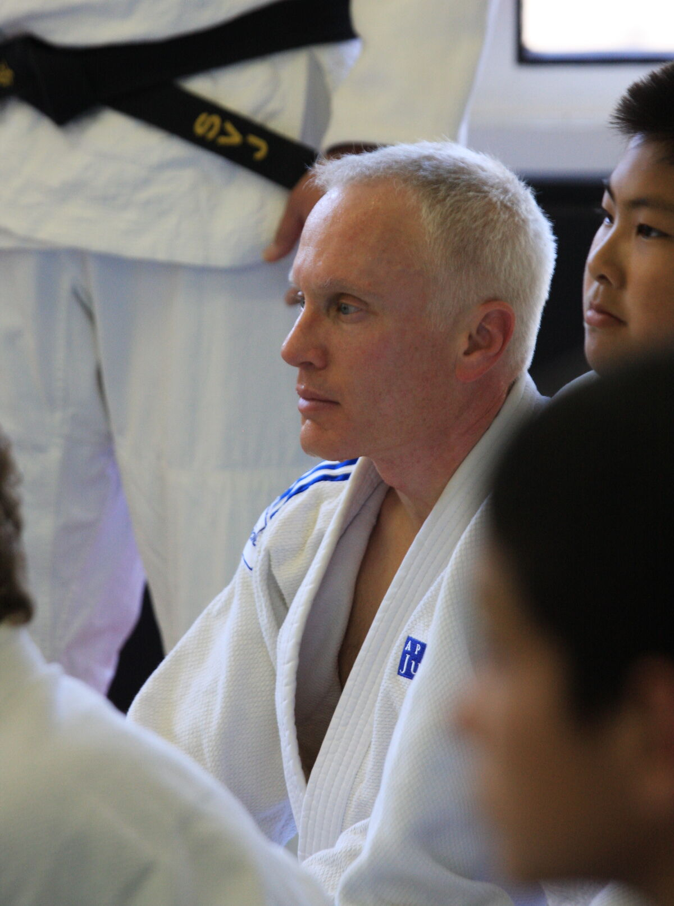
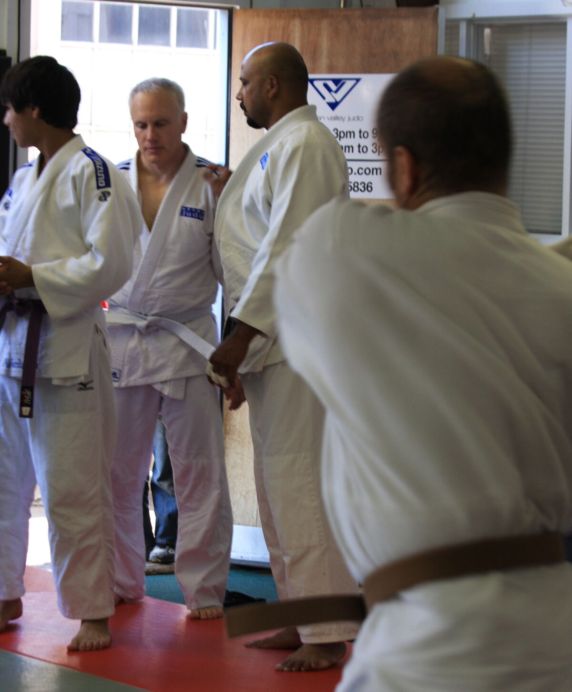
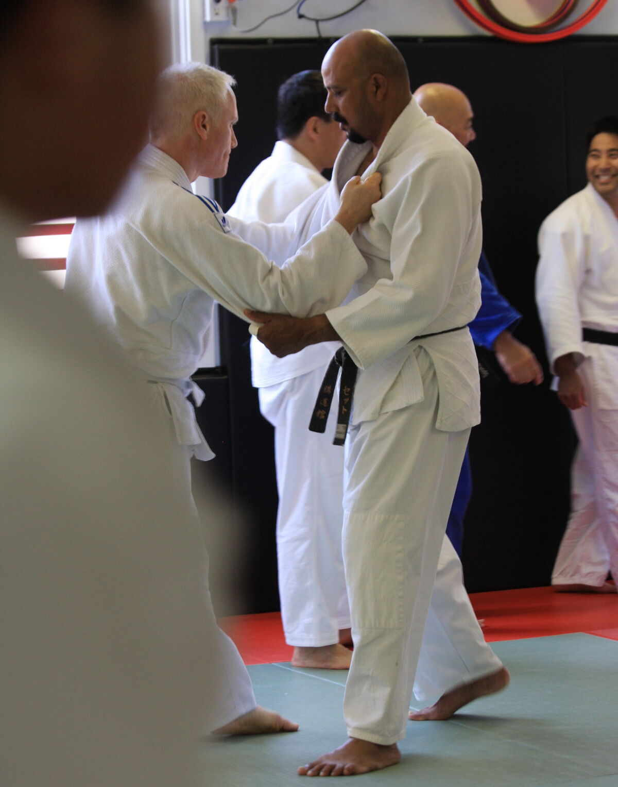
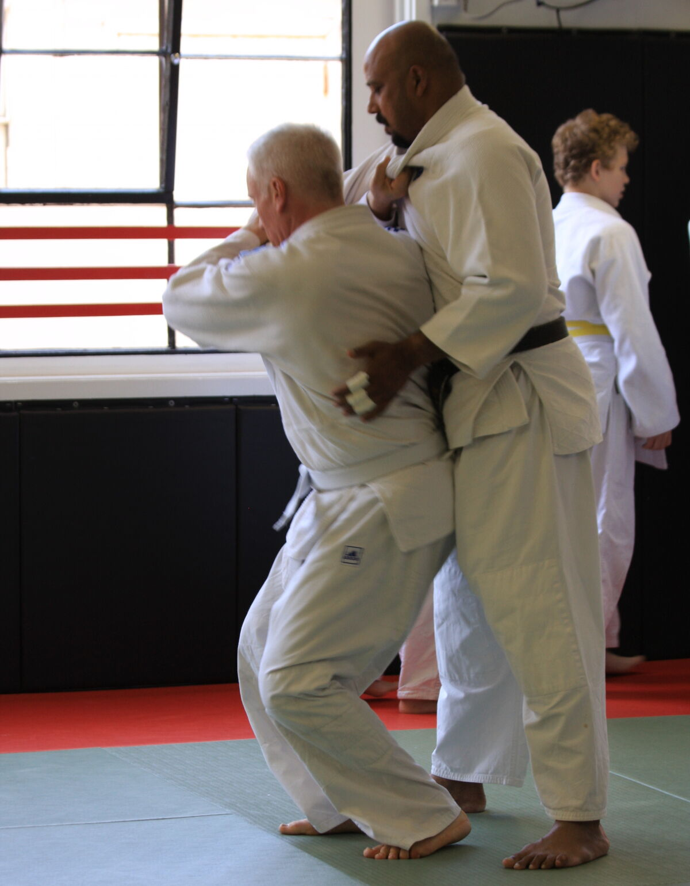
