+++
date = '2010-09-11'
title = 'Backpacking with Nick in Sequoia - Day 2'
author = 'David Multer'
authors = ['David Multer']
tags = ['story']

[cover]
image = "01.jpg"
+++

It was a tough night yesterday, and I knew I had to get Nick to lower elevation
to help him feel better. So it's back down the trail to see how he feels when
we get to the Pear Lake turnoff. Plenty of great views along the way, and I'm
happy to see Nick starting to feel better. Unfortunately Nick is in no mood
for another tough night in the back country, so it's back to the car for the
both of us. I'm looking forward to our next trip, with a little more time to
acclimate.

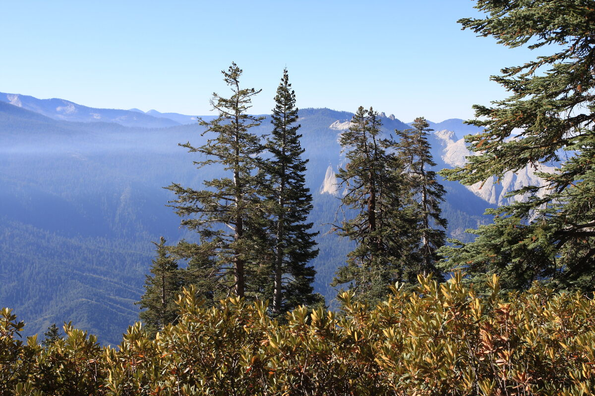
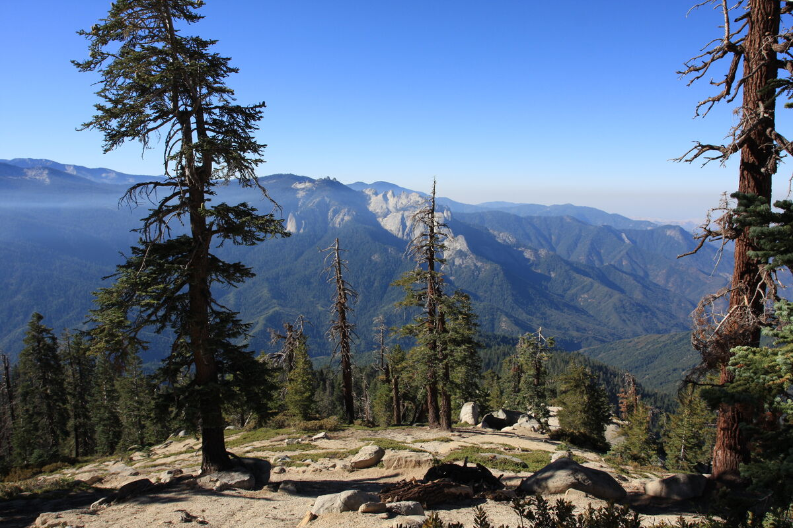
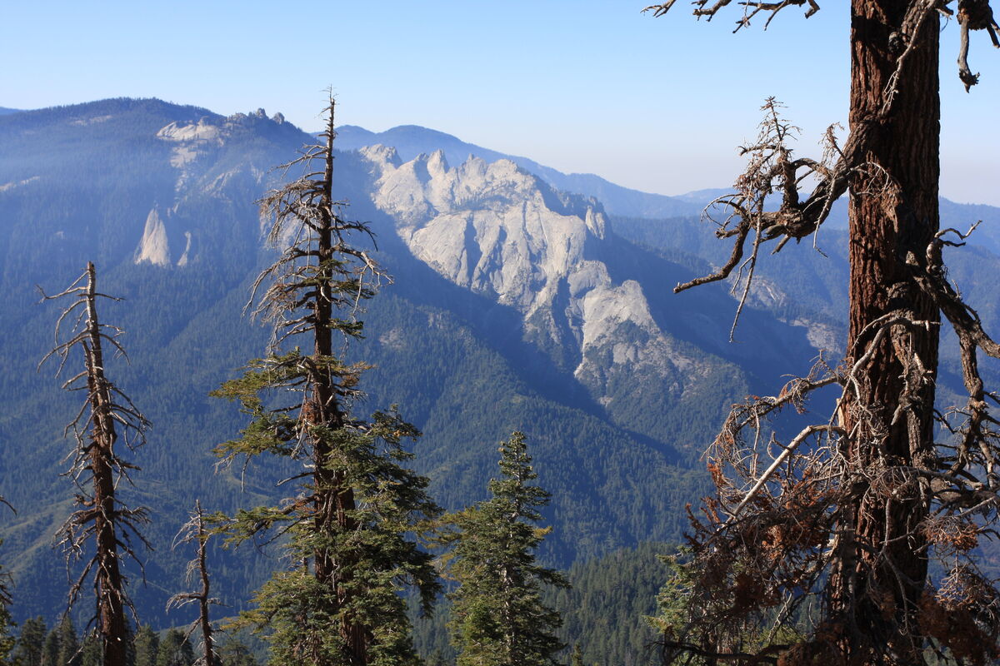
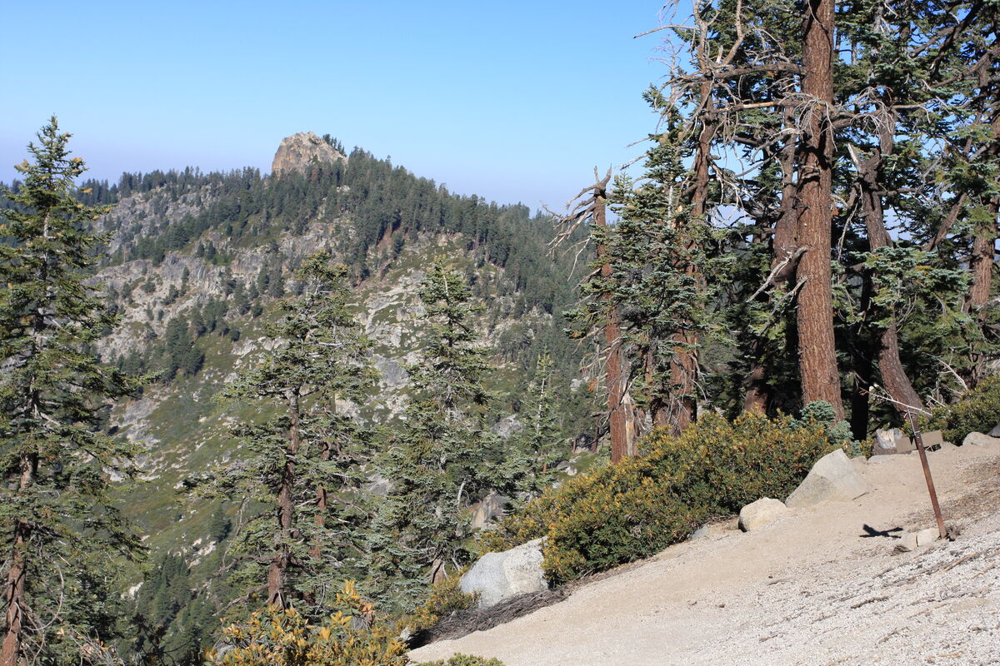
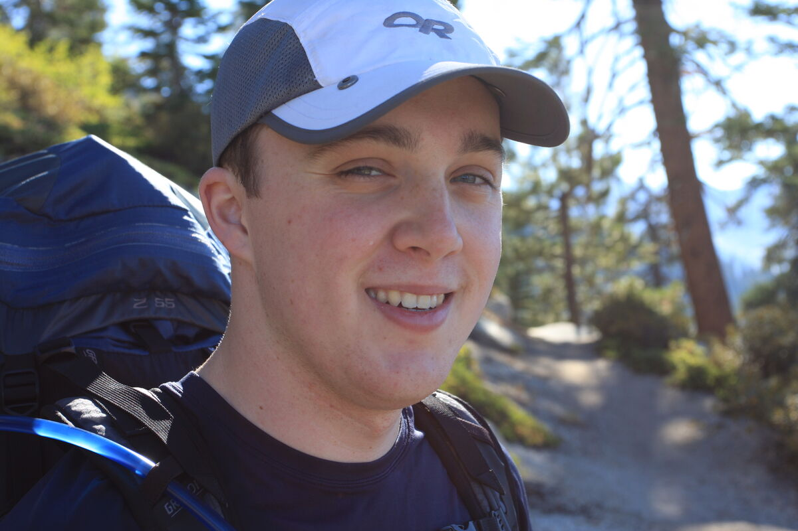
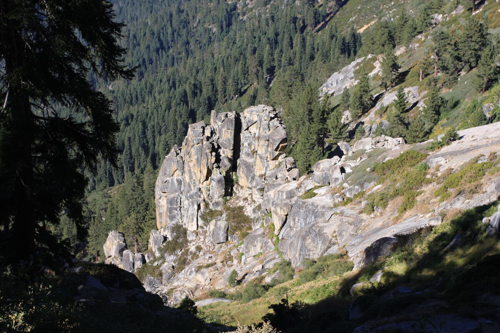
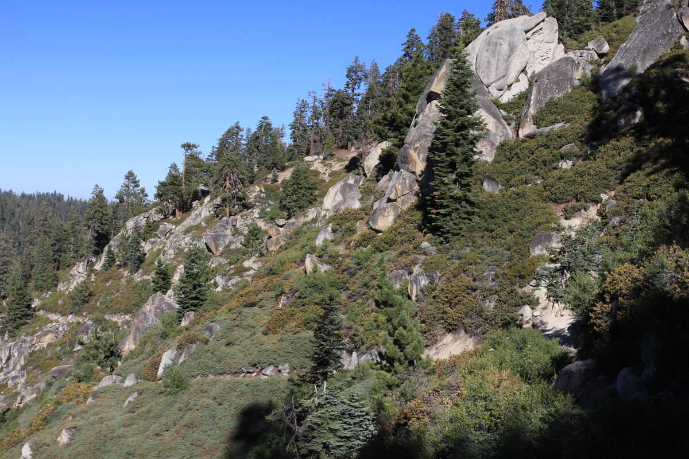
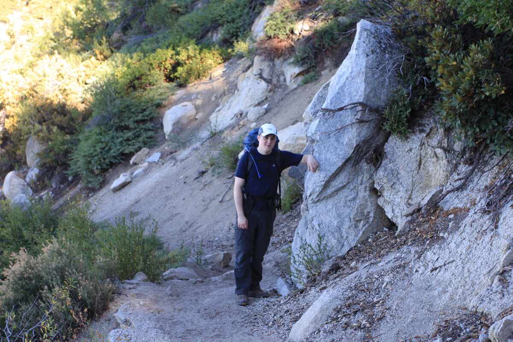
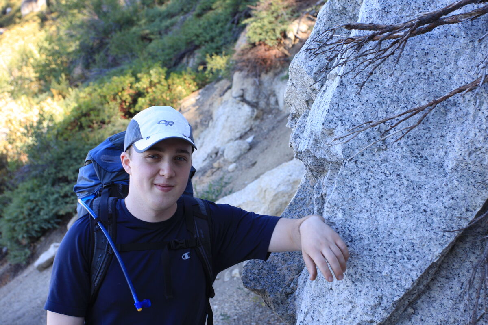
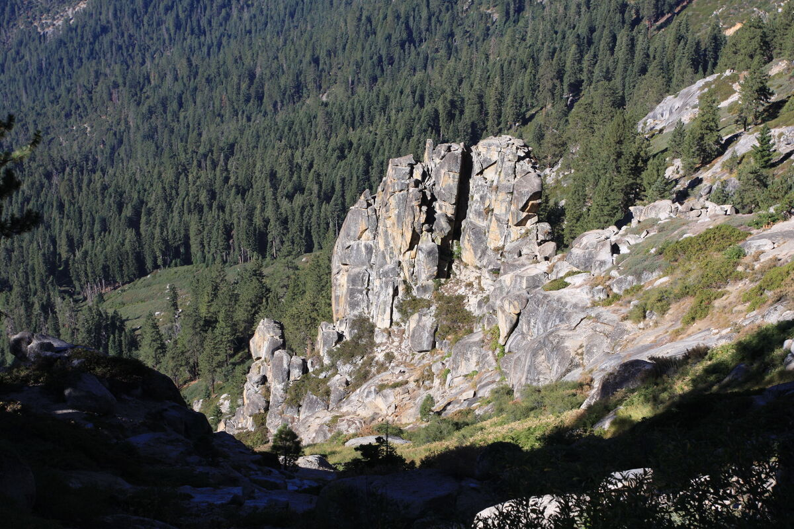
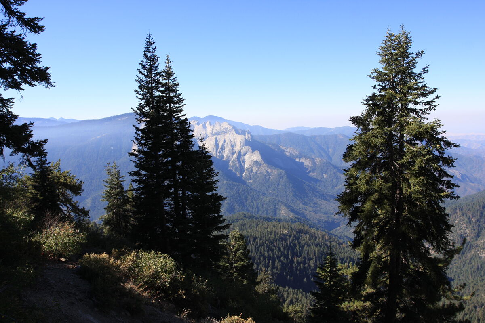
