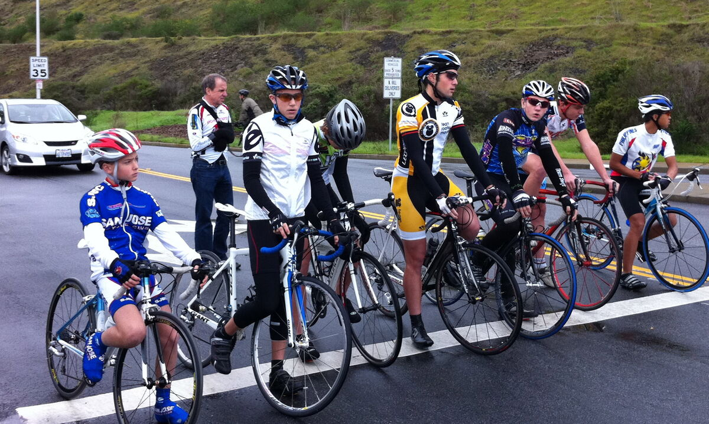
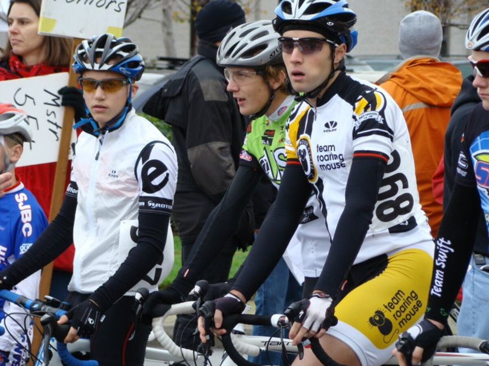
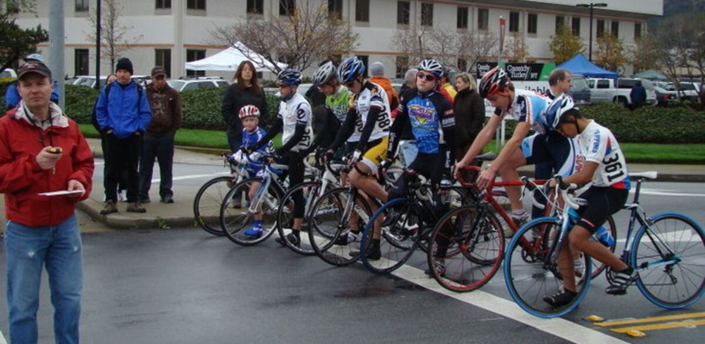
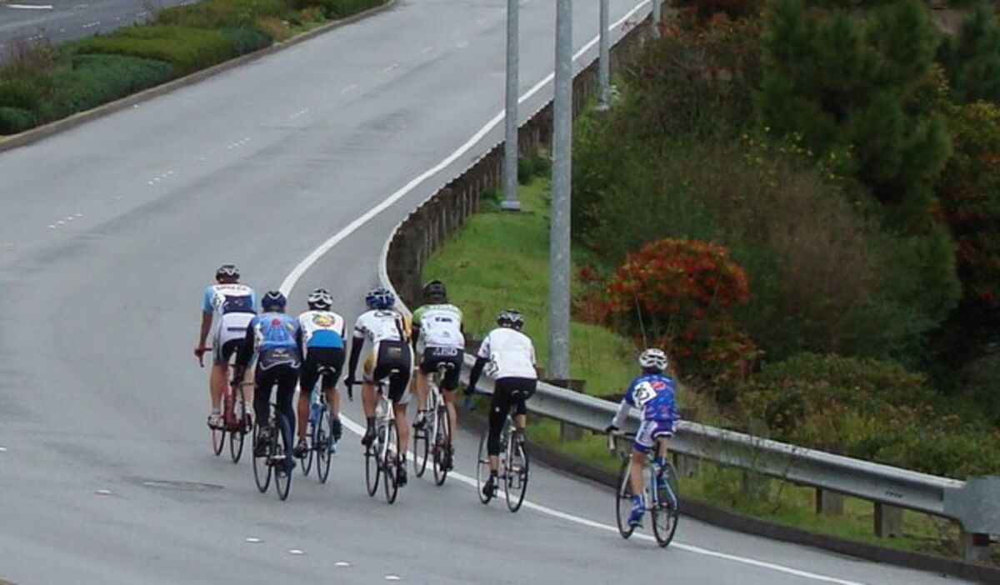
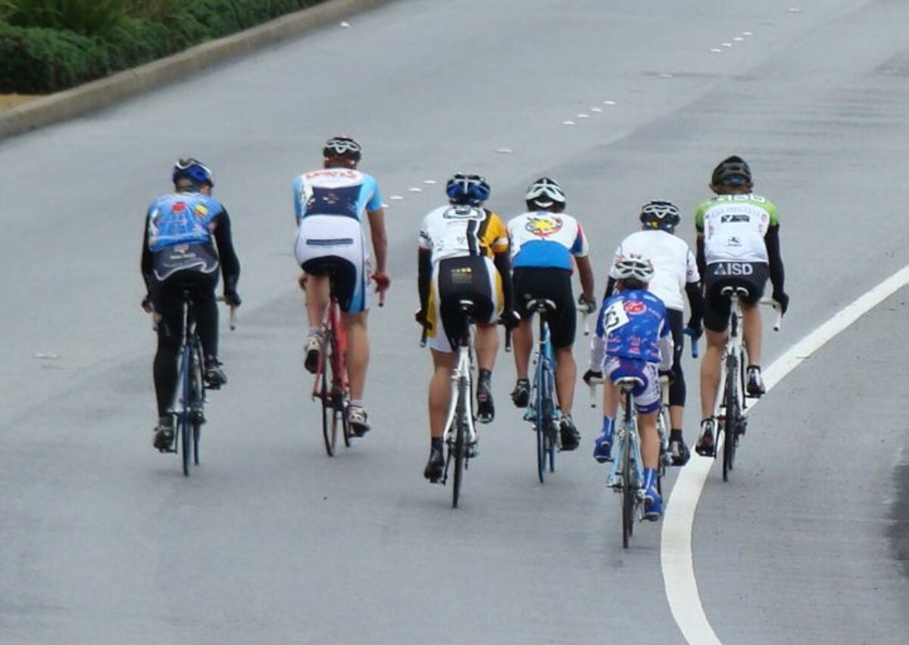
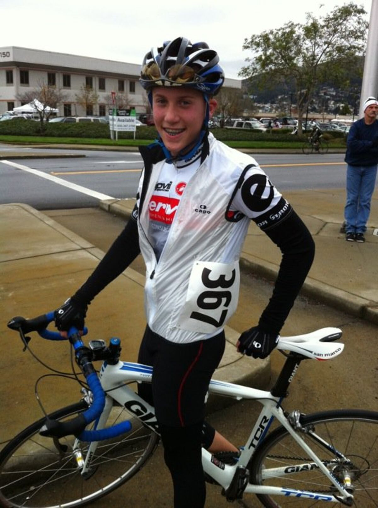

+++
date = '2011-01-01'
title = 'Gabe at the San Bruno Hill Climb'
author = 'David Multer'
authors = ['David Multer']
tags = ['story']

[cover]
image = "01.jpg"
+++

Gabe's racing season gets off to a start with the San Bruno Hill Climb. There's
plenty of rain and cold threatening as usual, but fortunately there's a
somewhat sunny pocket just for the race. Warming up is a trick at this race,
but we've got the tent and rollers that do the job nicely. It's too bad the
long line of starting groups cools him down completely before the start. I
know Gabe is nervous with national champions and older kids in this race, but
he'll do his best. I think he was happy with his result of 22:20.7 for the
day.

