+++
date = '2011-02-13'
title = 'The official Early Bird Criterium'
author = 'David Multer'
authors = ['David Multer']
tags = ['story']

[cover]
image = "01.jpg"
+++

Last week was the last training race, and today is the real thing. Fortunately
the field isn't packed with the usual ringers from SJBC or Specialized, so
Gabe is hoping for a good finish.

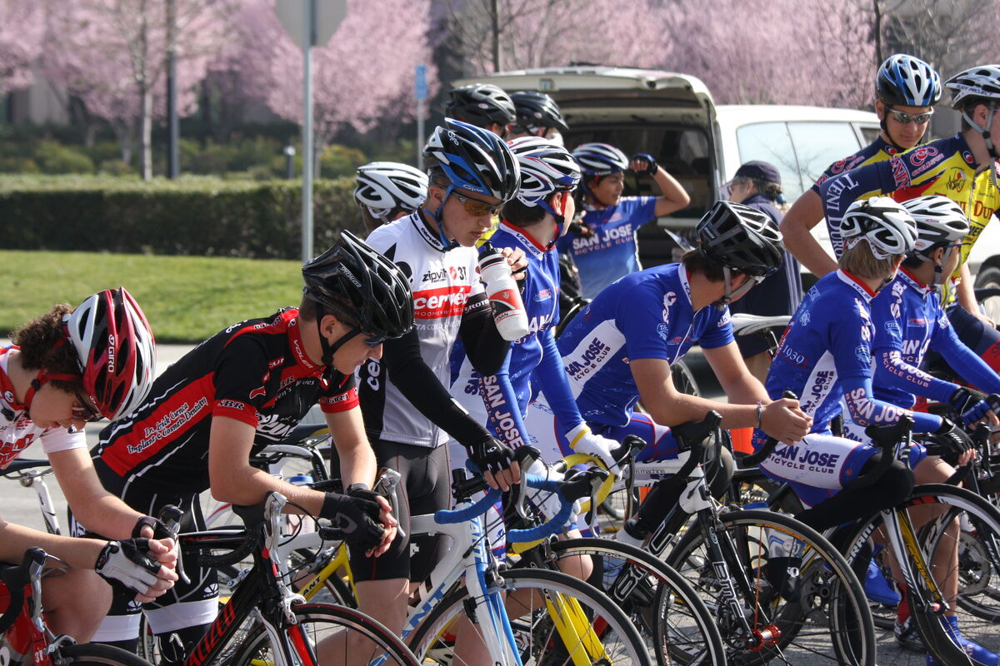
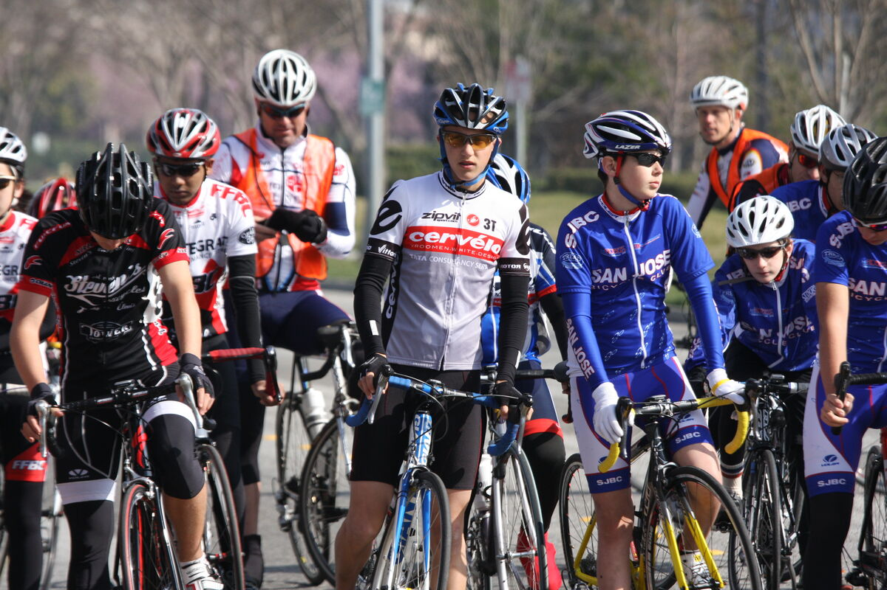
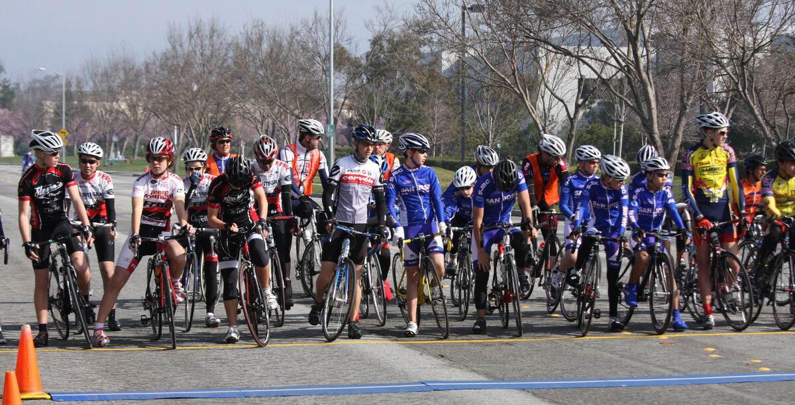
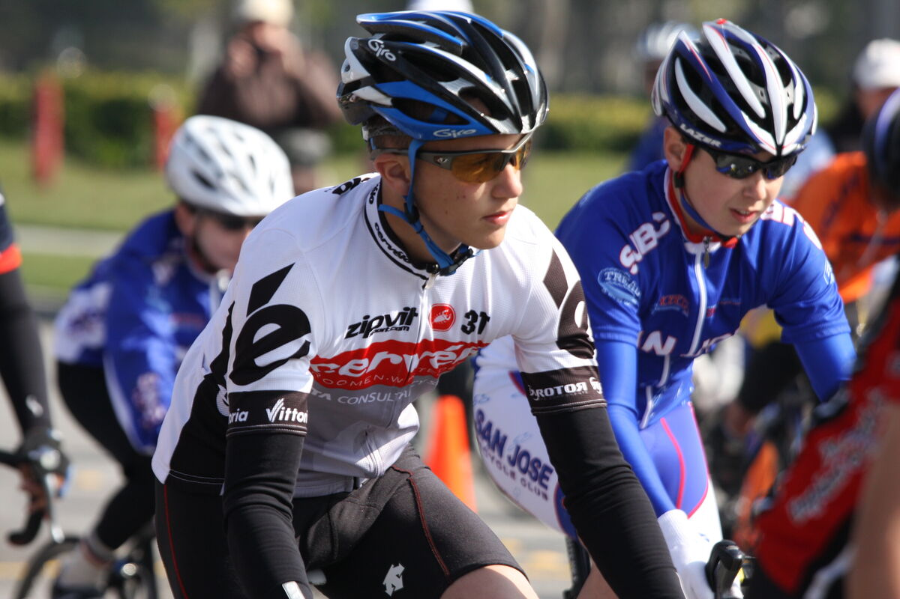
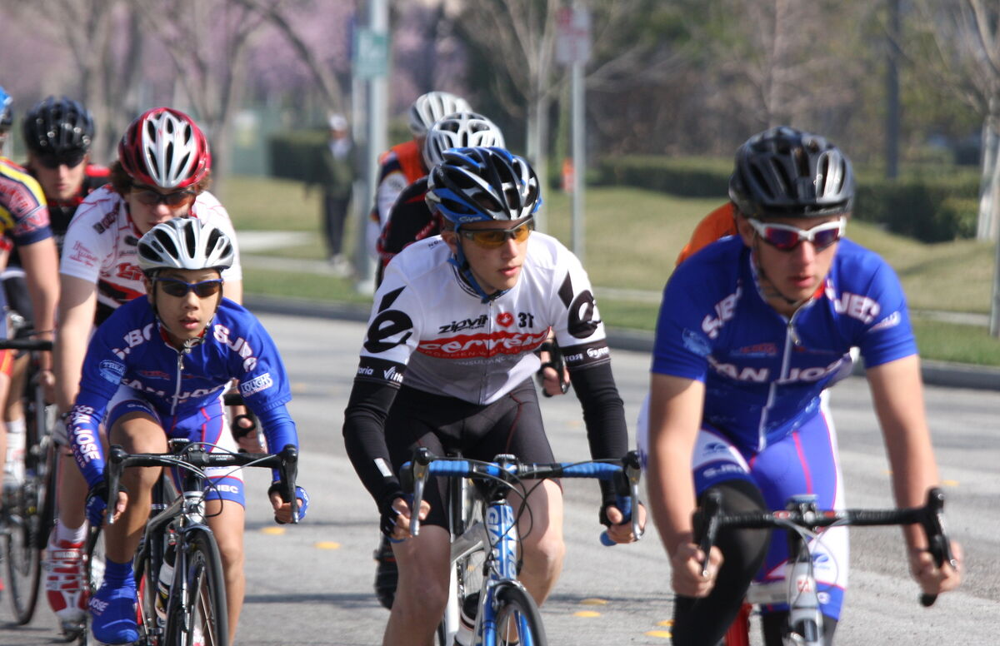
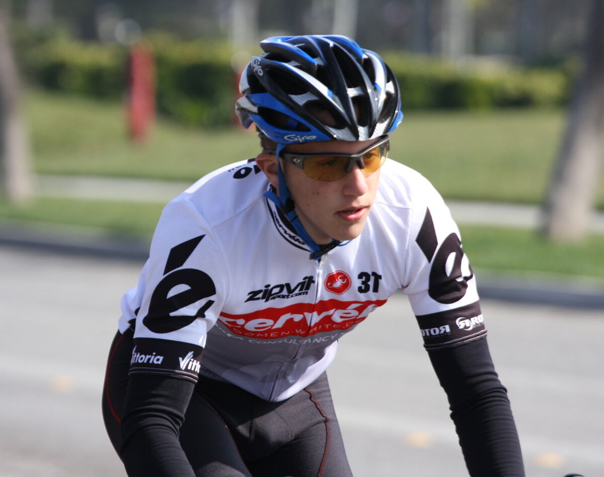

It's a slower pace than previous races, and I'm happy to see Gabe hanging right
at the front of the pack the whole race. He holds a pretty decent position on
the last turn and pulls off a sixth with Ryan from Steven's Bicycles taking
first.

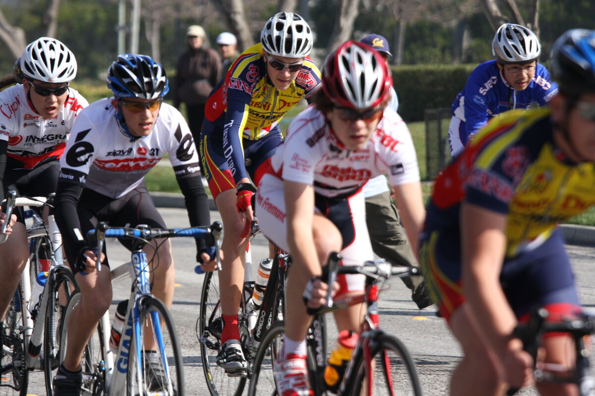
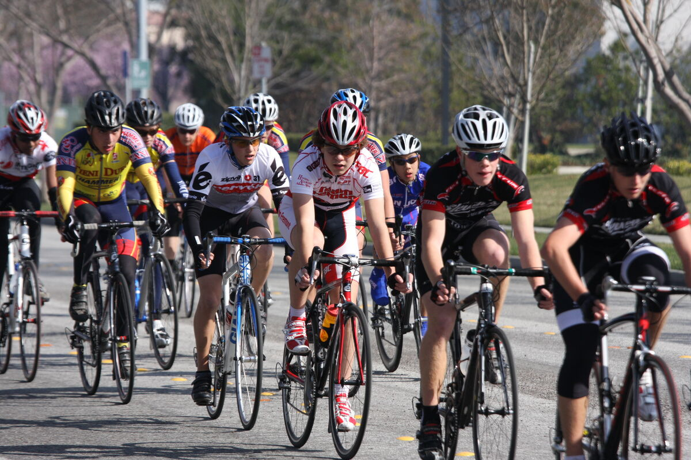
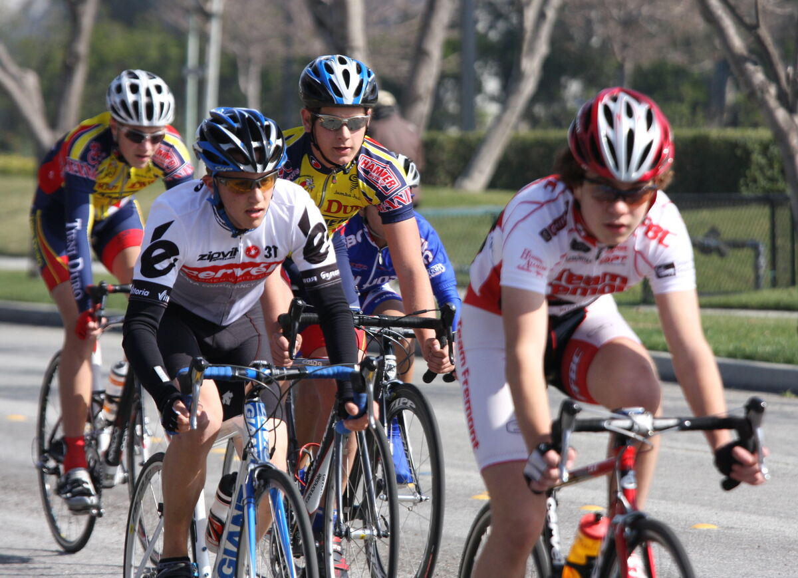
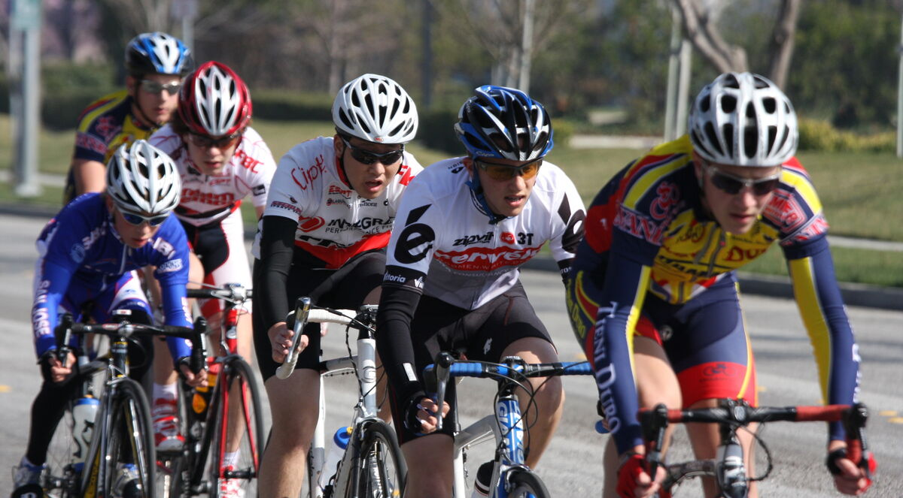
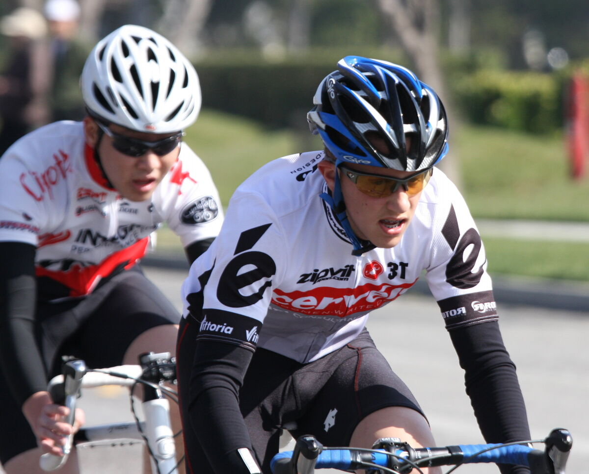
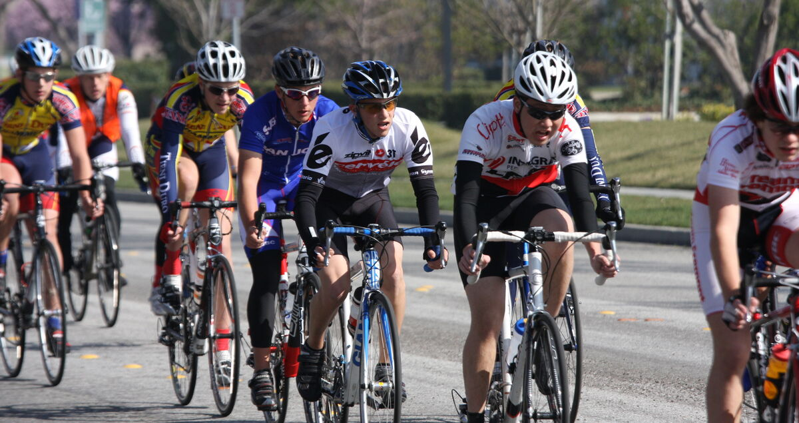
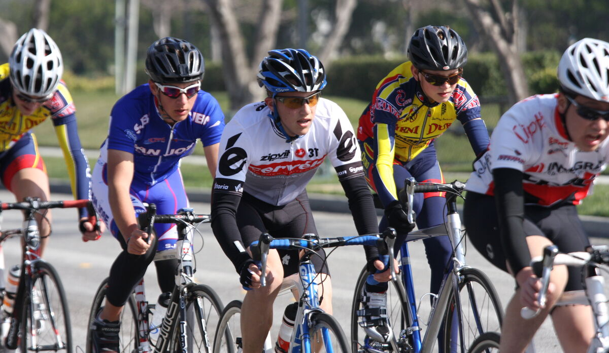
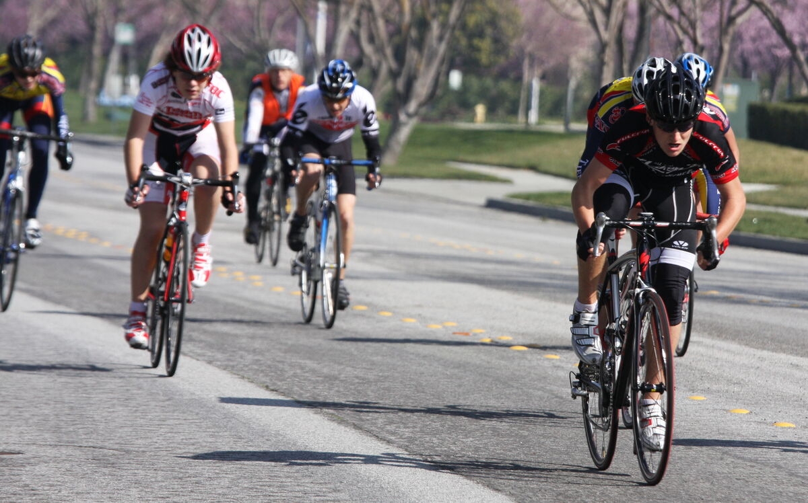
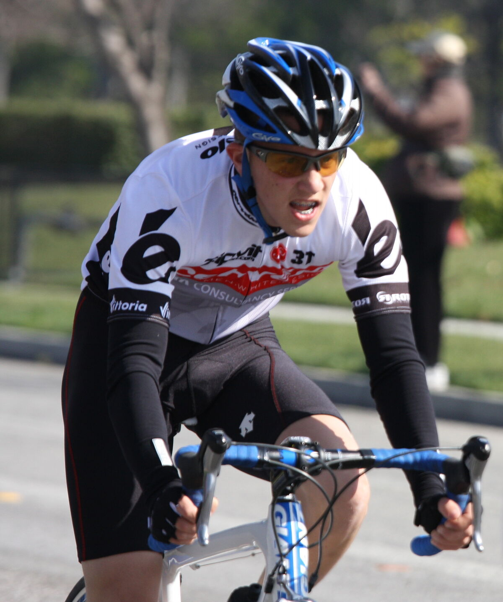
