+++
date = '2011-04-06'
title = 'Spring road trip - Jerome, Tuzigoot, and Montezuma'
author = 'David Multer'
authors = ['David Multer']
tags = ['story']

[cover]
image = "01.jpg"
+++

This morning's plan was to ride up Mingus Mountain through Jerome, after first
doing a recon of the route with everyone in the car. We decided to bail once
we saw how narrow and busy the road was, and it didn't help that it was
starting to rain as well. We had to make do with some huge views and a very
nice lunch in busy downtown Jerome.

Then it's a nice stop at [Tuzigoot National Monument]
(https://www.nps.gov/tuzi/) to burn off some of that no-ride energy. Gabe is
quite the goofball.

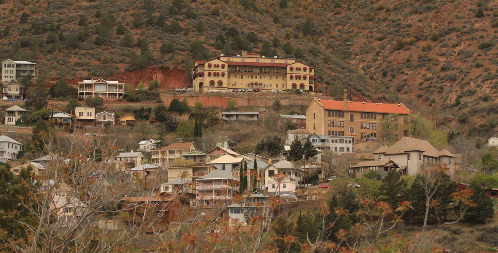
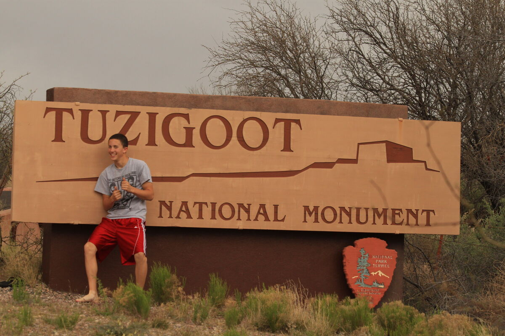
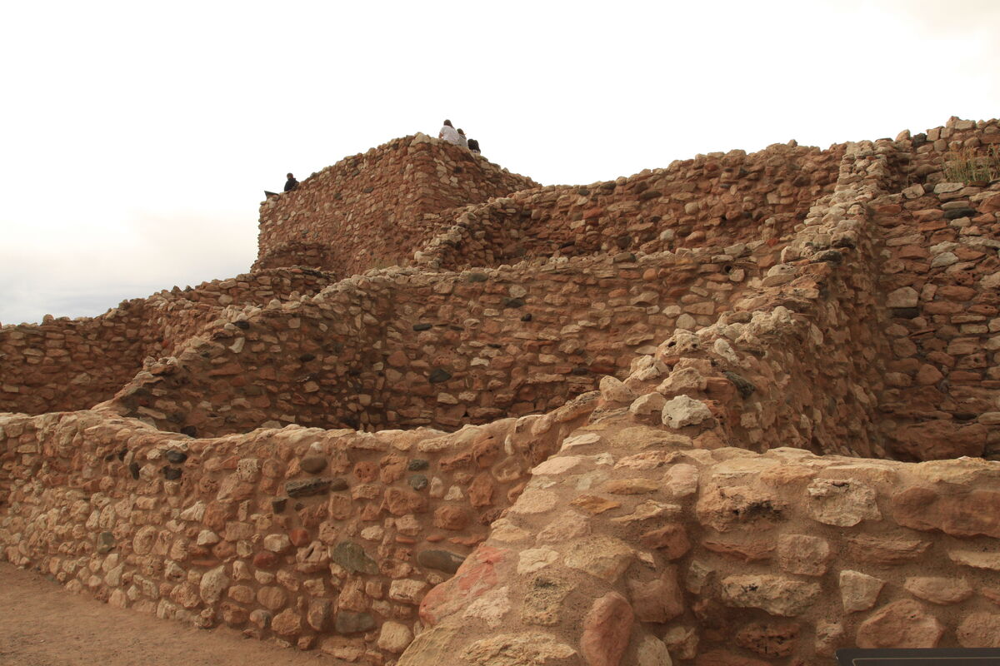
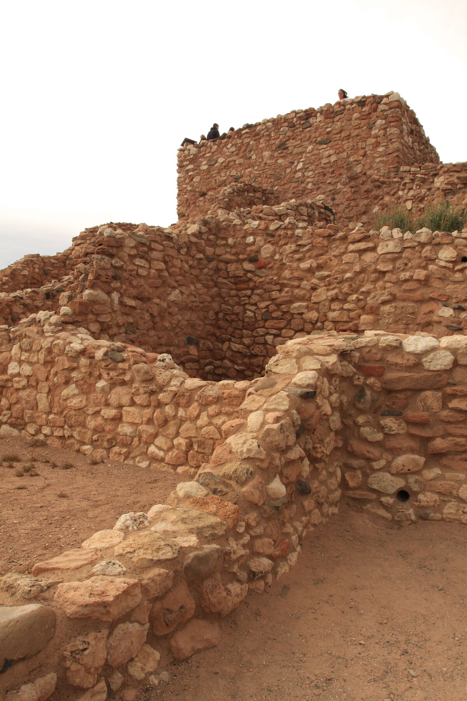
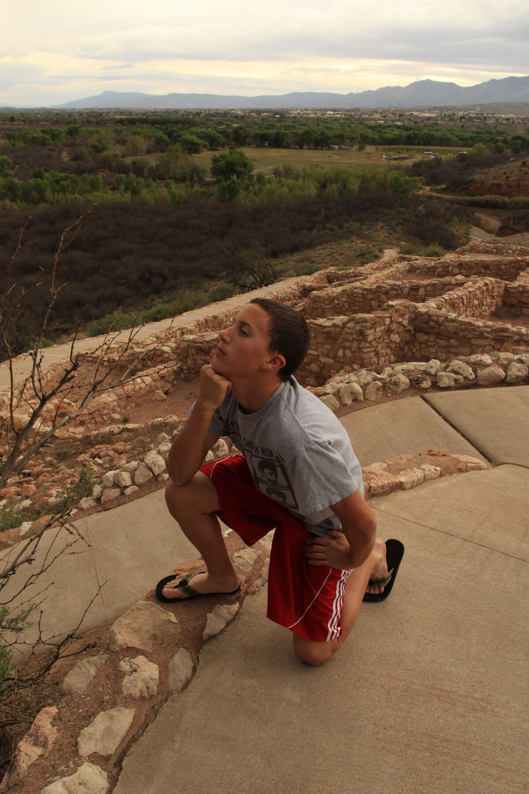
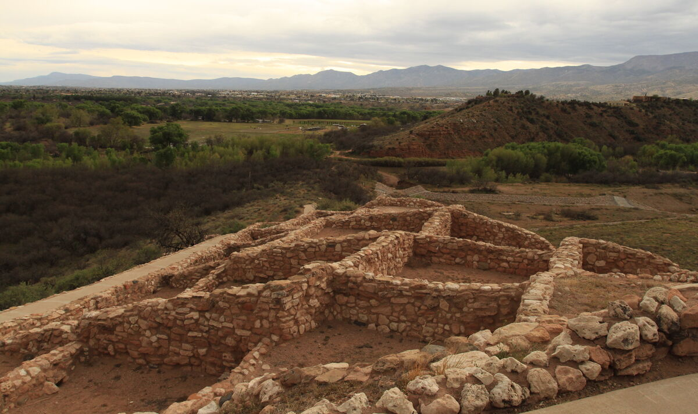
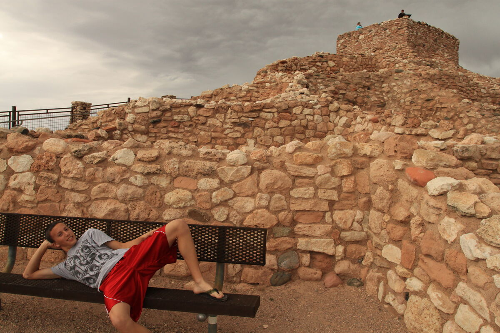
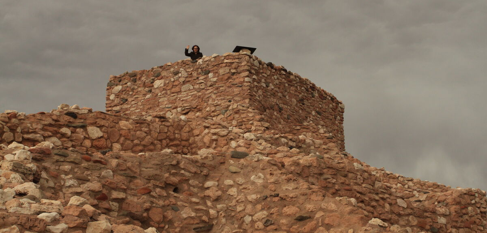
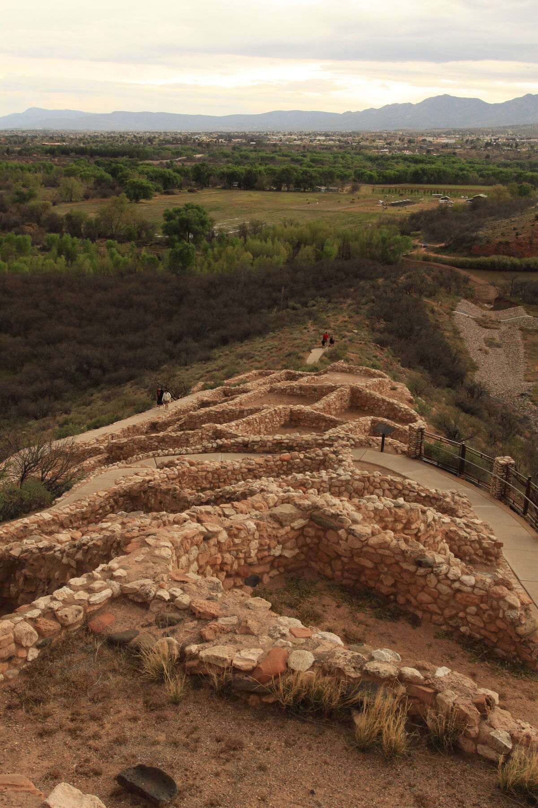
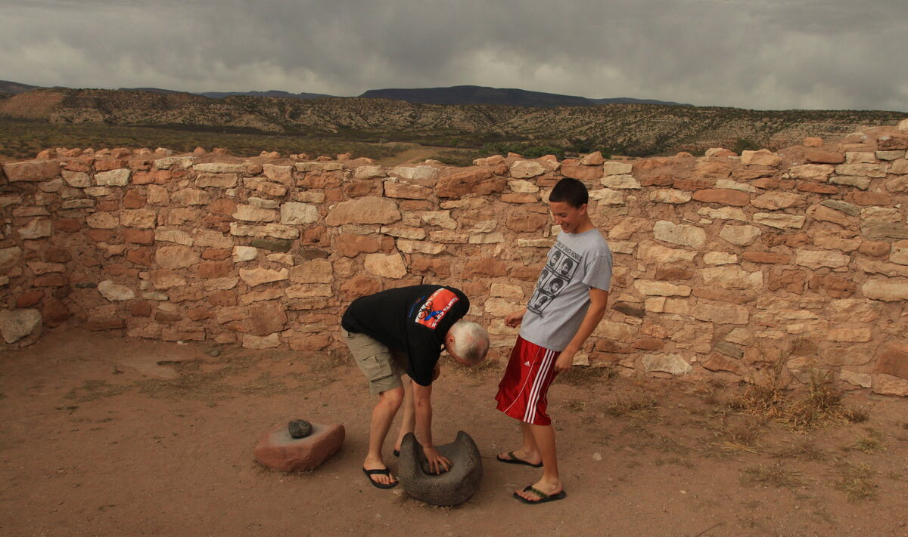

Our last stop is [Montezuma Castle](https://www.nps.gov/moca/) before heading
south for warmer weather down in Scottsdale. We didn't get any photos down
there, but Gabe and I had a nice ride around McDowell Mountain.

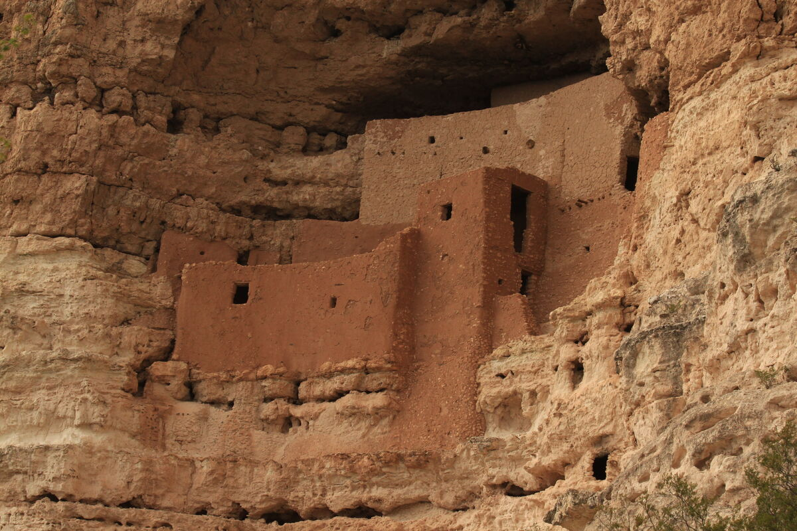
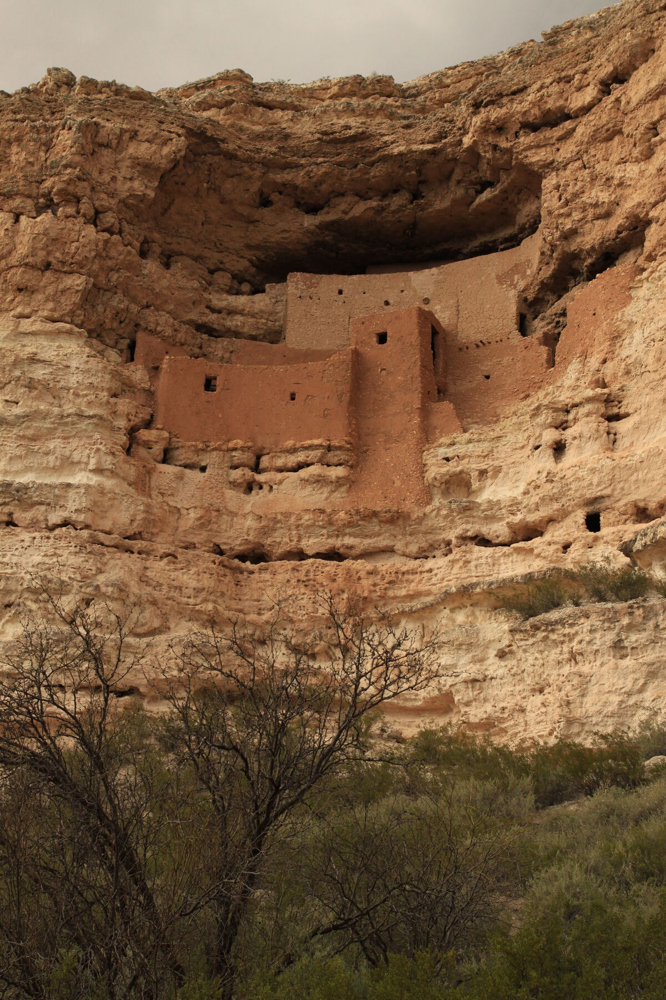
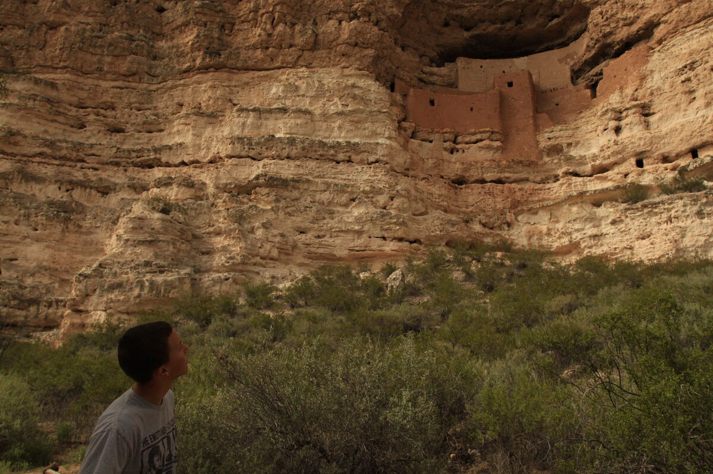
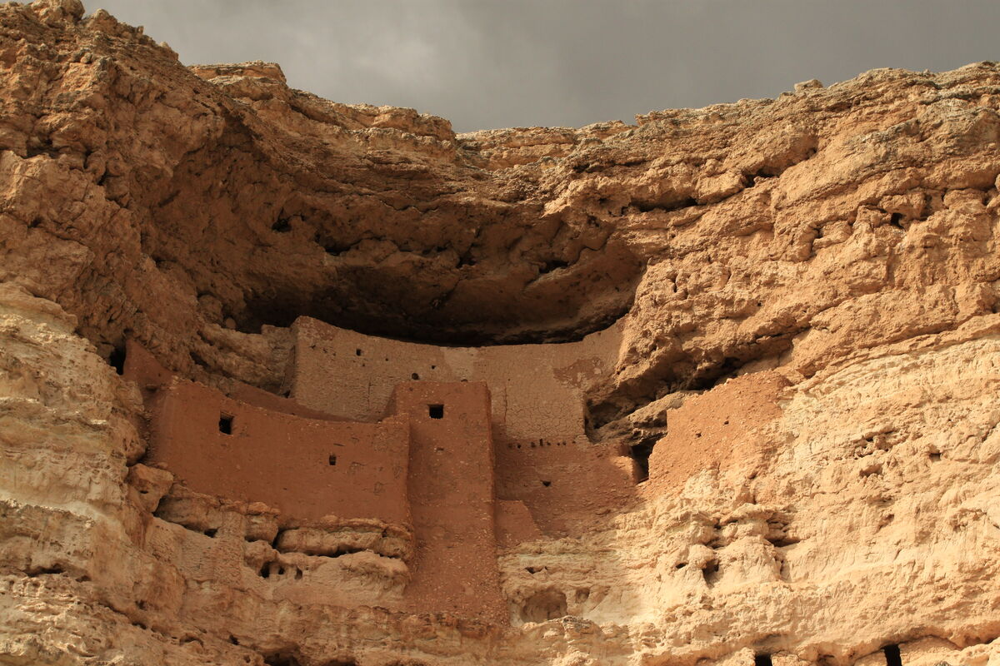
