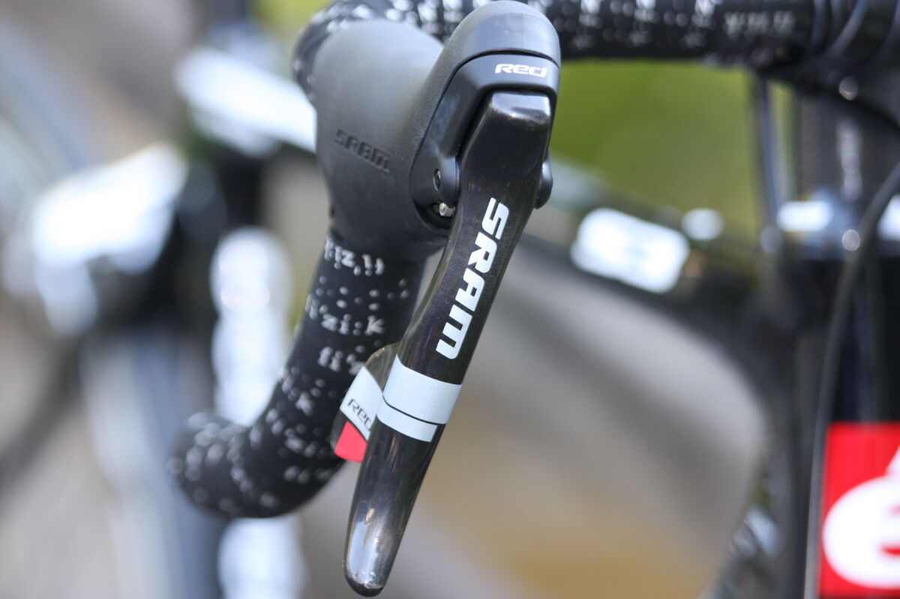
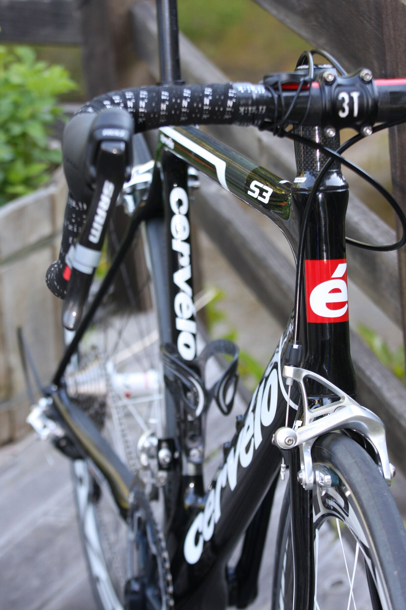
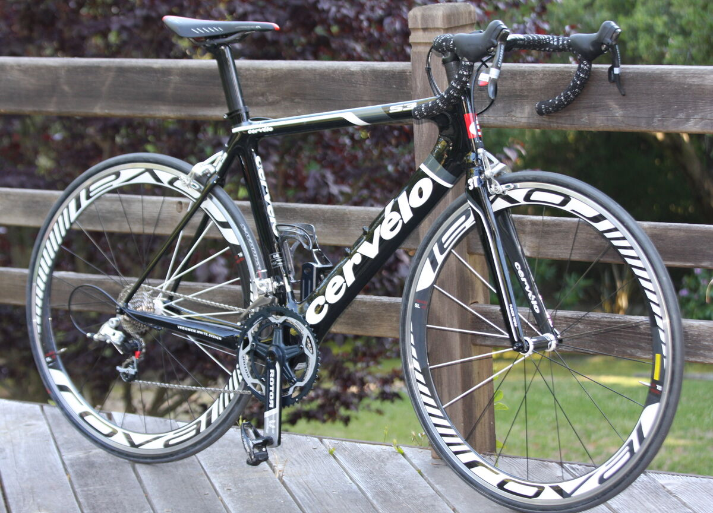
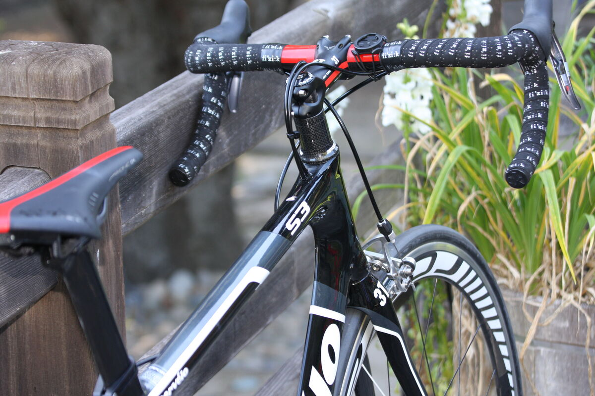
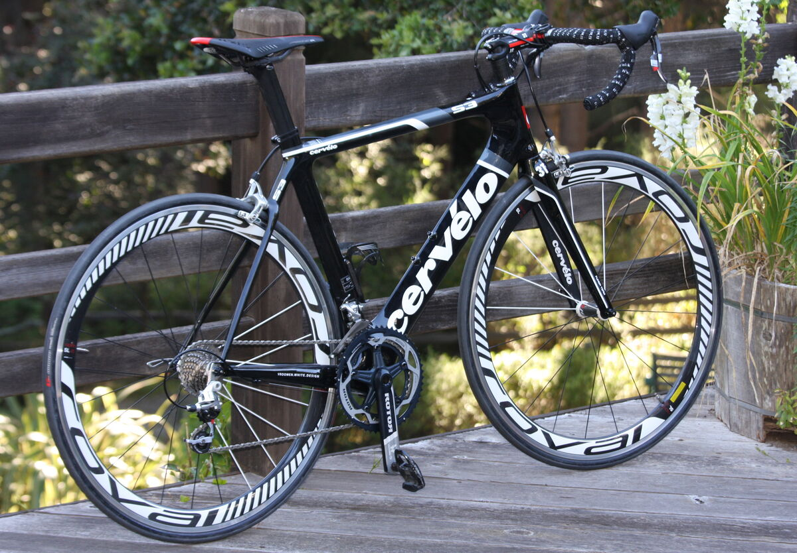
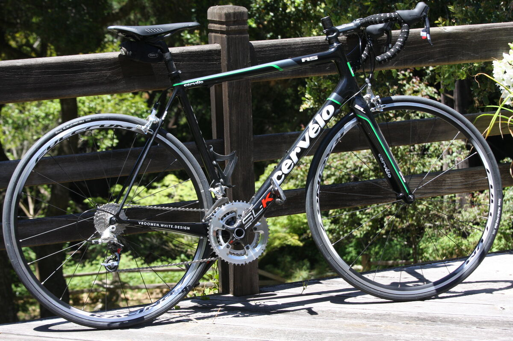
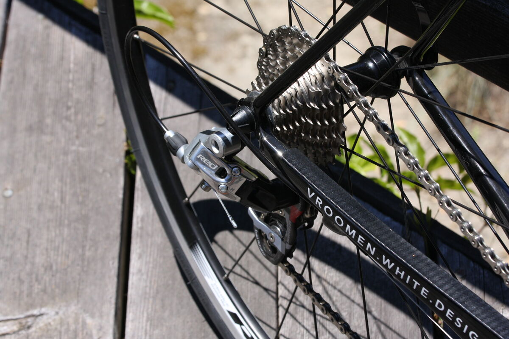
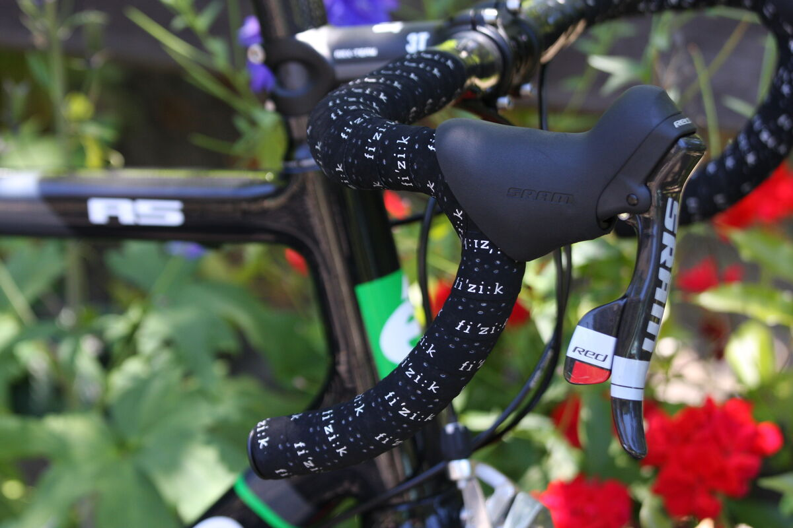
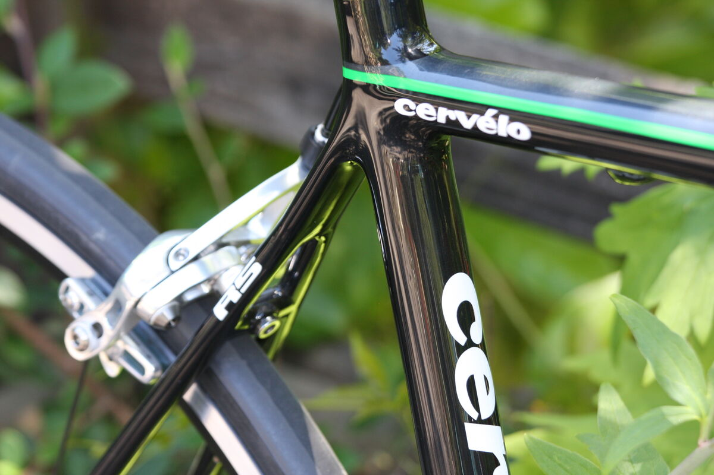
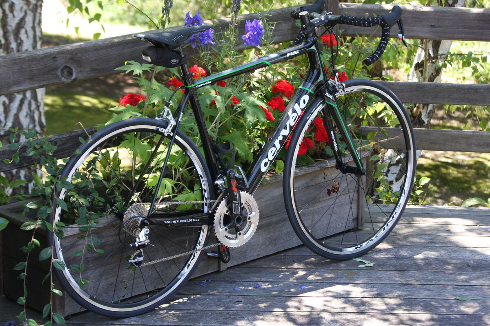

+++
date = '2011-06-21'
title = 'New Cervelo bikes for Gabe and David'
author = 'David Multer'
authors = ['David Multer']
tags = ['story']

[cover]
image = "01.jpg"
+++

Gabe's frame was recently cracked in a minor car accident, so it's bad news for
my wallet, but good news for the bike racing crazy junior. He was convinced
the Specialized S-Works SL3 was the way to go, but we were both hooked on
[Cervelo](https://www.cervelo.com) once we checked them out at Spokesman in
Santa Cruz. Gabe got the S3 with Roval wheels and S-Works shoes. Now that's a
racing machine!

And it just so happens that my recent visit to the bike shop uncovered the fact
that 7 years and 40,000 miles on my Trek road bike has finally worn it out.
Guess I've got to get a Cervelo R5 to round out the new bike stable at the
Multer household. One last visit to the bike shop for our fittings and final
bike parts next week, and we've got two very excited cyclists in da house.

