+++
date = '2011-06-26'
title = 'Burlingame Criterium'
author = 'David Multer'
authors = ['David Multer']
tags = ['story']

[cover]
image = "01.jpg"
+++

Gabe is racing Elite 4 at the [Burlingame Criterium]
(https://penvelo.org/burlingame-criterium/) today with Mack. It's the first
big elite field criterium Gabe has signed up for, and he's been looking
forward to it.

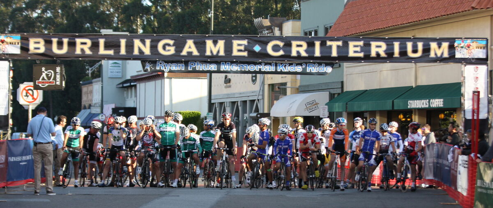
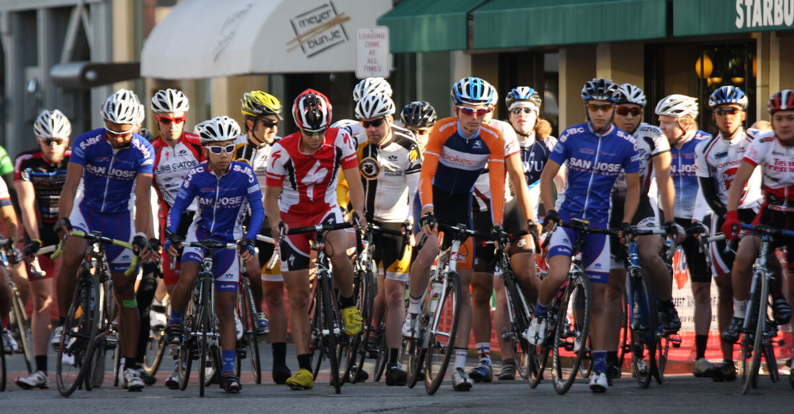
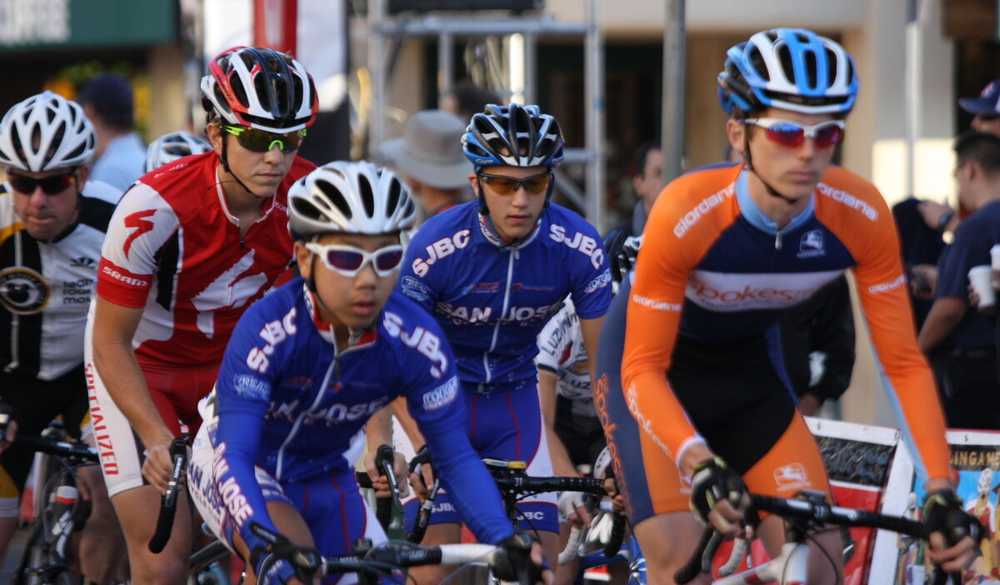

Mack did a very nice job of attacking throughout the race, but unfortunately
the field was plenty fast and no one was going to get away today.

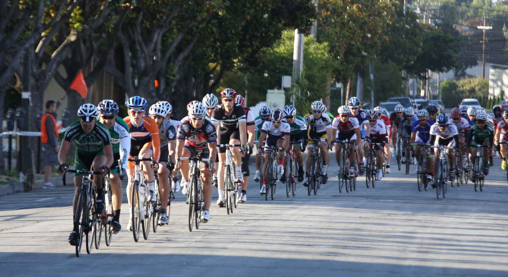
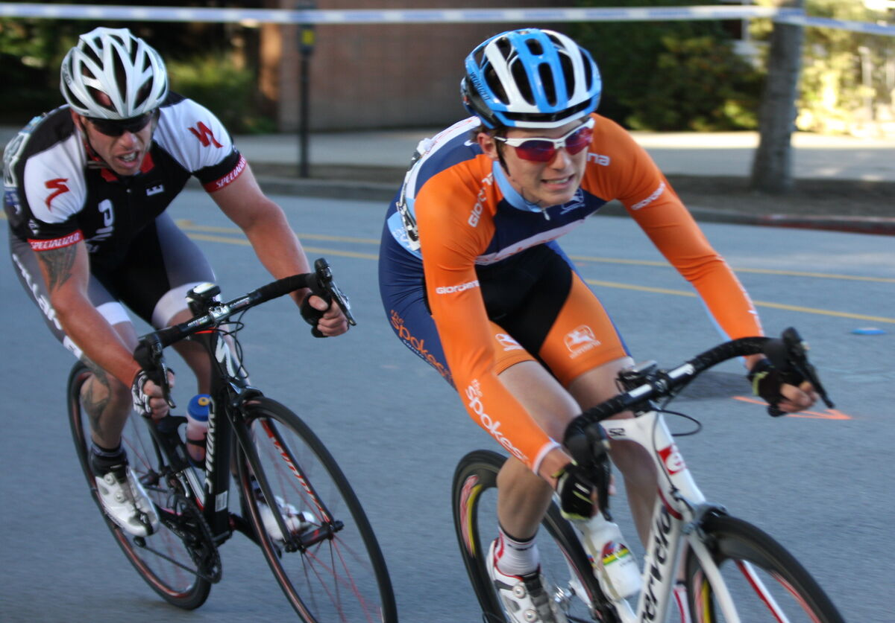
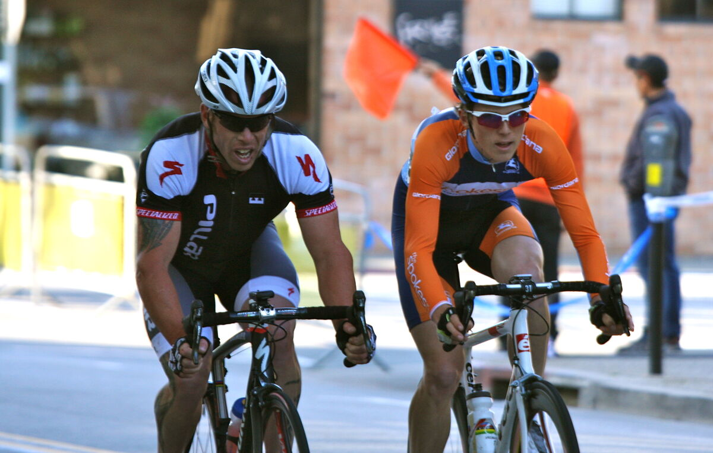
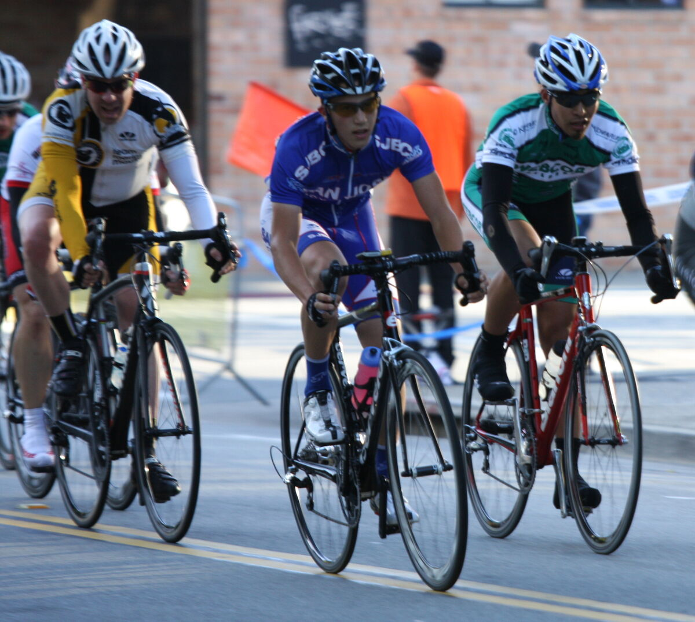
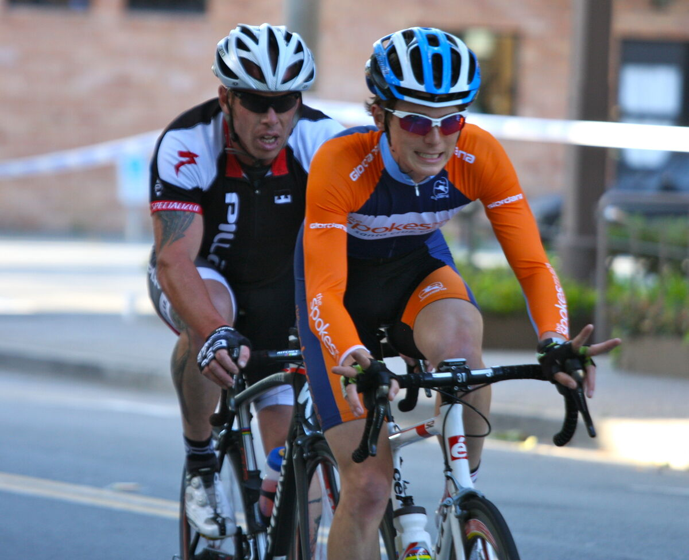

Gabe hung in the pack nicely for the entire race, while managing to avoid
getting into any trouble. Sorry to see Justin and a few others go down, but I
don't think anyone was seriously hurt.

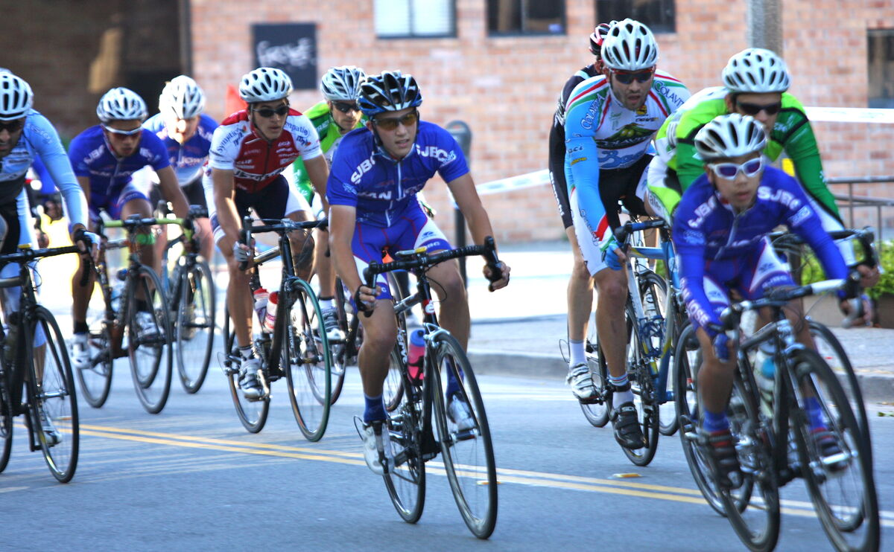
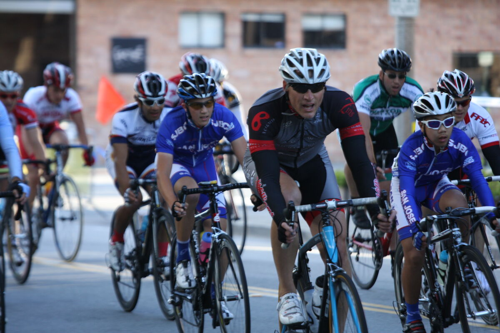
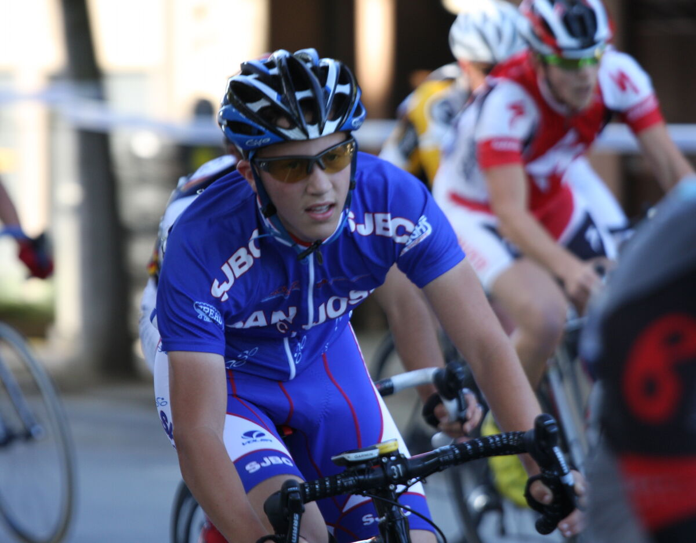

The inevitable catch, and the big field sprint. It sure will be cool when Gabe
is ready to contest these finishes.
    
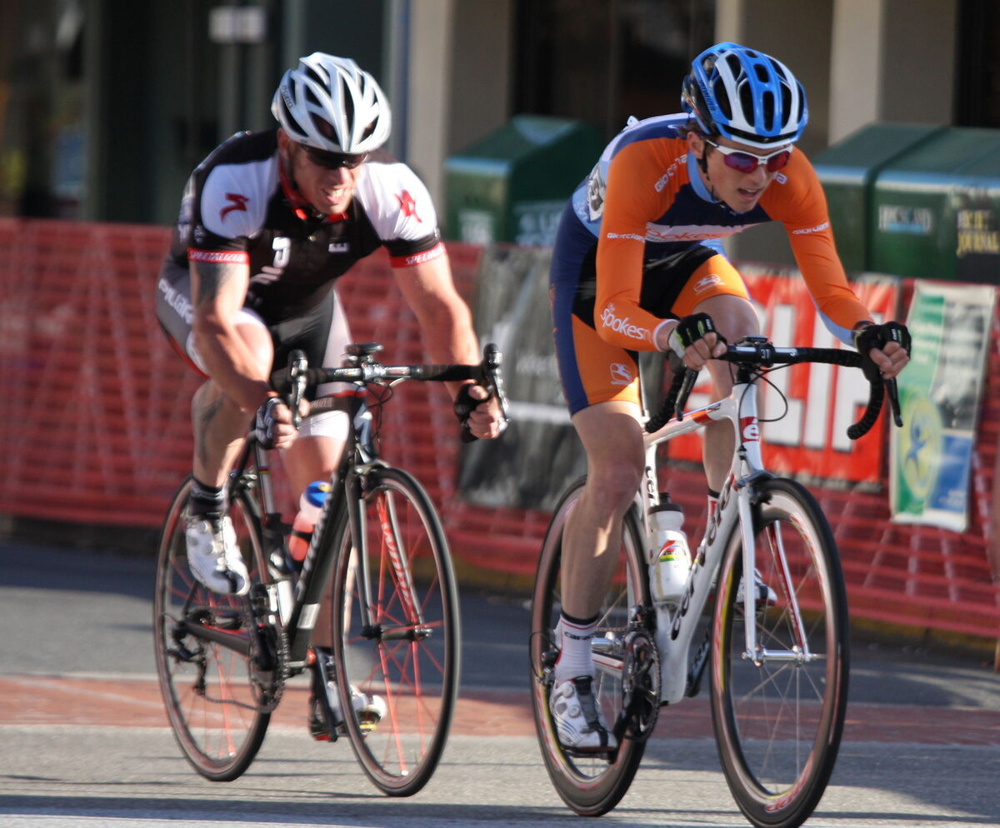
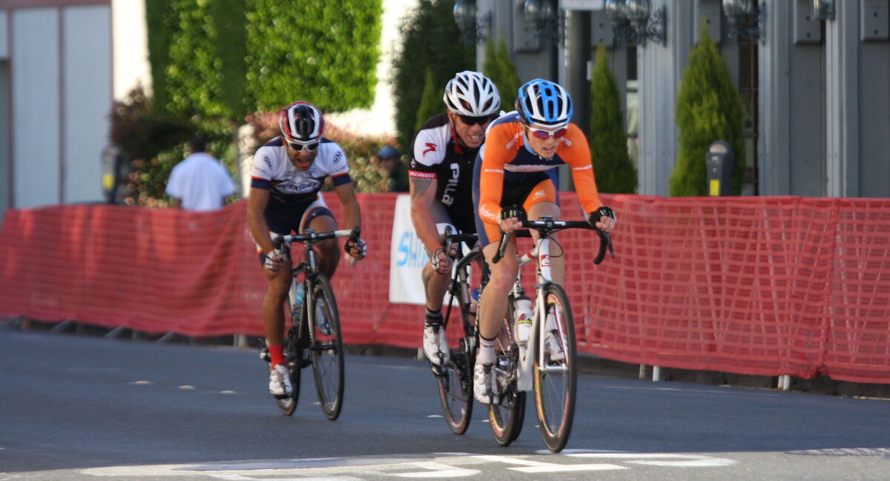
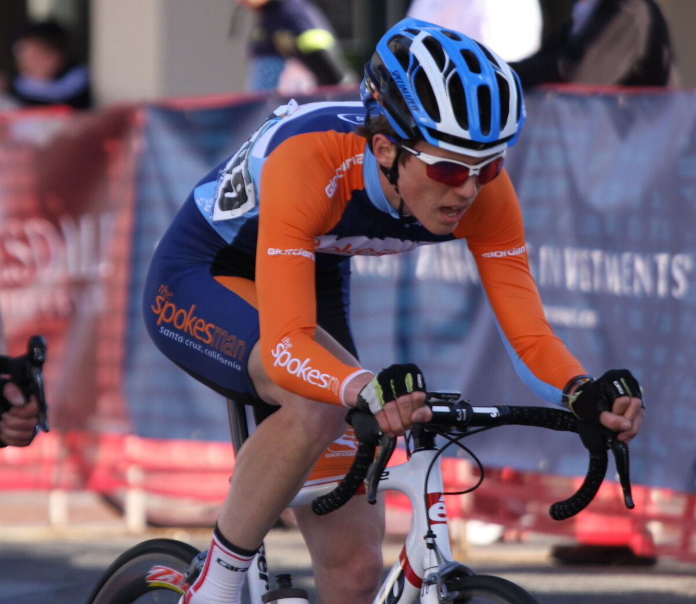
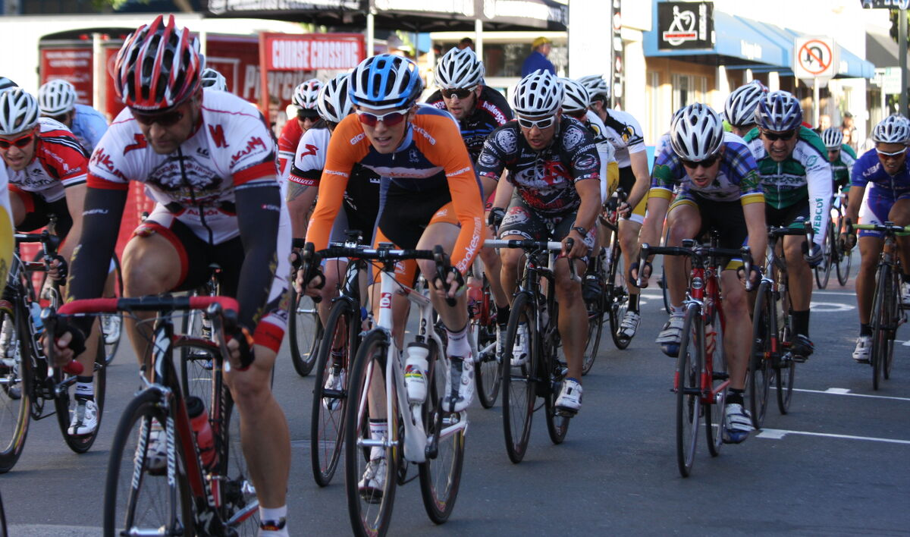
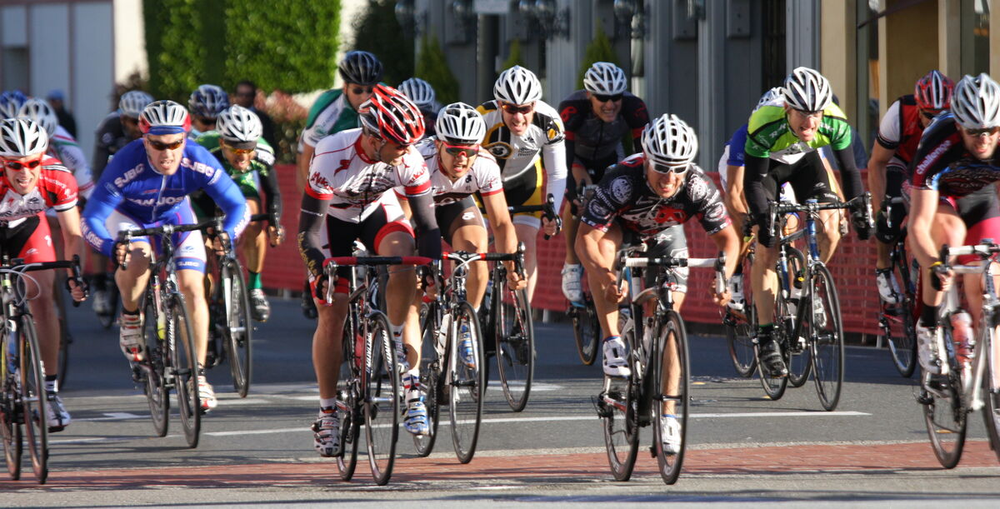
