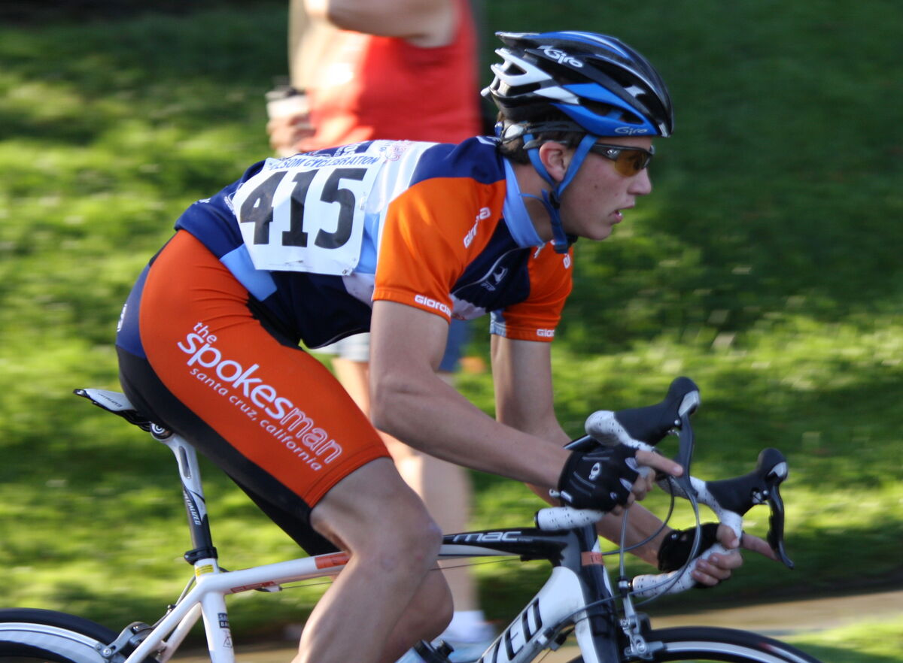
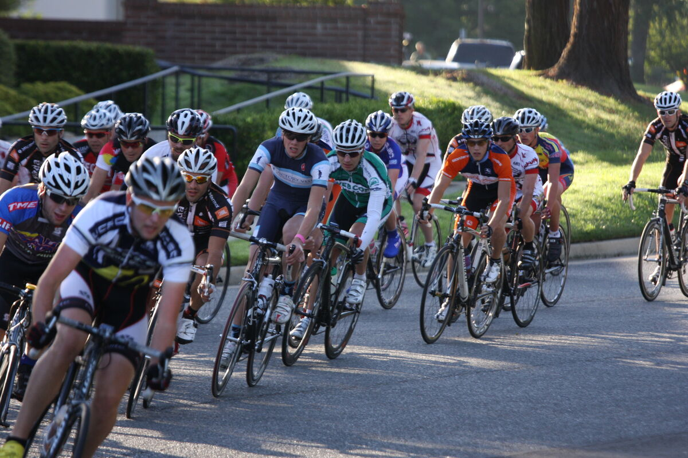
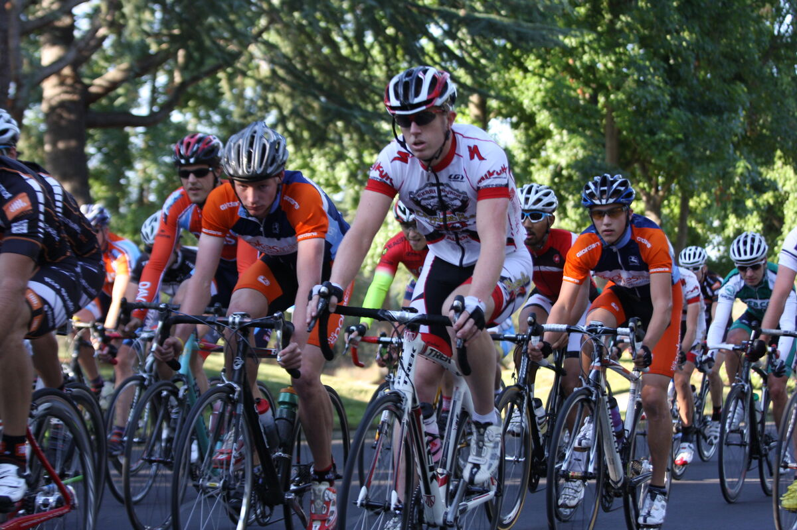
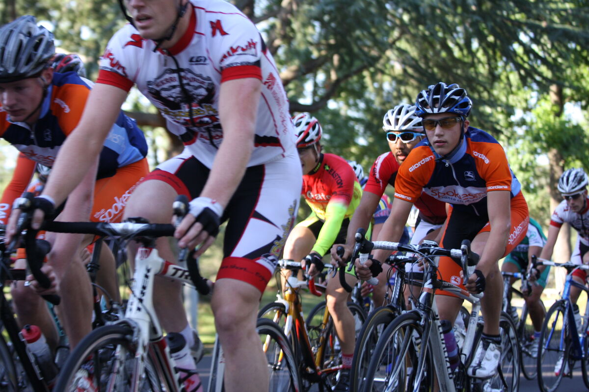
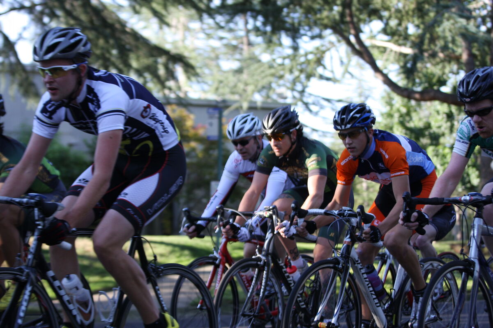
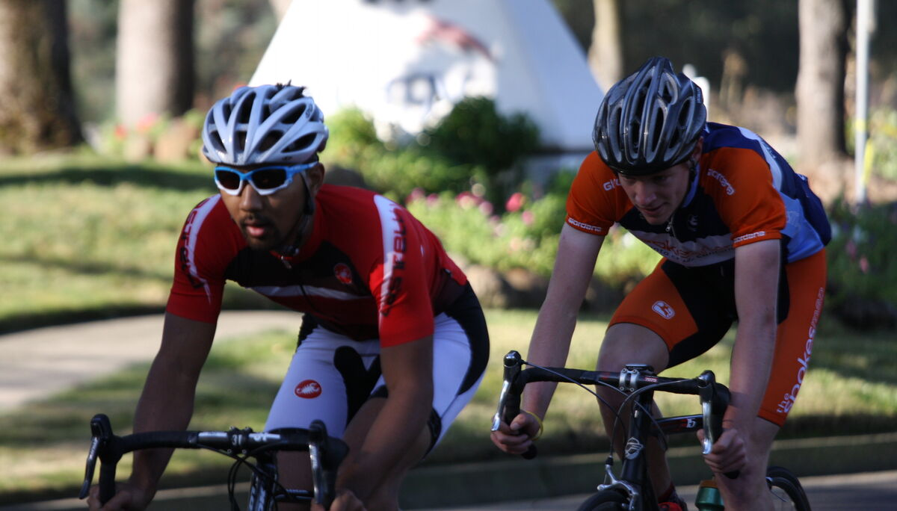
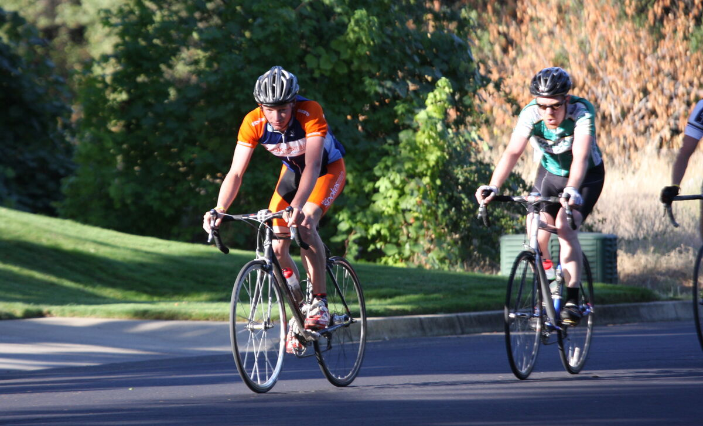
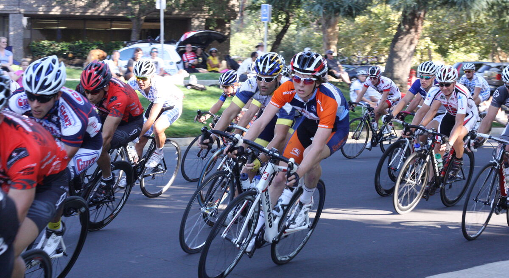

+++
date = '2011-09-17'
title = 'Folsom Cyclebration Omnium'
author = 'David Multer'
authors = ['David Multer']
tags = ['story']

[cover]
image = "01.jpg"
+++

Gabe, Bryan, Mack, and Matt are headed to the Sacramento area for the Folsom
Cyclebration Omnium this weekend. It's a great chance for most of the team to
hang out and race together, though we're definitely missing Tobin and Jake.
The first race for Gabe is the criterium, with the time trial later in the
day. No break could stay away today, and Gabe had some challenges moving up in
the pack when he needed to. A decent mid pack finish, so chalk it up to more
race experience.

