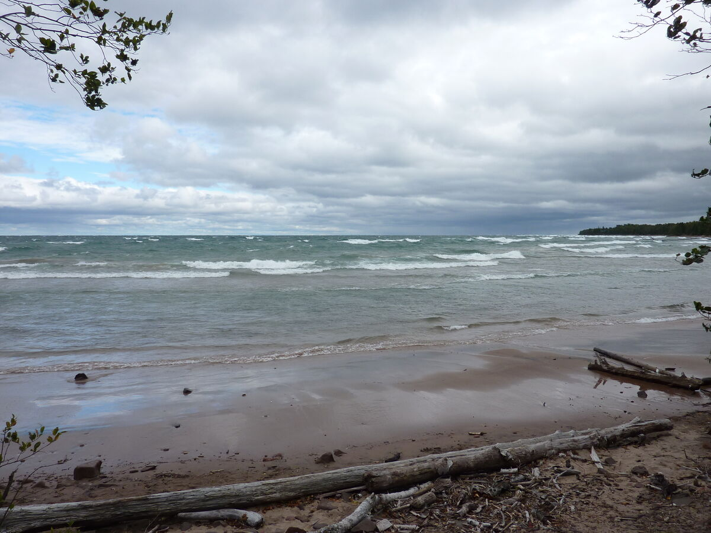
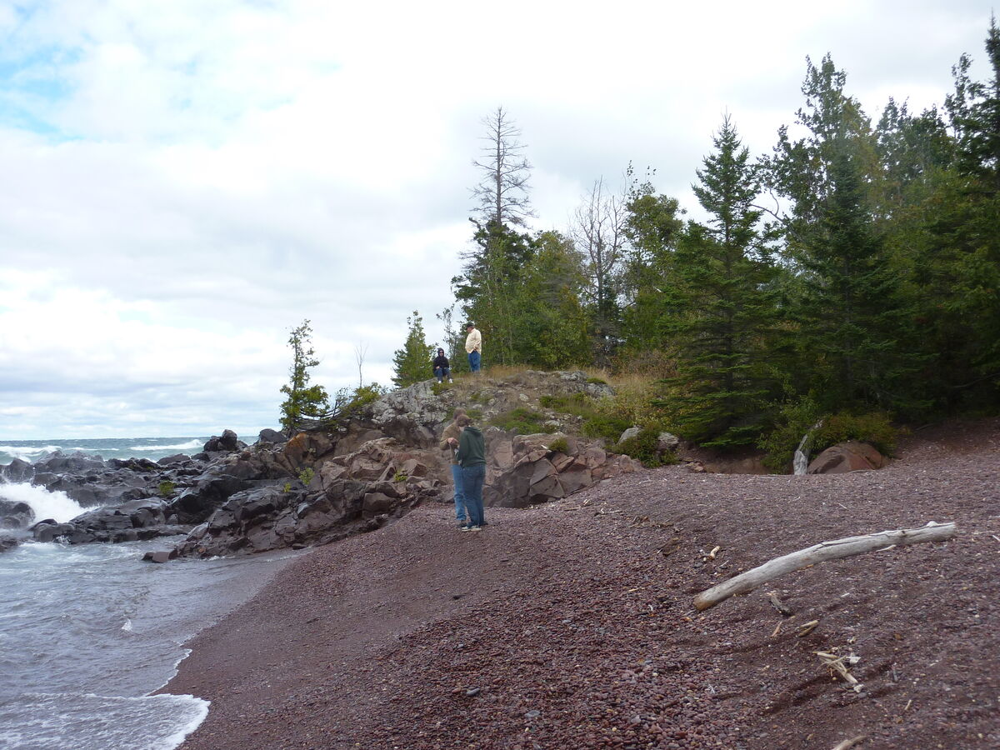
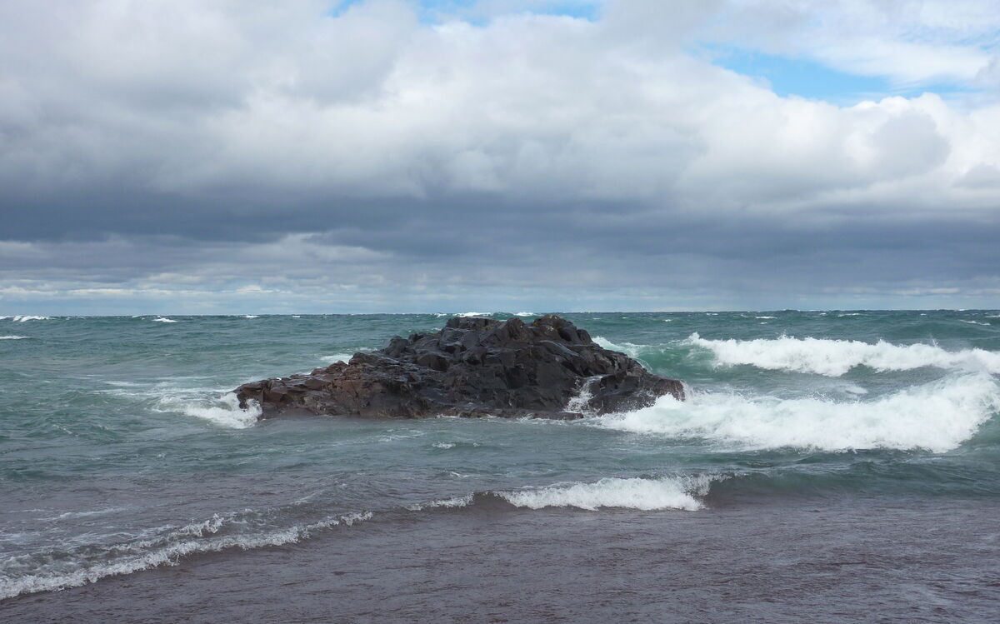

+++
date = '2011-09-04'
title = 'Hiking at Seven Mile Point'
author = 'David Multer'
authors = ['David Multer']
tags = ['story']

[cover]
image = "01.jpg"
+++

I'm traveling to Upper Michigan again with Charlotte on her regular trip to
bring Gordon back to Capitola. We're planning a week of hiking and exploring
in Isle Royale, but we have a day or two before we leave. Charlotte shows me
her latest discovery for hiking and agates over at [Seven Mile Point]
(https://northwoodsconservancy.org/NWC/Seven_Mile_Point.html)

