+++
date = '2012-02-12'
title = 'Fremont Early Bird Criterium'
author = 'David Multer'
authors = ['David Multer']
tags = ['story']

[cover]
image = "01.jpg"
+++

Today we're heading out to Fremont for some early season racing. Gracie is in
training to become a bike racing dog. And Gabe takes off in the Cat 4 field.

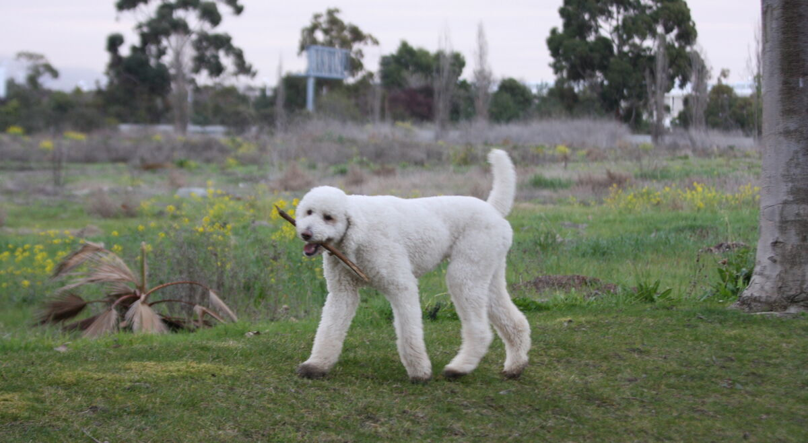
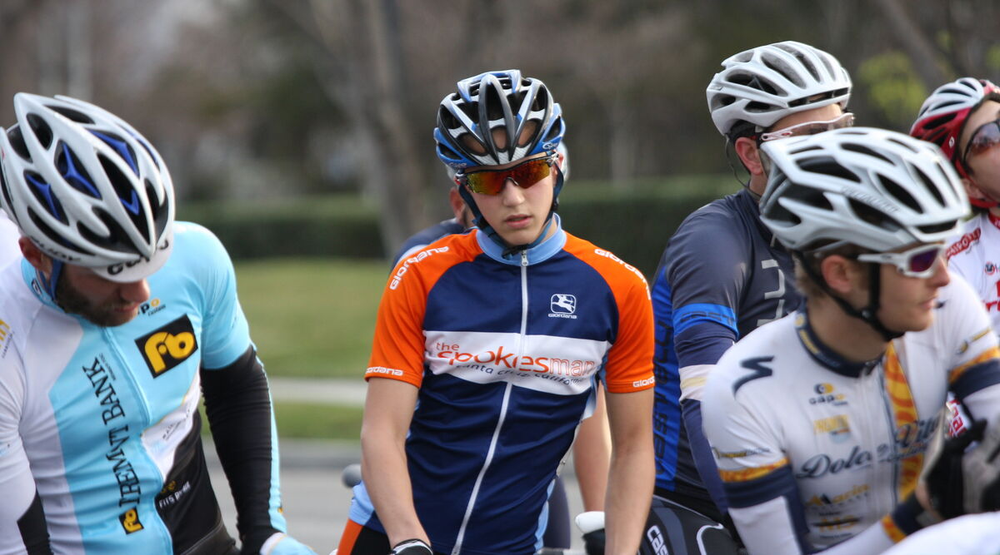
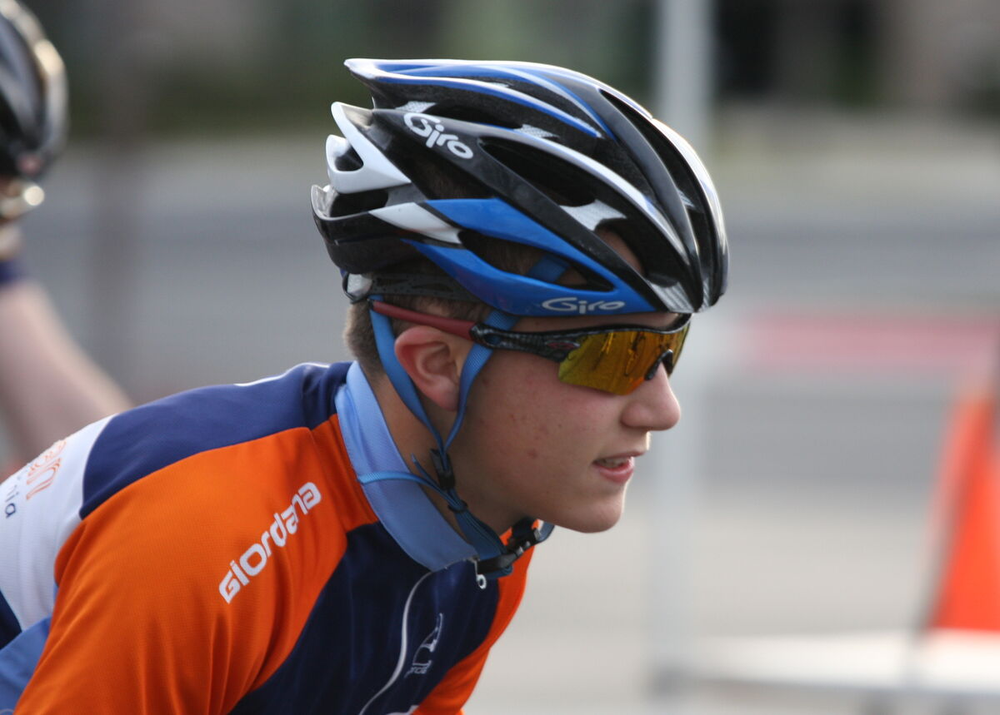
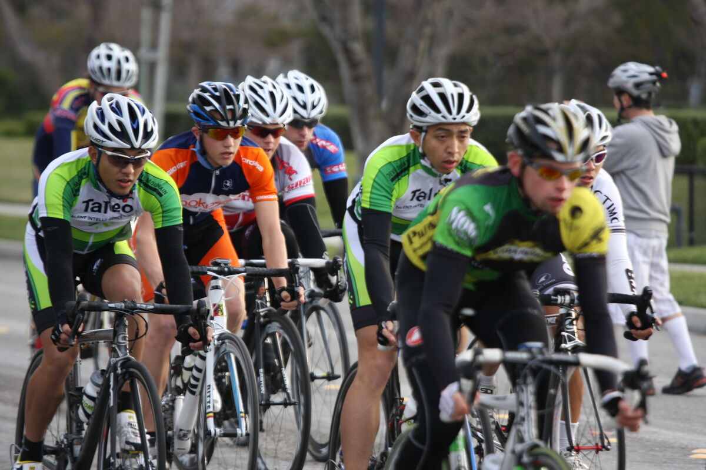
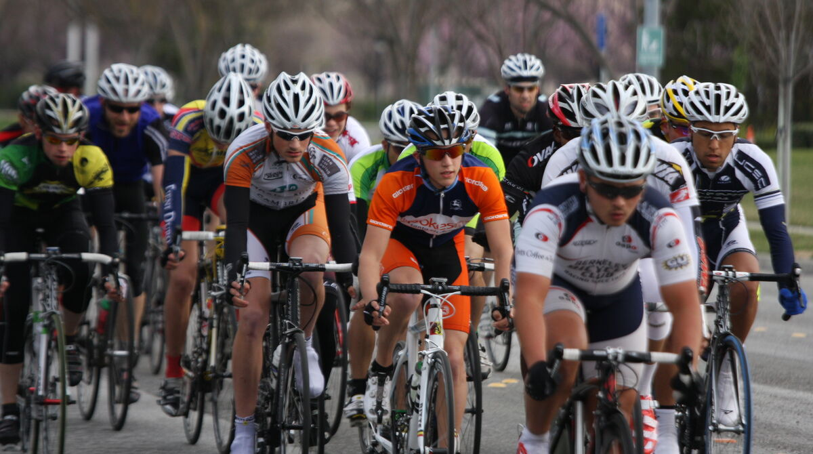
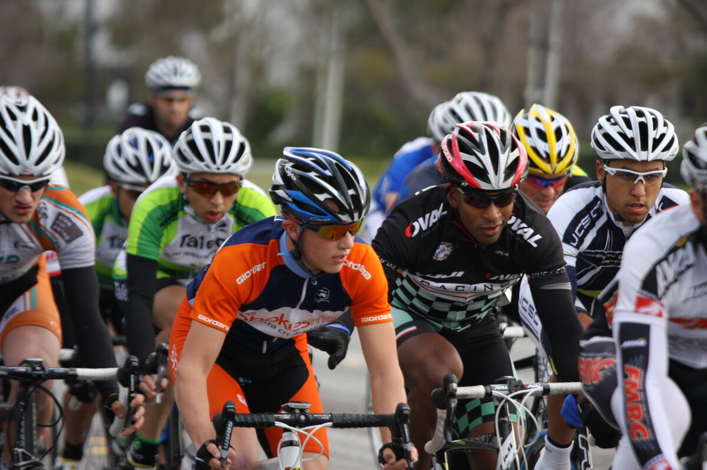
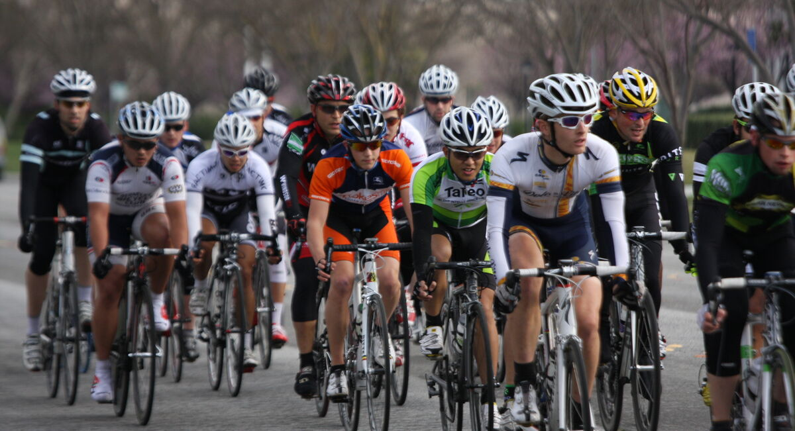
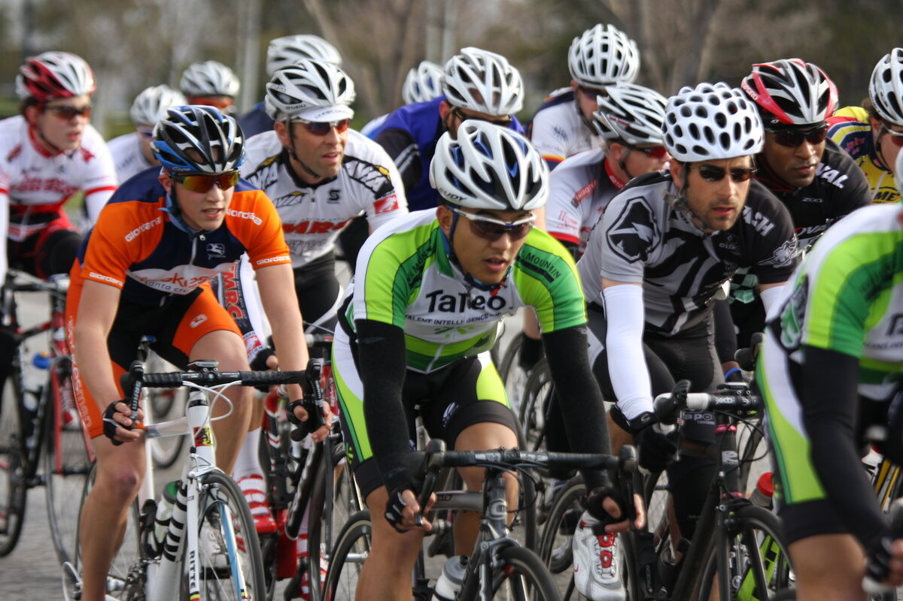
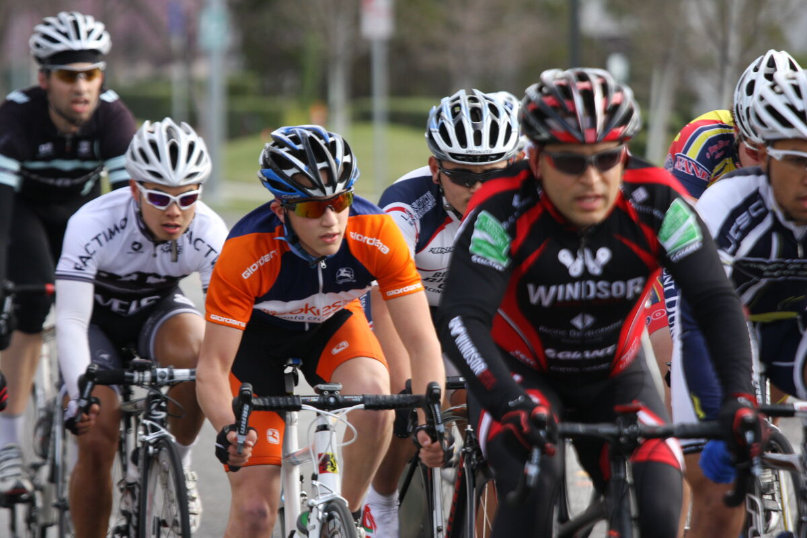

Later in the day it's time to have fun racing with the juniors.

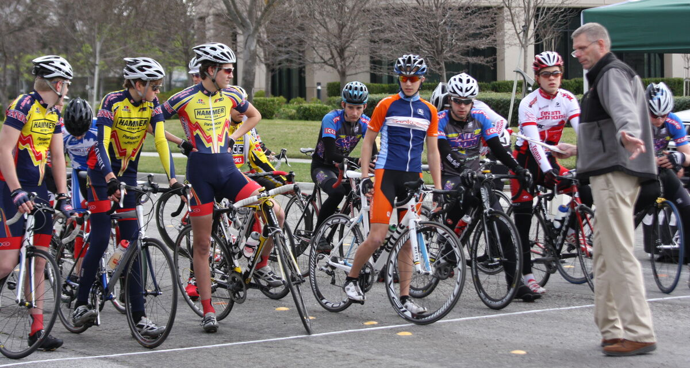
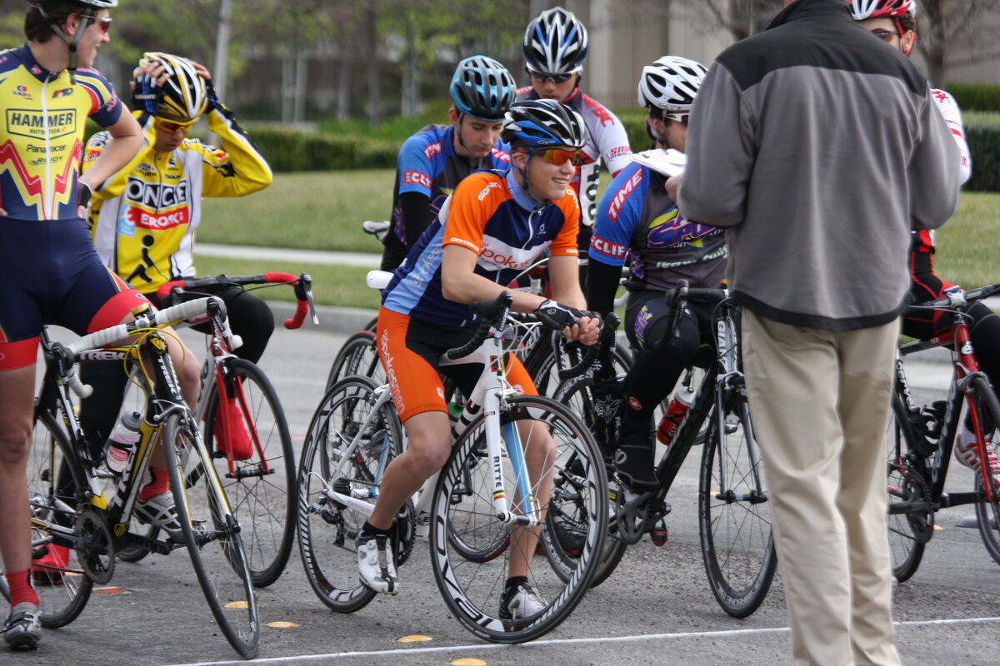
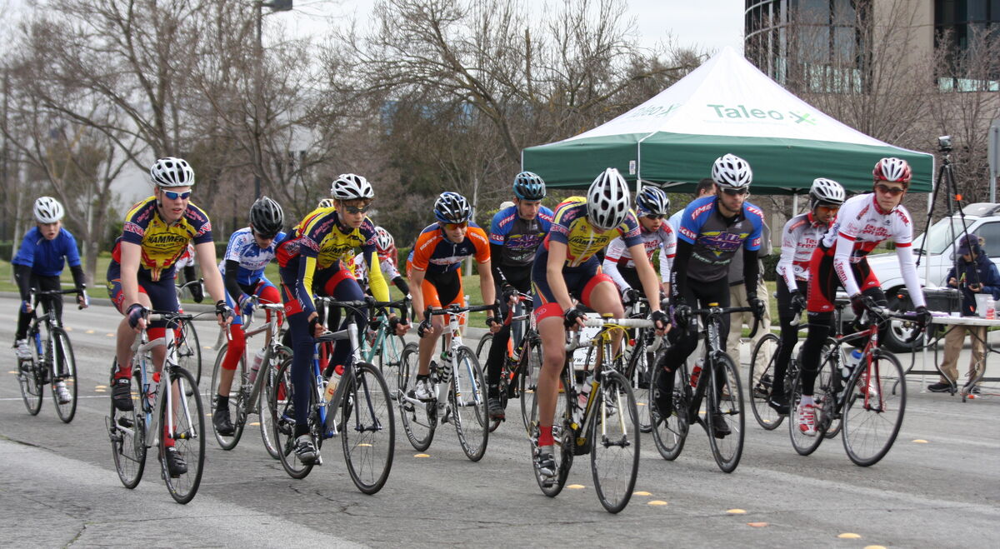
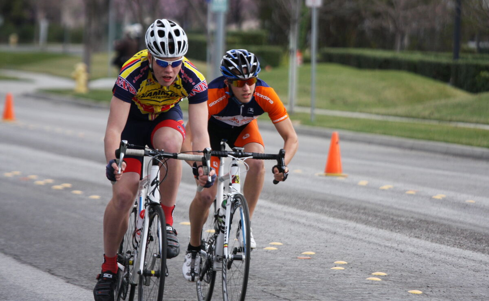
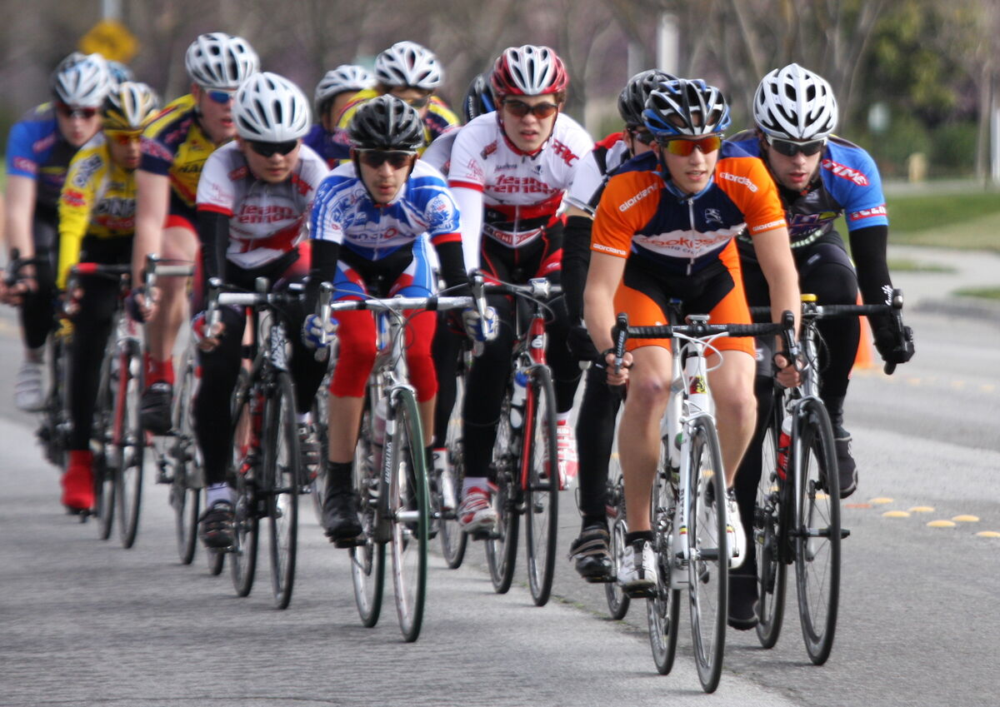
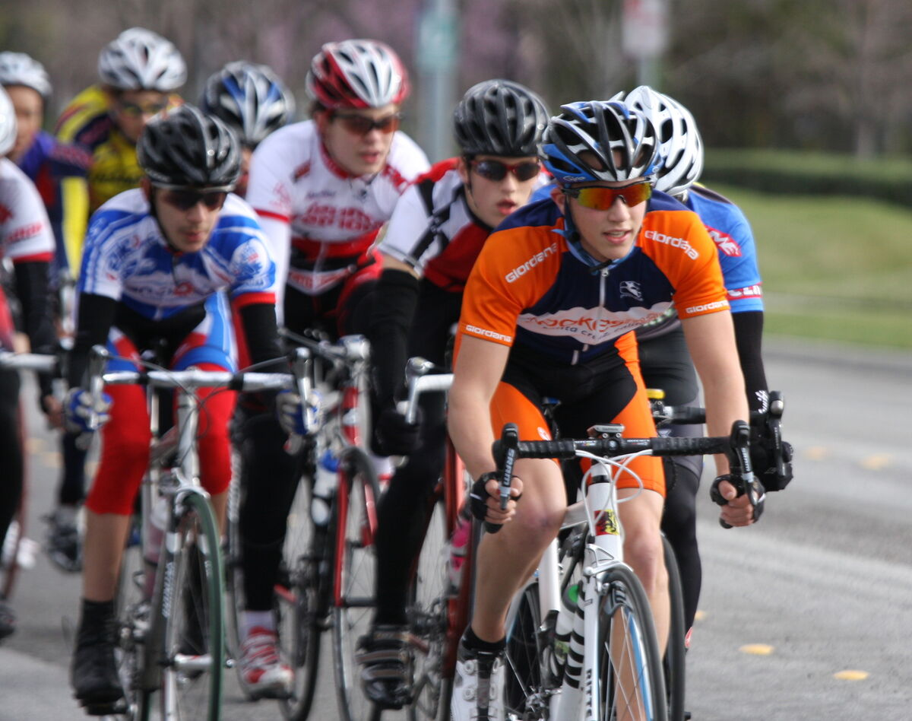
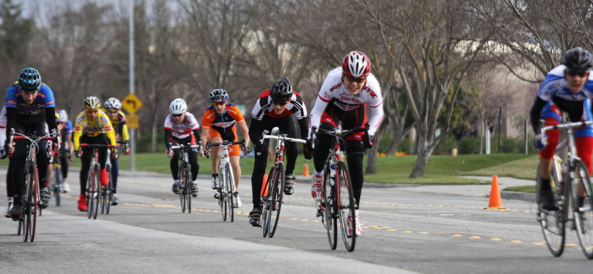
