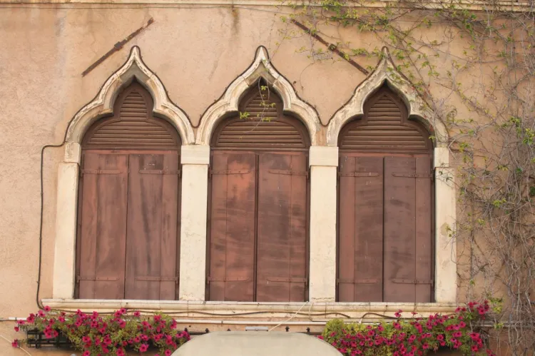
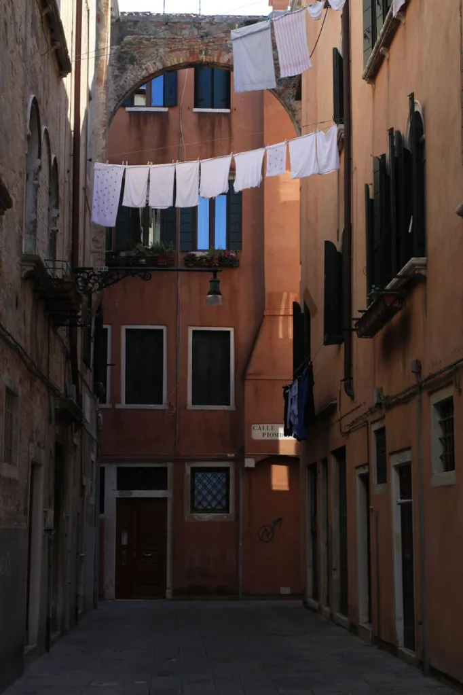
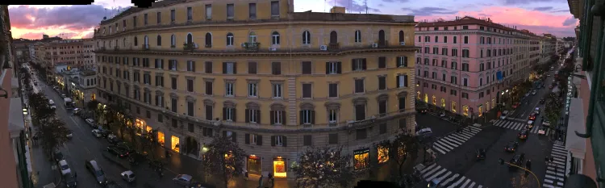
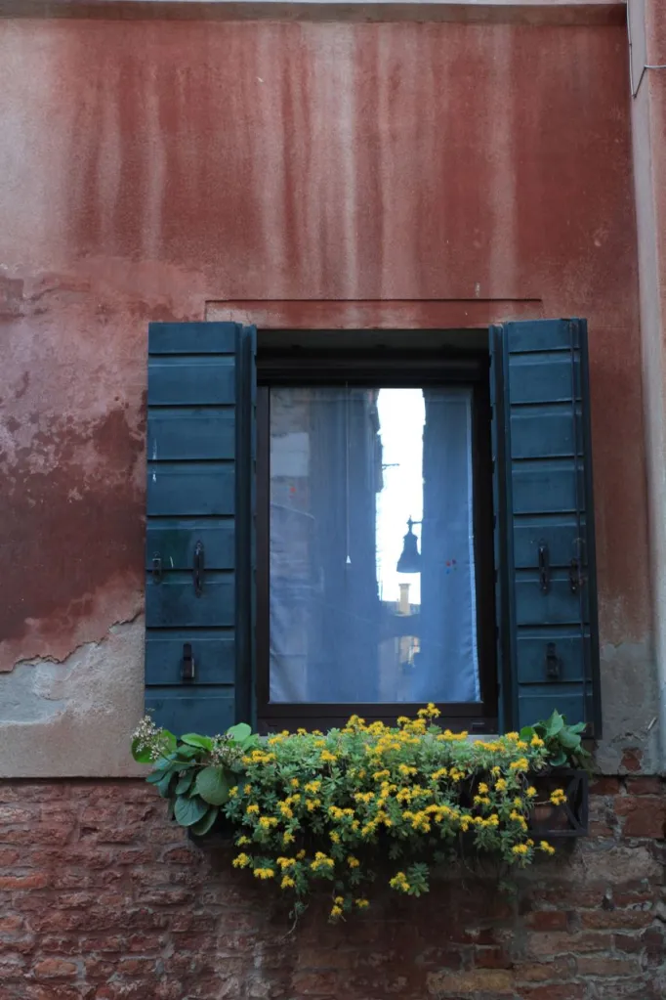
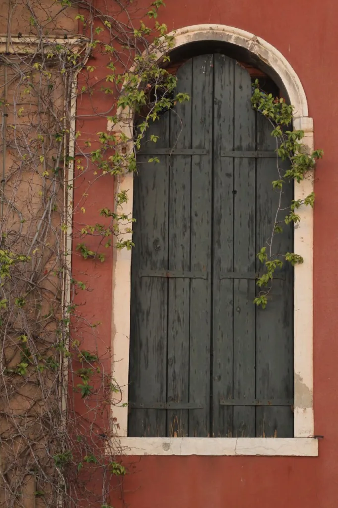
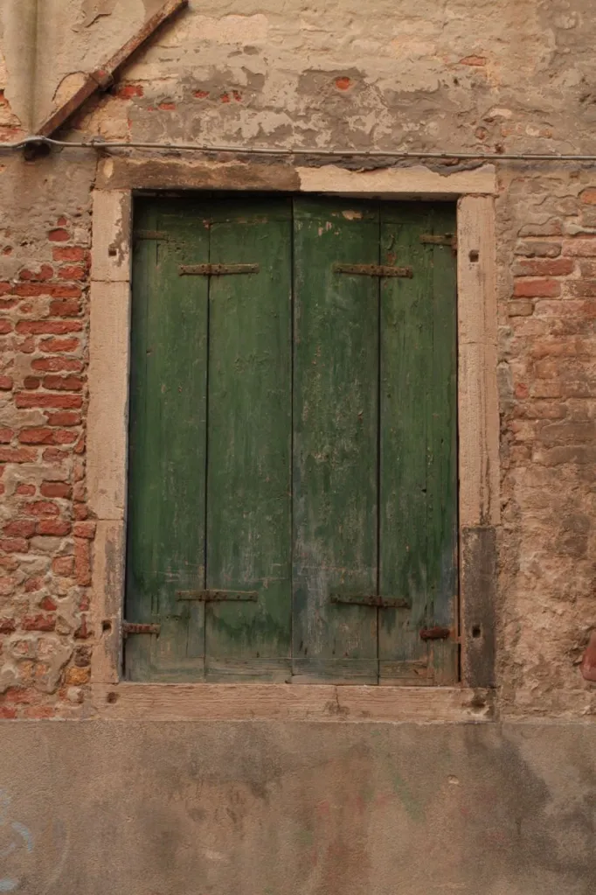
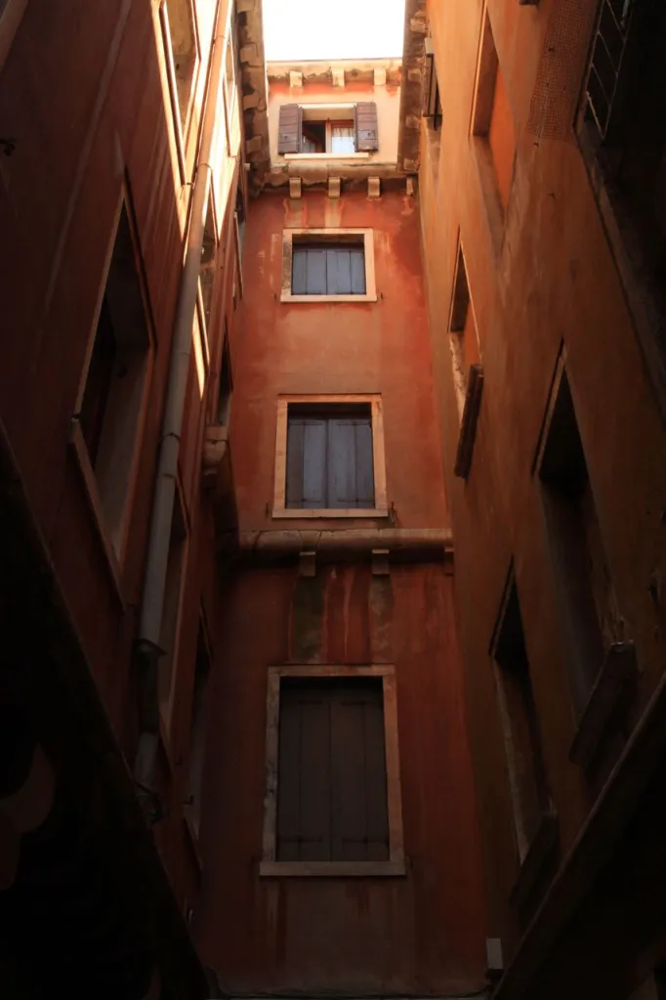
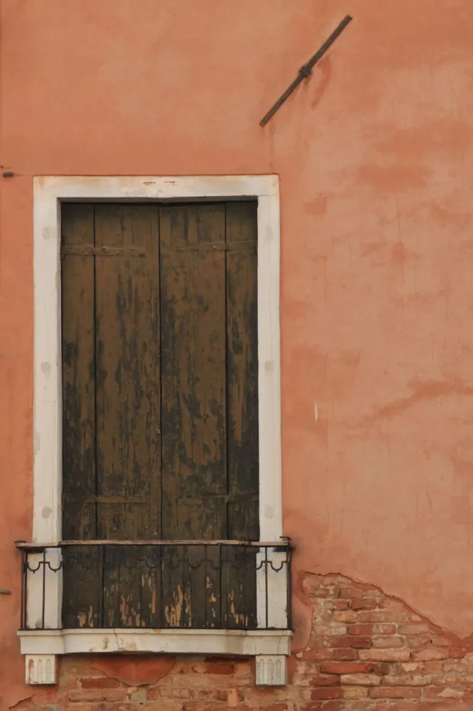
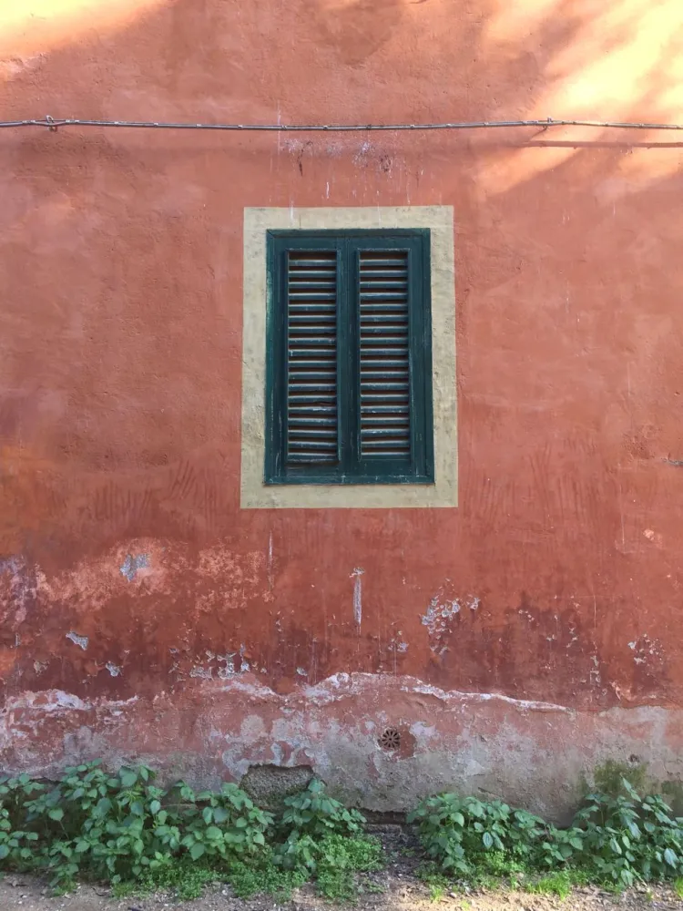
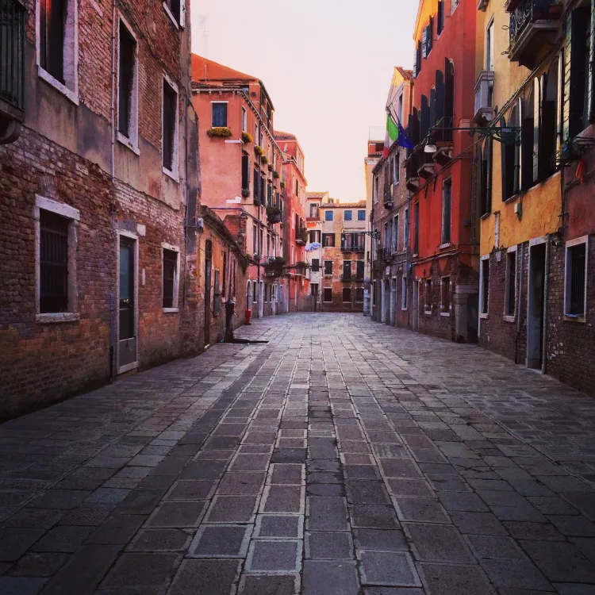

+++
date = '2014-05-15'
title = 'What the Window Frames'
author = 'Monica Multer'
authors = ['Monica Multer']
tags = ['story']

[cover]
image = "05.jpg.webp"
+++

Some of my favorite things about my apartment in Rome are the windows that open
wide to look down on the bustling street of Cola di Rienzo below. Windows,
shuttered, unshuttered, glass or iron grated, dominate the facades of most
buildings in Rome. Tourists photograph them, sometimes not even knowing why. I
count myself among this lot. Windows in Italy in general are beautiful, and
there is something magical about them in an ineffable way. I feel compelled to
take pictures of beautiful windows in the same way I feel compelled to take
pictures of sunsets; it isn’t just for the beauty, there is something else I
am trying to capture that I simply cannot explain. A mystery surrounds it,
maybe it is what lies behind the shuttered windows, maybe it is the fact that
behind every closed window lies a home, a world’s center, in which countless
memories, experiences, and tiny everyday moments occur that I may never know
about.

But now I find myself in the curious position of being on the other side of the
window frame. I am lucky enough to be one of the lives that exist unseen from
the looker-ons below on the top layer of windows that speckle the Roman façade
of this apartment building. I am the one within the window looking out, the
one hidden from those looking on from outside. What I have discovered from my
perch above the streets of Rome is that even on the inside, you never stop
looking. Just as those down below crane their necks to look to the windows
above, those behind the windows are still looking out, either up or back down
below.

I am not alone in this either, I see my neighbors, and the people across the
street in the apartment buildings all around my own, and they are always
looking. There is something unique about the look of a watcher, something that
speaks of a desire that comes from an unknown place in your soul. A searching
soul. They know not what they are searching for, but they are endlessly driven
to look, never knowing the origin or the destination, only knowing the face of
what they seek when it is right before them. Then and only then is it clear
where or what our seeking eyes were wandering towards.

People will come to their windows, some will throw them open with grace of arms
opened wide, others stand behind the glass with their nose only centimeters
from the glass. Others emerge onto flower covered balconies, resting their
elbows on the wrought iron fences that mark the outer limits of their personal
world, turning their head this way and that endlessly. But the most important
moment of looking isn’t the approach, or the slow wandering of eyes over what
there is to survey above or below, it is the moment that person turns away.
There is a strange pain in that lingering moment, the desire to never stop
looking, but pulled by the weight of other everyday necessities, the seeker
slowly turns, the body twisted, but the eyes remain looking over their
shoulders. Seemingly unwilling to stop the never-ending search, hoping that in
that last moment of looking the object of desire will be made know. But often,
nothing illuminates itself, and the seeker sadly turns and walks back into
their home to return to the normal everyday actions that beckon back inside.

What intrigues me even more than watching the other seekers from within their
window frames, are the windows that remain shut. The windows that, even if the
window shade is not drawn, no seeker ever comes to peer through the glass onto
the world below. There are so many seekers, and over my months here I have
come to know many of them as they come forth from their homes out into the
light to look, but there are still more yet, that even though I see movement
in their occupied homes, they never come to the window. These people are the
ones that make me wonder. Do they have nothing to seek? Did they not hear the
call of their soul to search? Or did they already find what their soul was
endlessly searching for? Those windows interest me, the ones who seem to have
no need to seek.

What the window frames will always be a mystery to me, the common thread that
ties my life to all of those in the buildings around me. We are always
searching together, maybe for different things, or maybe we are all searching
for the same thing, maybe we seek each other, or maybe we seek to be seen. I
do not have the answer only the ability to recognize the yearning in almost
every window that surrounds me. A community of strangers, linked in this tiny
habit, but unknown to each other in our independent worlds that just keep
spinning even in those small moments where the seeker takes a moment to poke
their heads out of their world in search of something other.

If every window holds a world, then every building is its own universe, and I
have found myself an explorer of worlds, desiring nothing more than to know
the contents of what lies beyond the window just as an astronaut strives to
discover new planets while drifting in the dark empty cold of space, knowing
that there is more to life than your own little world.

