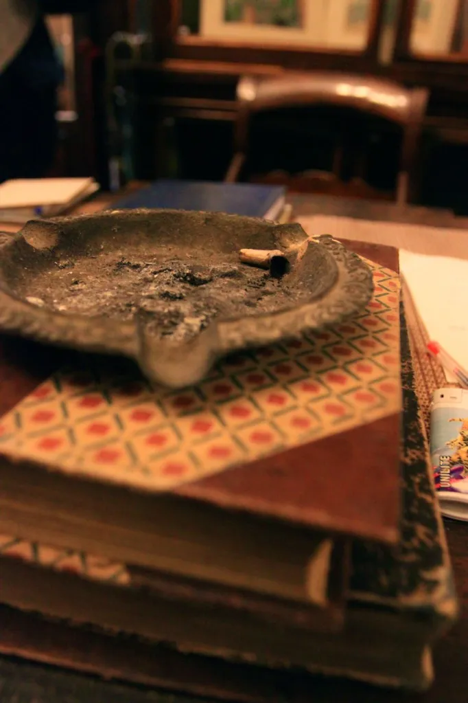
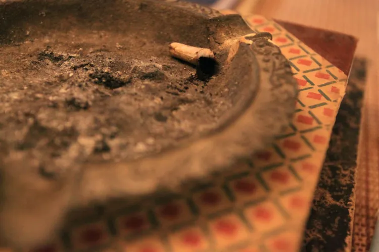

+++
date = '2014-05-15'
title = 'Burnt Sacrifice'
author = 'Monica Multer'
authors = ['Monica Multer']
tags = ['story']

[cover]
image = "01.jpg.webp"
+++

Smoke hangs in the air like the lazy wispy breath of a dragon left dormant, but
dangerous. Filling the highest corners of the room, wrapping itself around you
like a soft caress of a lover tracing the line of your cheekbones with tender
ghostly hands. You pick up the books, each page carries the sent of cigarette
smoke from the shop owner who sits languidly with his feet up on the small
modest desk, the slight remnants of mud dripping from his work boots onto
loose papers scattered haphazardly around the desk. Chair tilted back, one arm
across his chest, the other cocked with the cigarette held like a smoking gun
before the hazy grin of the warden of the books locked away behind glass
cabinets. His wrinkled eyes squint with the stretched grin of a man who has
seen too many things, watching the people as they come and go, enter only to
leave, but the books remain the same. Slowly soaking in the poison fumes of
his cigarette, which languidly rolls off the cherry red embers of the burning
end, the books have been drinking the bitter taste of cancer for so long it
has begun to taste sweet again. 

The warden flicks his hand sending the blunt withered end of the spent
cigarette cascading into its pit of ash. Like an offering to the Gods, this
burnt sacrifice has left only ashes and the smoke, the ghost of an offer, left
to wander the pages of the books for an eternity of antiquity.

Disposable, discardable, and undesired, the remnants of a sacred offering
turned to decay before the coals could fully die away. The slightest hint of
red still pulsing in its dying frame. The man who cast the smokey ghost to the
ceiling of the room, who, through cracked lips breathed the ghost into being
from lungs grown slick with tar. He is a modern day dragon caught amongst his
sacred treasure trove of books. But like the dragon that hoards his treasure
until the end of his days, the dragon of smoke pillars, the keeper of books,
this creature not only destroys himself but brings ruin to the books that grow
weathered with curling brown pages tainted and torn by the breath of a dragon
left floating in the air.

Yet how sweet the smell has become, how romantic this hazy den of treasure has
grown, like the lull of sweet sleep before the eternal slumber finally pulls
you down. Is this how it will end? With a moment of glorious transformation,
in which the bitter becomes the greatest and most just of desserts that has
ever come before my seeking hands? But maybe not on this cold day, where the
smoke constricts yet warms my face like the kiss of a caring grandmother rough
like sand paper against my cheek.

The dragon smiles behind his desk, watching with leering eyes my path that I am
led down by the smoky trails of a ghost I cannot seem to grasp. Intoxicated by
the warmth of its seking, the spell only broken with the ringing of a bell.
The front door opens, a rush of fresh air, the awakening of reality as the
smoke escapes through the door and I follow suit, leaving the dragon behind
the door as he reaches into his desk, pulls out a new cigarette and witha
flcik of his hands, the very same gesture he used to discard his offering,
lights another cigarette a new. His eyes watch me through the glass as the
cigarette burns red again, he tilts his head back letting out another fresh
plume of smoke between grinning teeth. The dragon has begun again.

