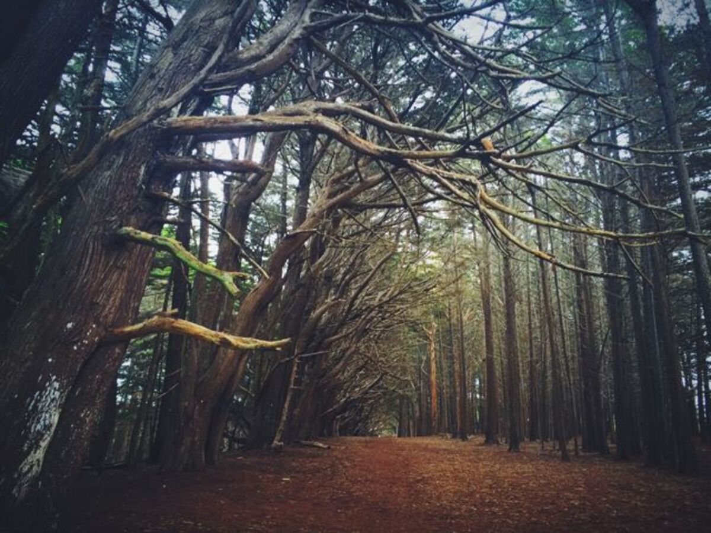

+++
date = '2015-09-14'
title = 'Back to the Beginning'
author = 'Monica Multer'
authors = ['Monica Multer']
tags = ['story']

[cover]
image = "01.jpg"
+++

I want to begin again.

I know I have been gone a long time now but I miss this. I miss the feeling of
my fingertips pressed against keys or pushing my pencil to the barren page. I
miss having a place to put my words, a place to rest my weary head stirring
with mercilessly jumbled thoughts. I miss knowing that I am doing exactly what
I was put on this world to do. I have found myself purposeless these last few
months, maybe even the last few years of my life and I am the only one to
blame.

Thousands of excuses, busy days, hectic life, reorganized priorities, and a
ceaselessly transforming sense of self have created a convoluted conundrum
that I have self-titled ME. Here I stand six years after I began this blog and
I am ashamed of how little I have written. Over the last four years I have
found many new titles for myself: UC Berkeley Student, English Major, Jew,
Christian, Proud Nerd, Tutor, Employee, World Traveler, Rome Resident,
Slackliner, Rugby Player, Slam Poet, Academic Honoree, and finally, UC
Berkeley Graduate.

There are two titles that once meant the world to me that seem to have dropped
from this list: Writer and Photographer. While yes, I have done both of these
things over the past four years, I set them aside to see what other molds I
could occupy, other worlds I could be a part of and inhabit for even a short
amount of time. Those two words, writer and photographer, were my entire world
and I never thought I could do or be anything else.I have found out two things
over these last four years: I was both very wrong and incredibly correct. I
have been a so many different things, but I don’t want to be anything else.

My friends who also graduated have been asking themselves and people have been
asking me How have I changed in the last four years in college? I have heard a
variety of responses; most respond that they have changed radically in
unbelievable and unpredictable ways.   Others mildly agree that they have
changed, but not necessarily in a world shattering manner that leaves them
aghast at how incredibly different they are now than the young freshmen
walking under Sather Gate for the first time. I have pitted myself against
this question several times and battled with the memories of who I was and who
I am now. I have come up with a response that surprised myself: I have not
changed at all.

This is not to say that I have not tried new things or had experiences that
altered the way I view the world. What I mean by this is that I started at
point A of myself, entered college and departed from point A into a million
different directions and digressions that led me to very strange and
unfamiliar places, which have radically affected me. However, in all of these
different circles and loops off of the trajectory I had envisioned when I
graduated high school, I have found that the root, the core of what made me me
never changed. So, in saying that I have not changed at all, I am not
declaring this a negative lack of progression or growth in character. Instead,
in discovering this, I have also relearned how much those two titles meant to
me because they were absent from my life for so long. I would never take back
the things I tried, the hobbies I took up, and the adventures I had into the
vast unknown world full of different opportunities, but I did lose an
important part of myself as a result.

I was lost in the craze of a thousand possibilities and the path that had
always been so clear to me before was obscured. Like Dante, “Midway upon the
journey of our life/ I found myself in a dark wood,/ For the straightforward
pathway had been lost” (Canto 1, Inferno). Except I, unlike Dante, had no
Virgil to guide me through the perils. But if there is one thing that I have
discovered in my wanderings, it is that being lost is the best way to find
yourself. Being lost is not necessarily a bad thing; for me, it did mean
losing sight of the things that were most important to me, but if I had not
put those pursuits on the shelf for as long as I did, I never would have known
just how much I needed and loved them. It was only when I found myself lost
and without my purpose that I was able to understand just how essential
writing was to my entire existence. Writing and digital storytelling through
my photography truly is my purpose above all else in the world, without it I
am not really me. This is what I have found.

So here I stand, wholly changed, yet exactly the same and ready to begin
again.

Welcome back to my strange little world; walk with me, talk with me, cry with
me, and learn how to live again with me on this unexpected journey. I am ready
to claw my way back to the roots of my being and strip away the atrophied
muscles of my mind in order to find the words that have been buzzing in my
brain, dormant but living, for the last four years.

Join me.
