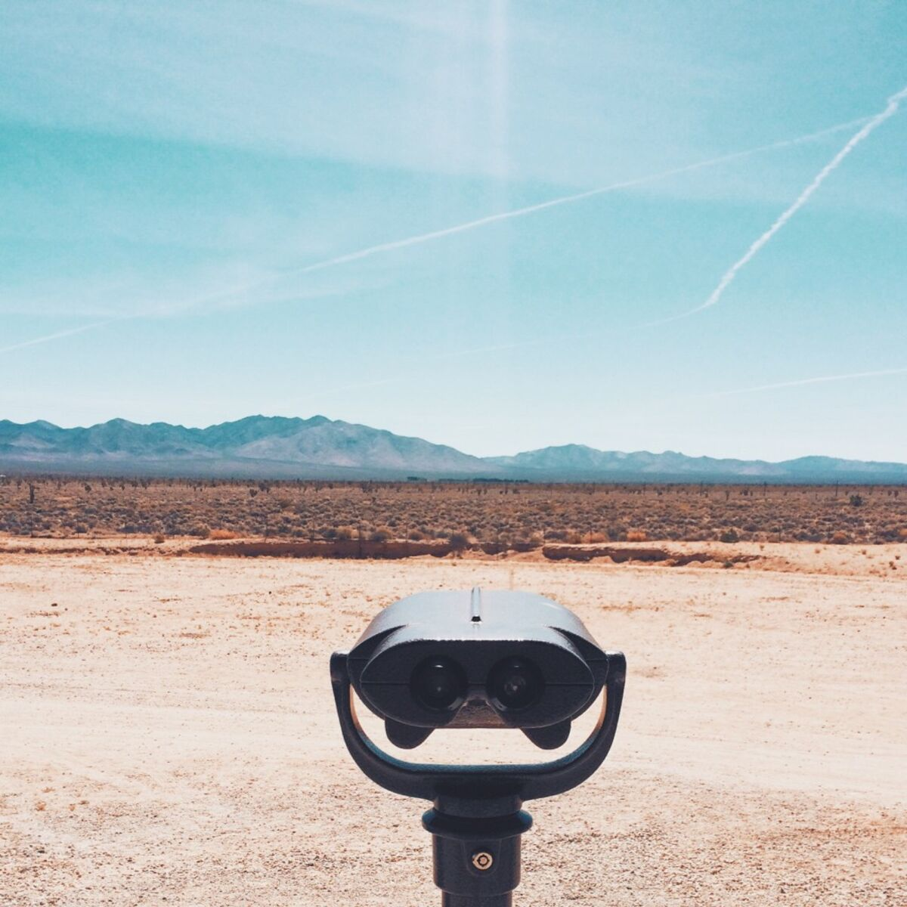

+++
date = '2015-09-16'
title = 'The Weight of Lives I am not Living'
author = 'Monica Multer'
authors = ['Monica Multer']
tags = ['story']

[cover]
image = "01.jpg"
+++

One reason I have decided to resurrect my blog is to document my cross country
solo road trip. Today I hit the road and won’t find myself back on the West
Coast until I have climbed the mountains of Colorado, rolled in the fall
leaves of Northern Michigan, put my feet to the pavement of New York City,
driven nearly the entire length of the East Coast, let the Atlantic Ocean wash
the dirt from my tired feet, sipped a cup of coffee at Cafe Du Monde in New
Orleans, and driven all the way back home. In total, I should be gone for
about three months. Just me, my Prius (nicknamed PriPri), vast open expanses
of road, and any adventure that finds me along the way.

The main question I have received upon telling people this (after clarifying
that yes, I do actually plan on doing this and no, I am not crazy) is WHY?

And this question is not unjustified either, I have asked myself the same thing
over and over again as the date of departure creeps closer and closer. I will
be the first to admit it, I am terrified. I can make this trip sound so
romantic, dreamy, courageous, and many other enviable traits, but the reality
is that this is scary; this is going to be extremely hard. There are going to
be days I will wish that I had never left home, never gotten out of my bed,
never said goodbye to my parents, and never abandoned everything that made me
comfortable in life. There is one thing that I know even though the trip has
not yet begun: I will never regret this decision.

I could have stayed at my job in the Bay and lived comfortably, but this is the
path I have chosen. So to answer the ubiquitous question, which follows me
like a shadow wherever I go, I have four things to say.

1. **I can hear my bones straining under the weight of all the lives I am not
living.** This quote from Jonathan Safran Foer’s Extremely Loud and Incredibly
Close has resonated in my heart like the rattle of little Oskar’s tambourine
since I first read this magnificent book my first year at UC Berkeley. My
bones, my body, my mind, and my spirit ache with the weight of not knowing the
many paths that my life could lead me down. I plan to go to graduate school
and get a doctorate and after that seek a professorship for the rest of my
days. While a majority of the people I know are now desperately pursuing a
lifelong career, I have found myself unwilling to tie myself to one thing.
There are so many things in life I want to do and be that after graduate
school I may never get to experience. So I have decided to put real life on
hold and go adventure for a while. I do not want to be one thing, I want to be
many and I hope to never cease changing in my life. As an English major
(aka major book nerd) I have always felt that the most amazing result of
reading is that the reader is able to live a thousand different lives through
the novels they immerse themselves in throughout their own finite life. I have
lived the lives of others both real and imaginary, some more than once, but I
have yet to live my own.

2. **Desperately seeking self.** Perhaps it is cliche
to seek yourself on the open road, or perhaps there is a wisdom in this
repetition that proves success. I never feel so inspired than when my wheels
are spinning on the pavement and my mind is whirling with thoughts heavily
lined with the experiences of yesterday. A solo road trip is obviously a lot
of alone time, which both terrifies me and intrigues me with the possibilities
of unformed experiences. I have to communicate with me; there is no way around
it, no where to run or hide. I am an introspective and introverted person, so
this isn’t exactly new to me, but lately I have found myself wrapped around
the fingers of others. As time has passed and I have dedicated less time to
writing and creating, I have found myself throwing all of my time into others.
This is not to say I should not have done this, or that I regret doing this,
but I have lost the confidence in being alone that I once had. I have shelved
my purpose, my pursuits, and my identity for far too long and traveling alone
allows me to be selfish in a way I have not been able to be in a long time. I
want to recover the entirety of who I once was and learn how to live a life
that is fully mine.

3. **I am a strong young women building my inner independence from the ground
(or road) up.** Let’s be honest, the main reason people ask me why in the
world I would do this is the same reason I have to do this: I am a woman,
alone, and the world isn’t always nice to solo women trying to find their
place in the world. People ask me, aren’t your parents scared for you? and I
can see the real question in their eyes and implied in their words, there is a
lot of danger that I am courting just because I am a young woman with no one
to watch my back, no one to protect me, no one to stave off the danger of cat
calls, rude and greedy eyes, lecherous thoughts of strangers, and the
unknown/unpredictable mishaps that could occur on the road. This, however, is
the very reason I must go. Yes, I am a woman, yes I can do this on my own. I
am capable, strong, independent, cautious, wise, and fear will not hold me
back. I am a part of this world and I am going to take part in it. Hiding at
home will never change the way the world perceives women. To think that my
blog in any way will affect this though is naive and not what I am getting at.
What I want this blog to do over the next couple of months is serve as an
example that women can do anything. I am just one of many women who has chosen
to take to the road alone and just as those women who have served as an
example for me, I hope that I can help at least one other woman see that they
can do it too. To help show just one person, even if that one person is
myself, that it is totally worth it is all I want to achieve.

4. **I am an adventurer and nothing is going to stop me, not even myself.** A
lot of people see me as someone who is unafraid, outgoing, adventurous, and
motivated. In truth, I struggle with all of these things greatly. But still, I
must go. Crippled by anxiety, scared, small, often sick, and indecisive, I am
horrified by things that are unknown and uncontrollable. But still, I must go.
Unable to let go of control and filled to the brim with nervousness, I am
unsure about everything I am about to embark on over the next few months. But
still, I must go. Why? Why. why. No matter how scared, nervous, chronically in
pain, or unsure I am, I am only sure that I must go. Because I am an
adventurer; because the road has been calling my name since my mother first
introduced me to it six years ago; because I am my own worst enemy and
adversaries exist to bring out the best in us; because I am not living my life
if I let my fear, anxiety, or illness win. These are the things I know. For
some reason my heart picked adventure and I cannot say no, even if the rest of
my being is against it. In some ways, this post is more for me than for you. I
am my harshest critic, the one with the most to lose in this, but also the one
with the most to gain. I guess you can say this is my manifesto, or simply a
reminder for those dark days when all I want to do is give up or cry in a
corner. This is my reminder that I can do this, that this is exactly what I
want and need, and that no matter where I find myself, I am still me, I am
still strong, and I will keep moving.

By the time you read this, I am already gone. Another white streak across the
sky, tumbleweed rolling down the road, a stranger in a car window disappearing
in the opposite direction. I will see you all again, some sooner rather than
later, and hope that you will embark on this journey with me in one form or
another.

Ultimately, there are a thousand reasons why I should not go and only one that
underlies all of the reasons of why I should: I must. I have told myself a
thousand times that I would and now it is hear and there is no backing down.
So here I go, down the rabbit hole. Unsure of where it will lead me, this road
is the path I have chosen; through all of the exciting loops and digressions,
through all the wrong ways and misadventures, through all the new friends and
unfriendly strangers, through all the beautiful sights I will see and the
empty expanses of nothing, I have chosen this path and now I must follow it to
its end.

