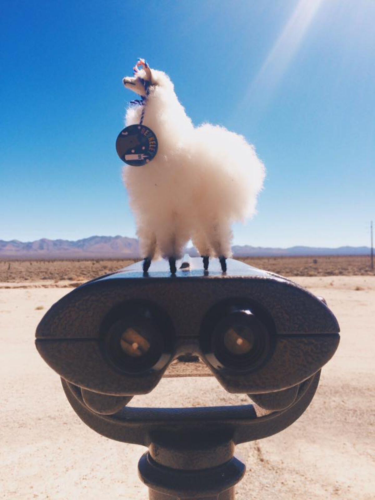
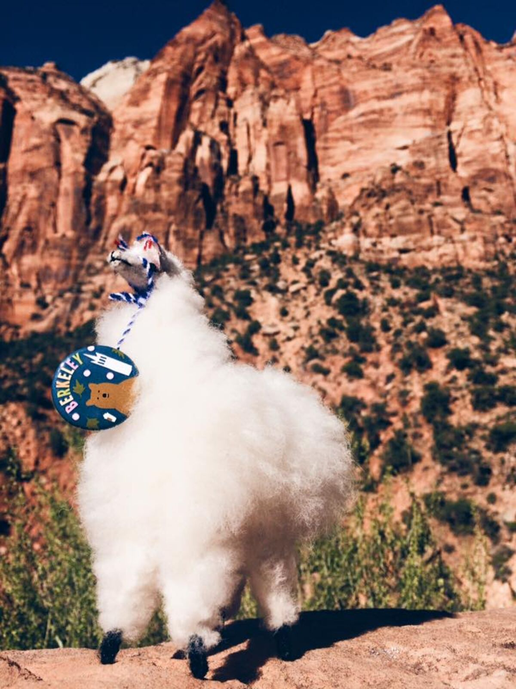
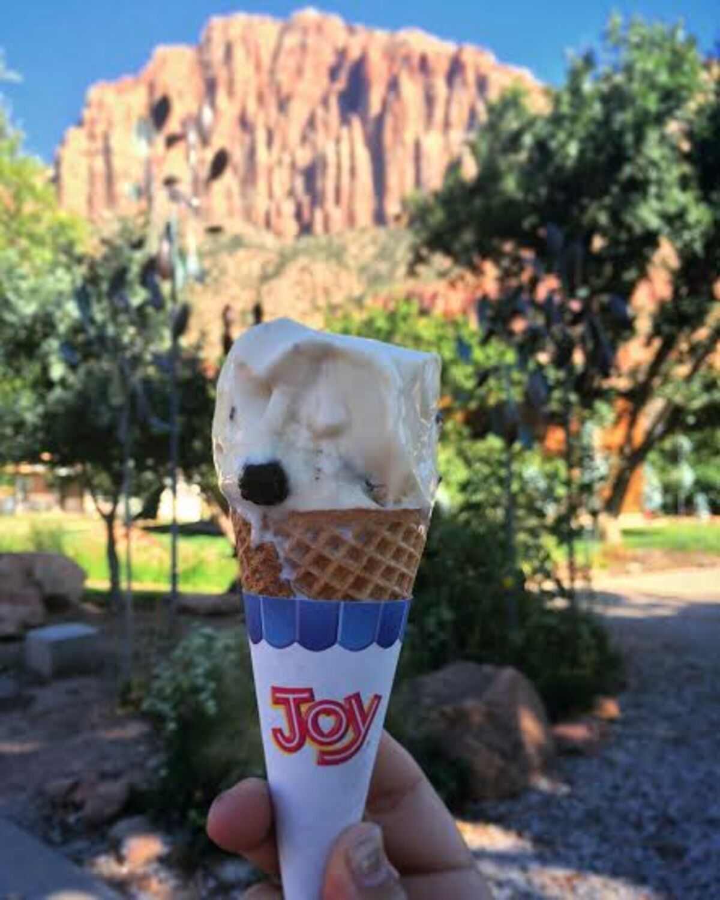
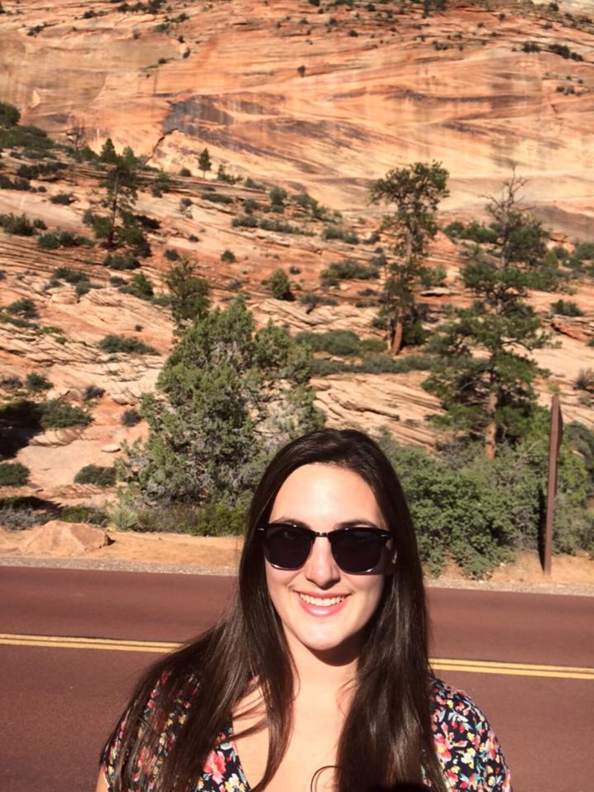
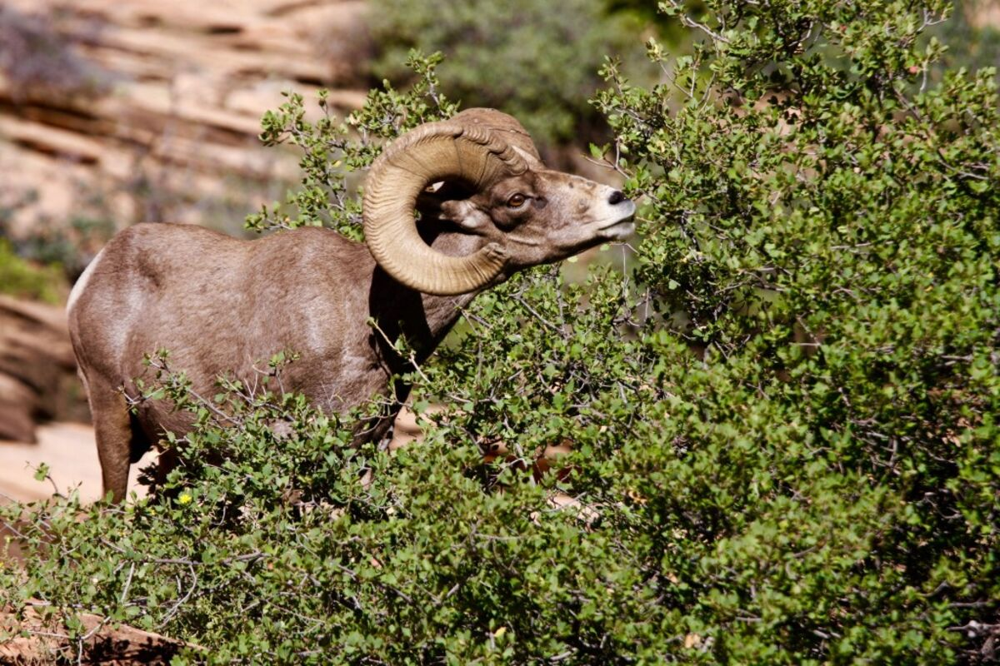
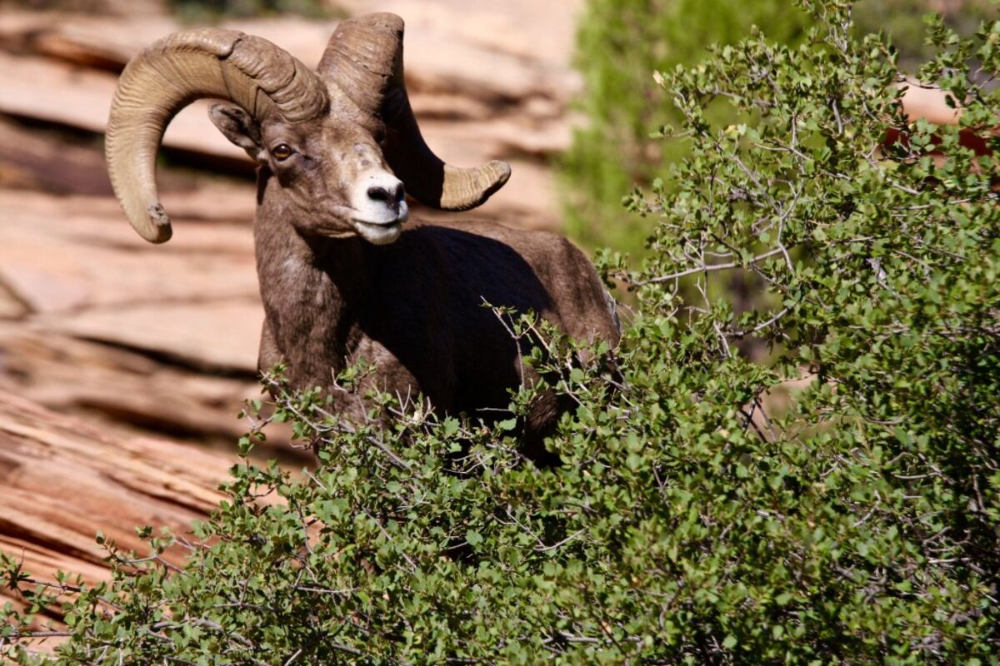
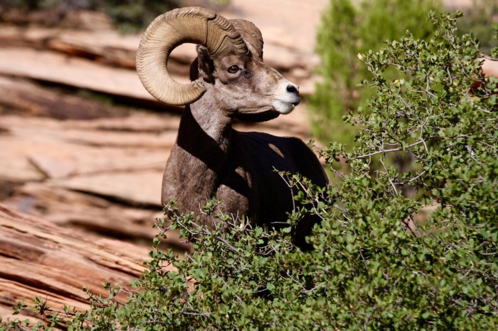

+++
date = '2015-09-17'
title = 'The First Day: 800 Miles Away'
author = 'Monica Multer'
authors = ['Monica Multer']
tags = ['story']

[cover]
image = "04.jpg"
+++

I am already over 800 miles away from home. Today was my first full day of
traveling and I had forgotten how baffling it is to suddenly be so far from
everything familiar in such a short amount of time. One day and four states
later, I have yet to realize that this is actually real and happening.

Crash course description of my day: Barstow, Las Vegas, Springdale, Zion
National Park, Page — California, Nevada, Arizona and Utah (and then back to
Arizona again).

Two things I want to add in before we go any further.

1. My father has decided to come with me to visit my brother in Durango,
Colorado. So he has faithfully followed me onto the open road for the first
leg of the trip. Tomorrow we get to see my little brother and I am so excited!
2. I have another travel buddy since my mom, my true travel buddy, cannot come
with me: Mama, the Berkeley Llama. She will be standing in for the two main
things missing in my life as I travel, my constant travel companion and my
Berkeley community. While it replaces neither, it serves as a reminder of how
much I need the people who mean the most in my life even when they aren’t
physically with me. So I will be photographing Mama the Llama everywhere I
go.

The real highlights of the day (aside from my last In N’ Out Burger for the
foreseeable future in Las Vegas) were in the area around Zion National Park in
Utah and beyond it. Everything that preceded it was rather monotonous
(because let’s face it, not everything on a road trip is fascinating and
beautiful) and uneventful. However, passing over the border into Arizona
changed everything and the mountains started to rise and the red rose in the
stone like a fire.

After weaving our way through the canyons of layered red stone we arrived
outside of Zion at Springdale where we took a much needed ice cream break. Joy
really was the only way to describe my state of mind.

Zion is really a beautiful place and I love visiting it, even if we only get to
drive through it.

On the far side of the park we did get a treat, a herd of bighorn sheep grazing
on the sparse shrubbery dotting the multicolored hillsides. It was a great
opportunity to put my wildlife photography boots back on and start practicing
my photography again.

He was a great model and was stunningly beautiful to watch. The texture of his
horns and the color of his amber eyes were captivating. I had not realized
until the moment that I was frantically running down the road in a dress with
my camera equipment in one hand and my car keys in the other how much I missed
the thrill of pursuing wildlife in its natural habitat.

Now I sit in Page Arizona, mere miles away from Horseshoe Bend and Antelope
Canyon and just yards from the Glen Canyon Dam on Lake Powell. It is a lovely
gateway to so many incredible places, but still all I can think of is getting
to see my little brother tomorrow. My heart is set on Colorado and I can’t
wait to make it to the first major stop on my road trip.
