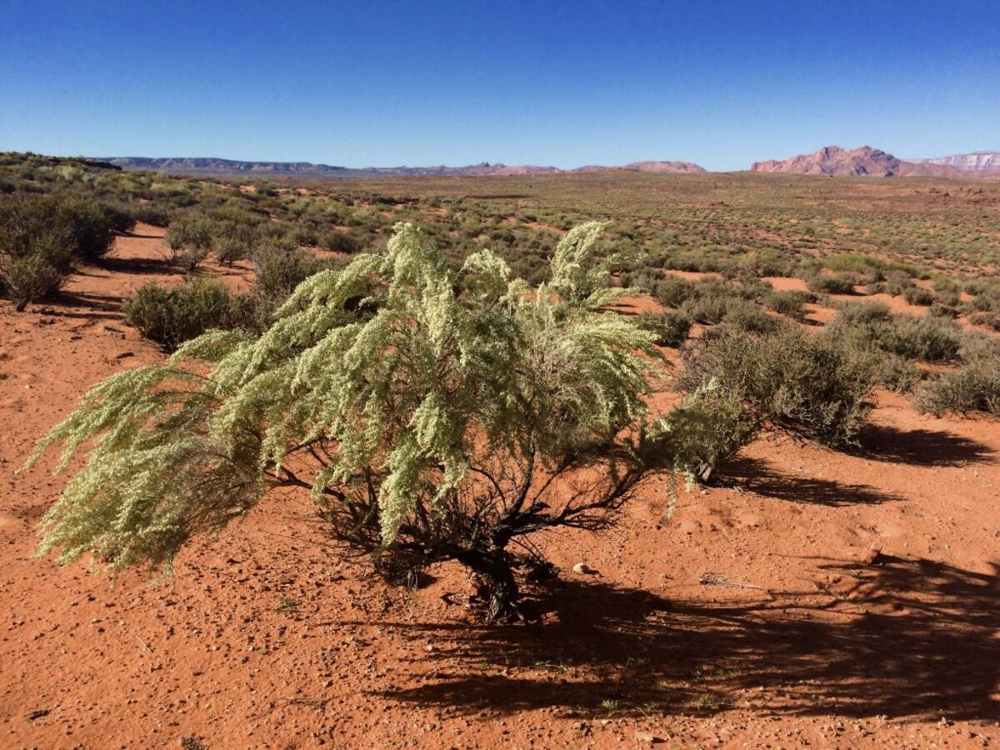
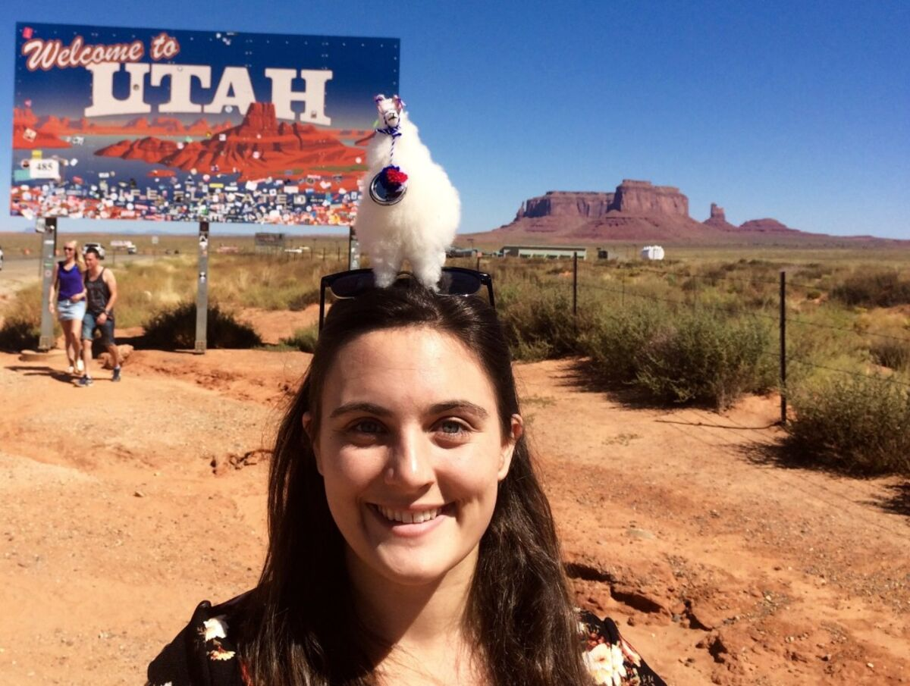
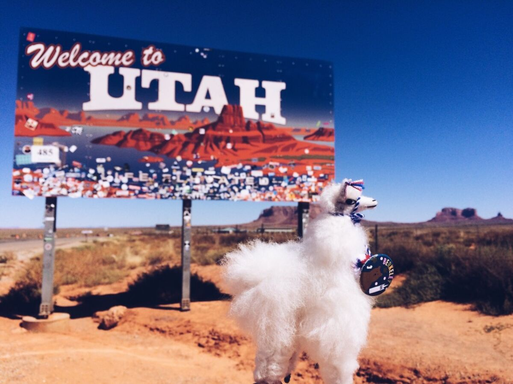
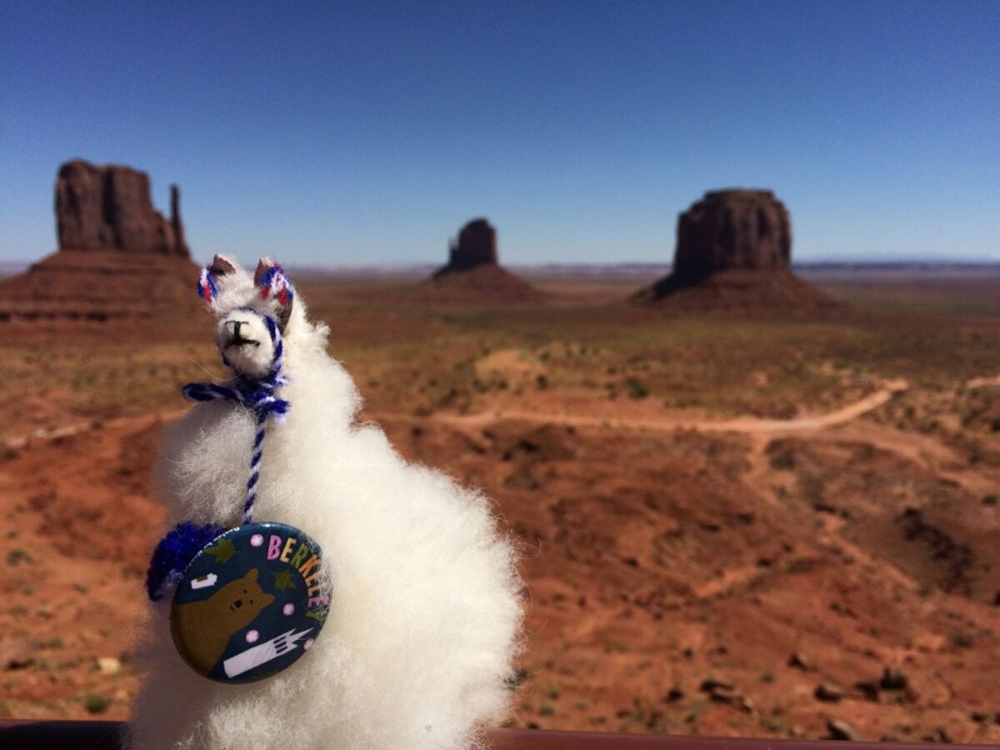
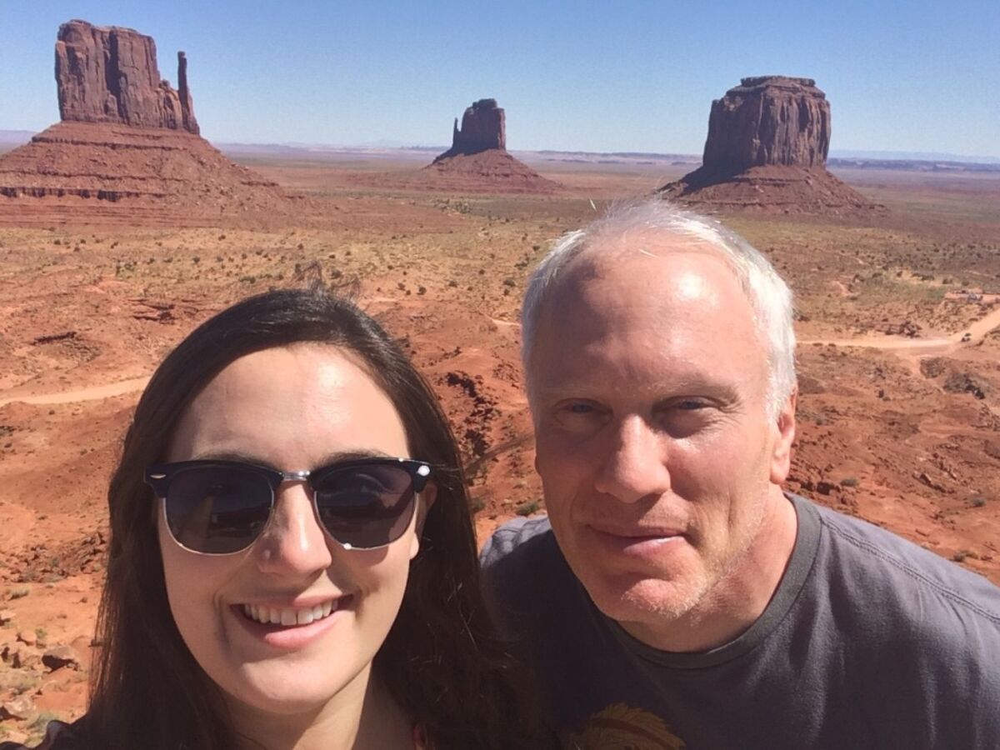
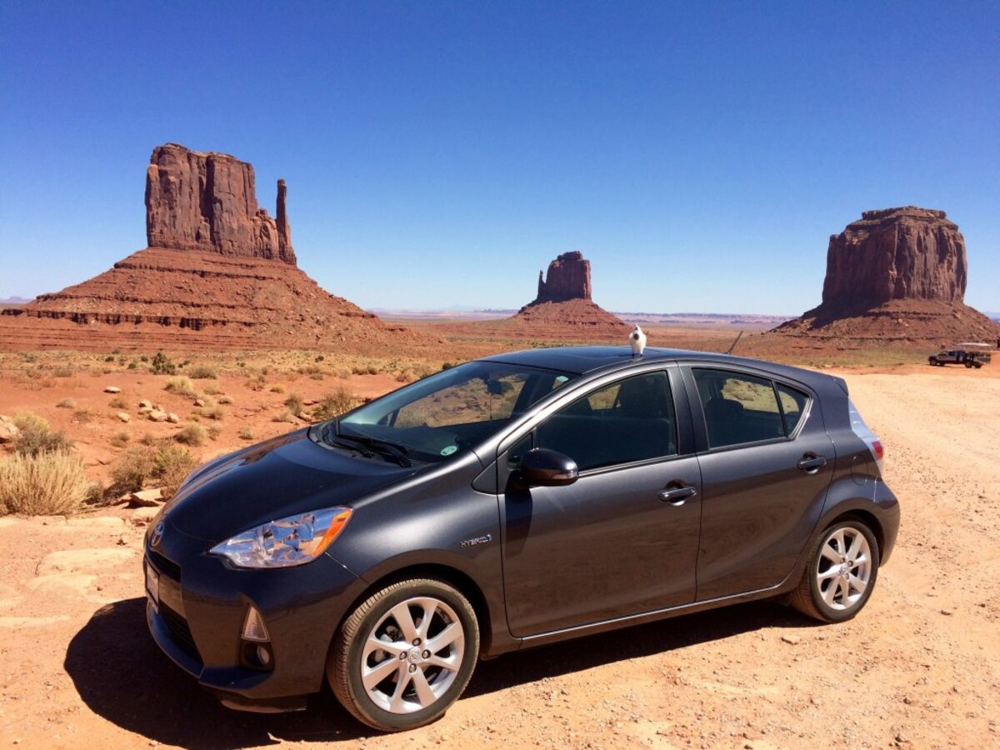
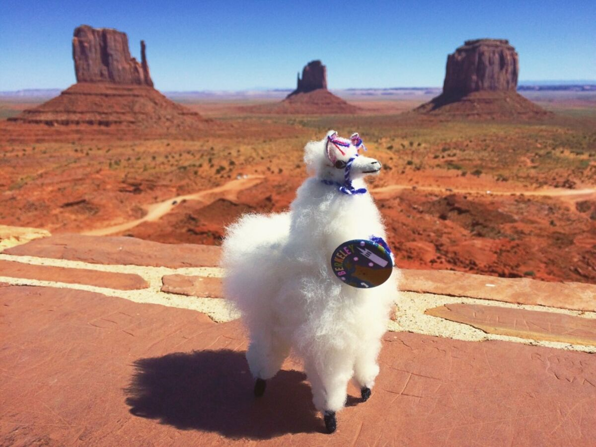

+++
date = '2015-09-18'
title = 'The Weird Llama Lady'
author = 'Monica Multer'
authors = ['Monica Multer']
tags = ['story']

[cover]
image = "02.jpg"
+++

I have officially become that weird person wandering around with a little llama
fluff ball sticking out of my purse. I have already had numerous conversations
with strangers about it; it is a great conversation starter. The first
conversation I had was with some very nice janitorial staff at a rest stop who
were entirely baffled by Mama the Llama. They hesitantly followed me around
the rest stop as I took pictures and finally came up and asked me what in the
world it was that I was holding. I told him it was a llama, which then sparked
a somewhat circular conversation in which he insistently question me about
whether it was a real llama or not no matter how many times I told him no, it
was most definitely not a real llama. Aside from the giggles and pointing
whenever I am out and about taking pictures with my lovely sidekick it has
been quite a lot of fun even if it is hard to remember to always take her with
me places.

Today we left Page for Durango where I will be staying for almost a week with
my little brother. I am happy to say that we made it safe and sound with
little incident.

After a slow morning where our tour plans for Antelope Canyon fell through and
a meandering look at the ever faithful Horseshoe Bend we headed out to
Monument Valley.

We took off from the straightforward route and fit in some adventuring time to
visit this tribal park. Sitting right on the border between Utah and Arizona,
this collection of monolithic rock formations of fiery red stone and sunset
oranges always is a treat to stop for on a road trip.

At Monument Valley we took a picnic break and then I made an ill-informed
decision to try to drive just a short bit of the dirt road loop around the
monuments. I learned today that PriPri is in no way, large or small, an
off-roading vehicle. There were a few moments on that road (which I was doing
by myself since my dad had the foresight to decide not to come with me) in
which I really thought my car wasn’t going to make it. I survived and so did
PriPri, although the car was definitely covered in red dust for quite some
time afterwards.

From Monument Valley we continued on a smaller road to cut over to Colorado
above four corners where we encountered some really beautiful rock bluffs that
towered over the road. Driving in the shadow of these red mountains is truly a
humbling experience. It makes you wonder at the thunderous sound it would make
to hear the mountains crumble and it is impossible not to feel small when
underneath them.

There is an extreme beauty in this country that constantly confounds me. The
fact that I can drive on these bumpy chewed up roads across this vast nation
and be so close to so many incredible natural formations and feel as if it is
perfectly normal for them to be there next to me is astounding. I never feel
more humbled than on a road trip, especially when I go through the Utah,
Arizona, and Colorado. I cannot put into words the incredible beauty that this
country has to offer and my photos cannot do it justice either.

Now I am in Colorado, nestled between mountains in the little lively town of
Durango. I will be adventuring, relaxing, and spending time with my brother
here before I head out on the second part of my journey across the states that
will take me to my next big stop in Northern Michigan.
