+++
date = '2015-09-20'
title = 'Taking a Break at the Lake'
author = 'Monica Multer'
authors = ['Monica Multer']
tags = ['story']

[cover]
image = "04.jpg"
+++

Five days after being on the road we finally decided to get away and get off
the main road for some back country driving. Gabe took us out to a place
called Spud Lake in the mountains behind Durango.

Trusting that our Subaru would get us through, we took to the unpaved rocky
mountain road (pun somewhat intended). We drove slowly through extremely rocky
terrain spotted with pot holes on a path lined with aspens. Yellow leaves
falling from the tall white trees fluttered down from above like butterflies
dancing in the wind, littering the roadway with the colors of autumn.

After an arduous journey up this winding back country road we found a lily pad
filled lake where we picked up a hiking path that led up to the mountainous
lake.

Hiking through the aspen forests we found hidden messages and little surprises
everywhere. My favorites were a smiley face tree and a lovely little reminder
to Live, Laugh, and Love no matter where you find yourself.

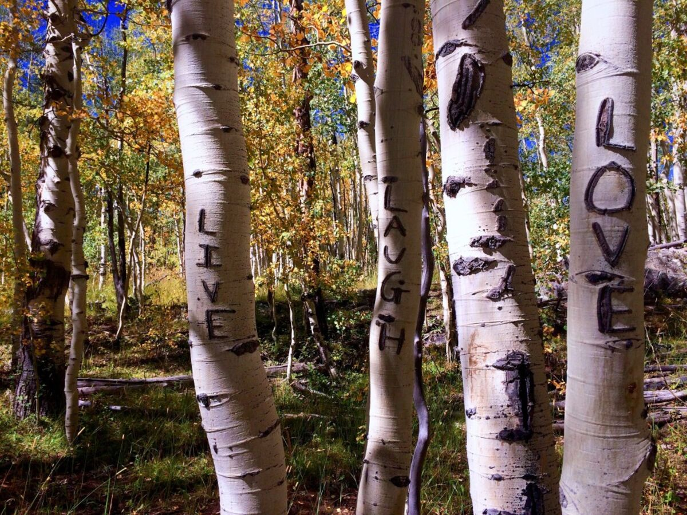
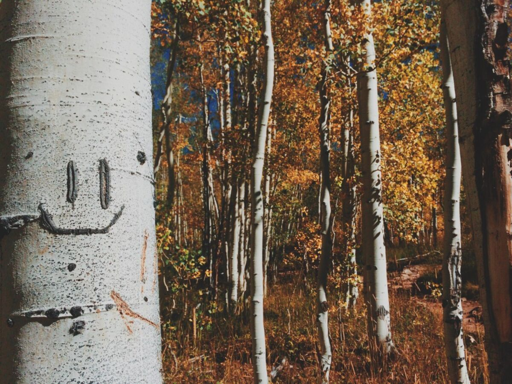
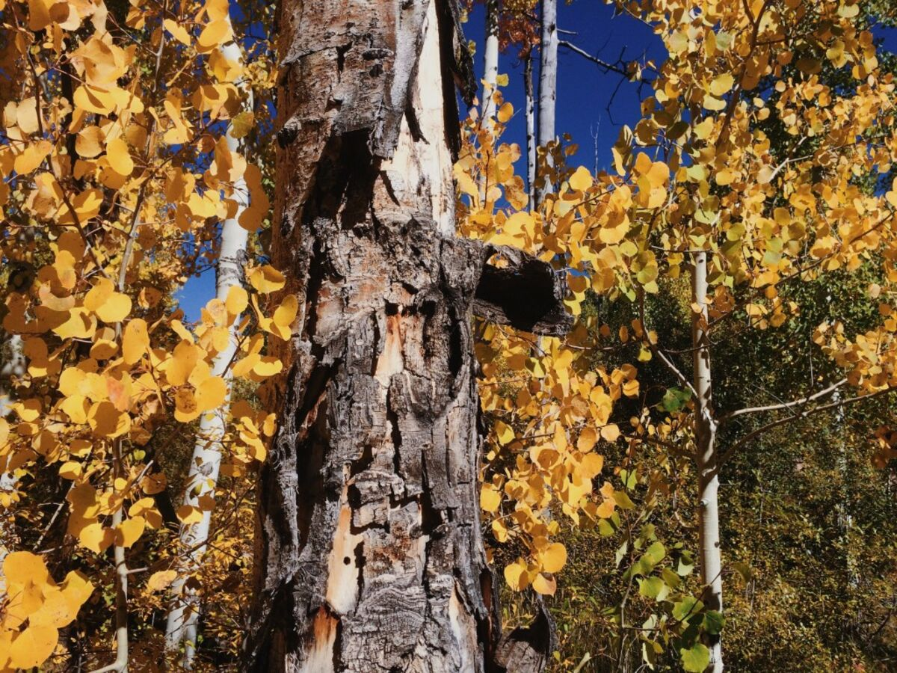

After hiking for about a mile we came upon the lake that filled a small basin
between the surrounding mountains. The water was still, the trees changing
color, and small fish biting at the surface of the lake.

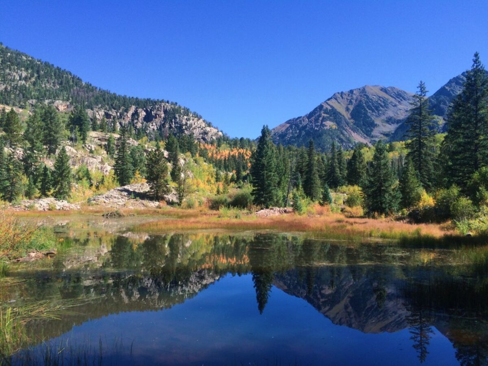
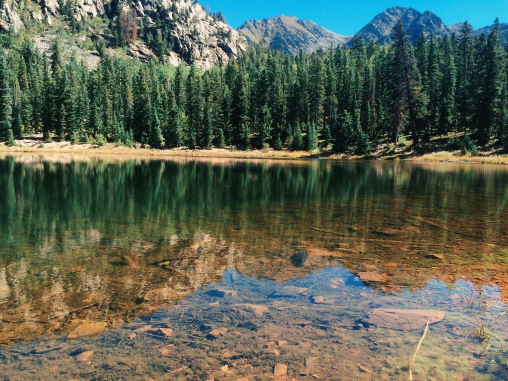

After going non-stop for almost a week it was about time to slow down and take
a break. So I found a spot, set up the hammock, and started a new book. But I
let Mama the Llama try out the view first.

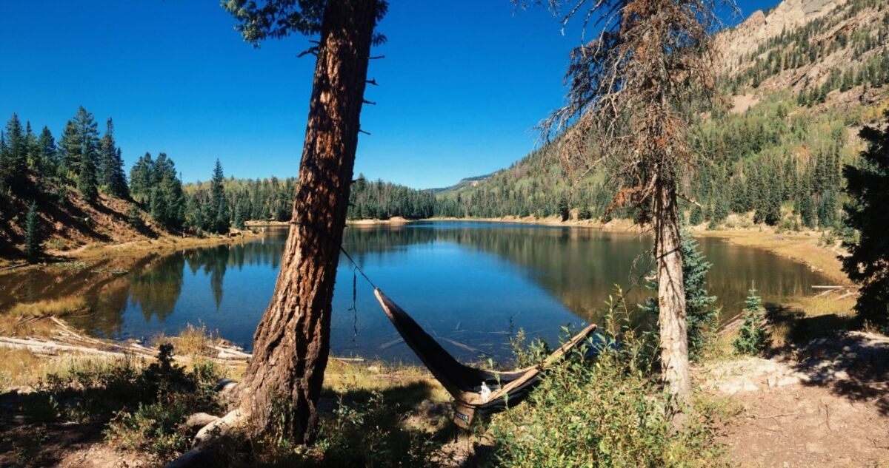
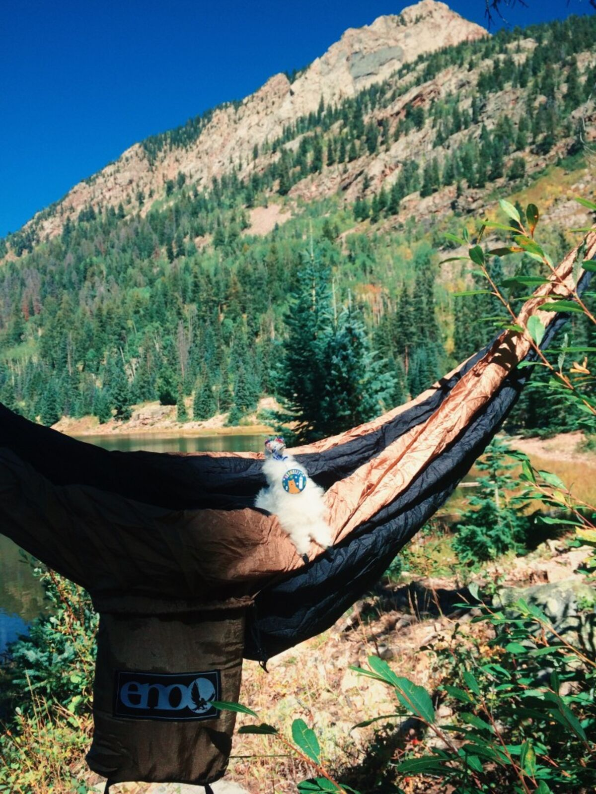

Reading Kerouac’s On the Road at this point in my life is beyond applicable and
I don’t think I could have found a better spot to sit back, relax, and read.

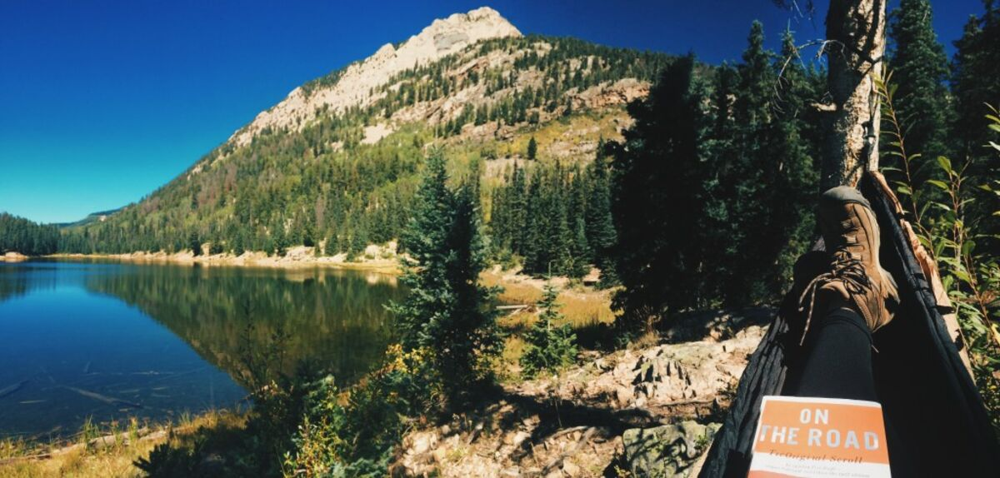

We stayed in this pristine spot for a couple of hours of hammocking, book
reading, hiking along the lake shore, and unsuccessful fly fishing.

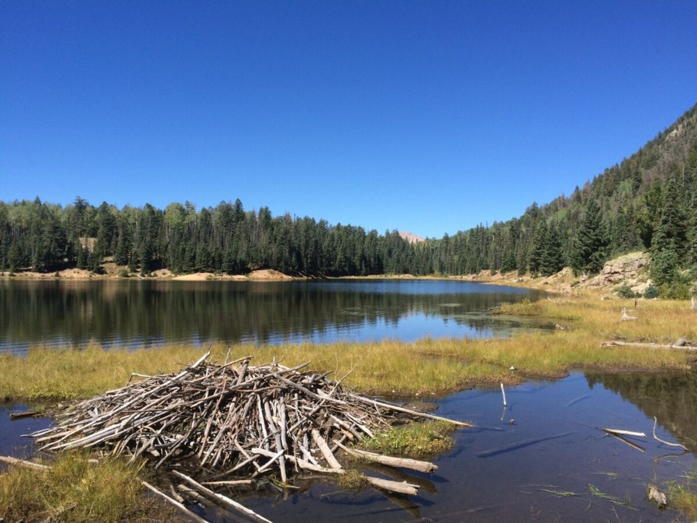
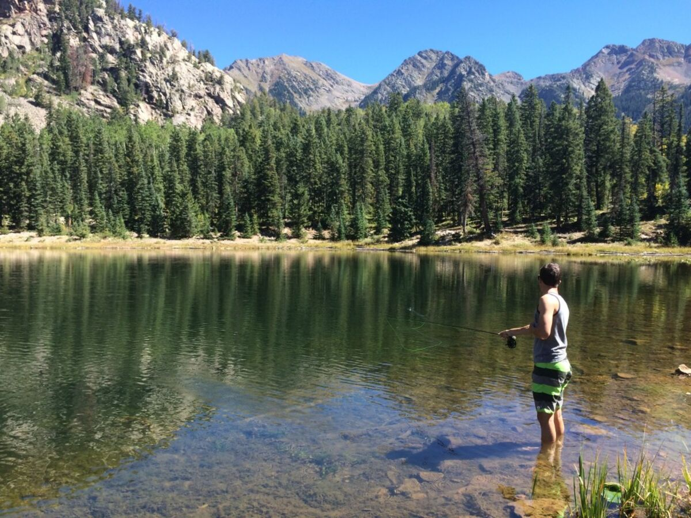

Begrudgingly we left Spud Lake to return to Durango, but the best part of it
all was that in either location everything was equally wonderful, albeit
beautiful in different ways. Even on the short drive back we found a weird
natural geyser just on the side of the highway. Yes, that is its natural,
unenhanced color. It was a truly bizarre little roadside attraction and is a
great example of how incredible the scenery is in Colorado.

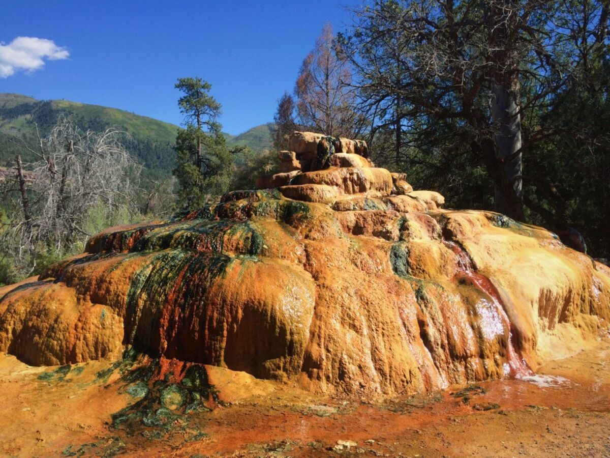

I have been loving Colorado and cannot believe the natural wonders that are
hiding down empty dirt roads and behind curtains of aspens. There is something
about seeing every car splashed with mud or covered in the red dust of
off-road driving and the people here who are so friendly and welcoming. The
air is full of adventure and some new exploration awaits around every bend or
switchback in the road. I am just happy to get to take part in the culture of
exploration and adventure that thrives in this Colorado community.
