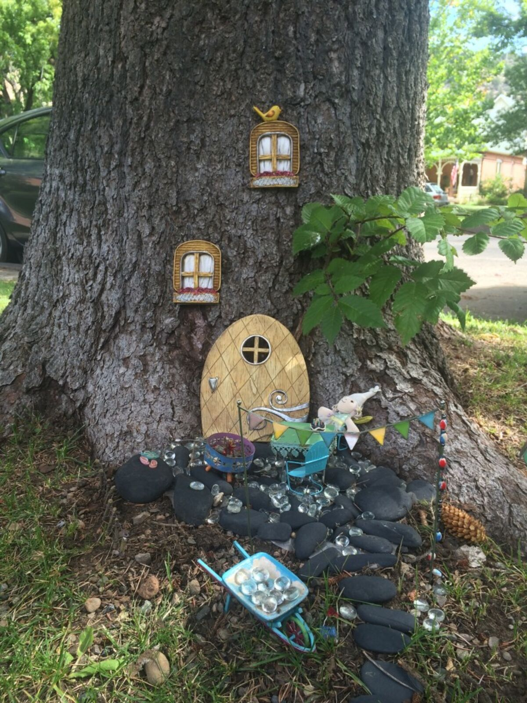
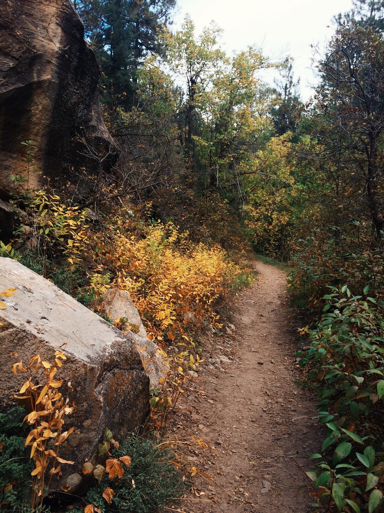
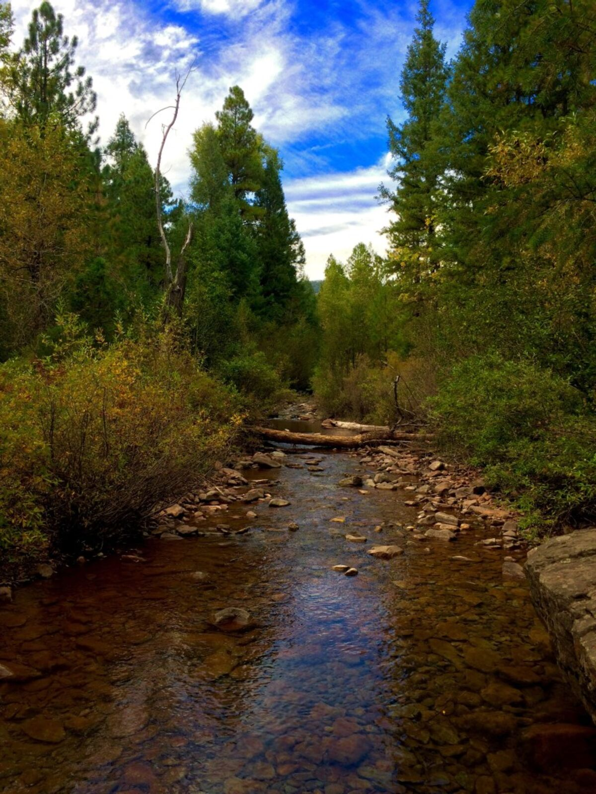
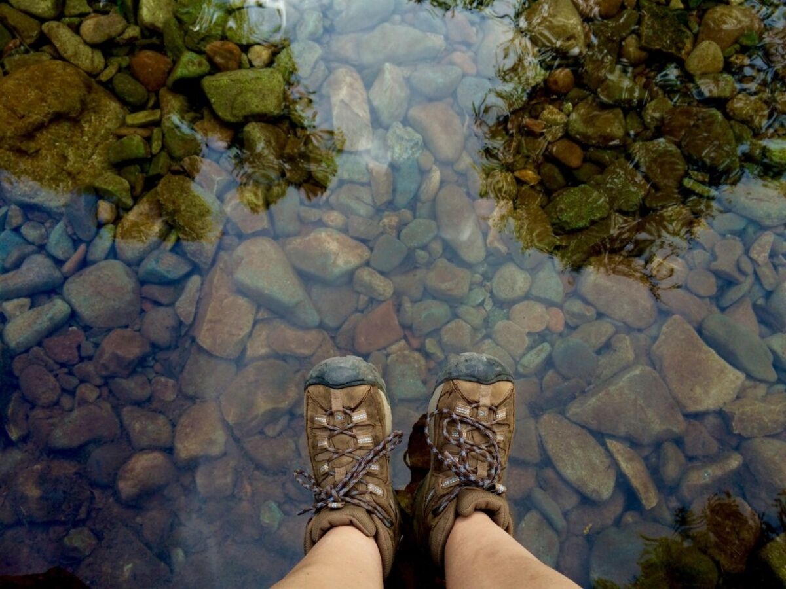
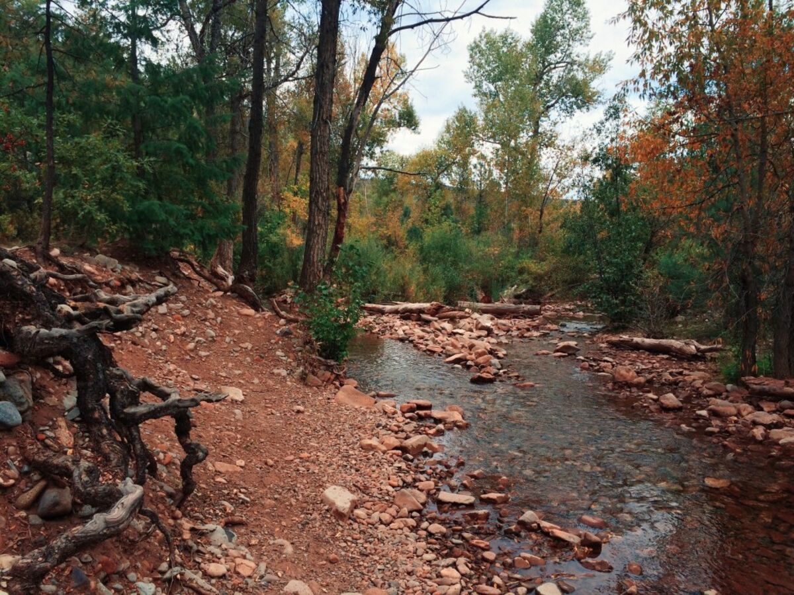
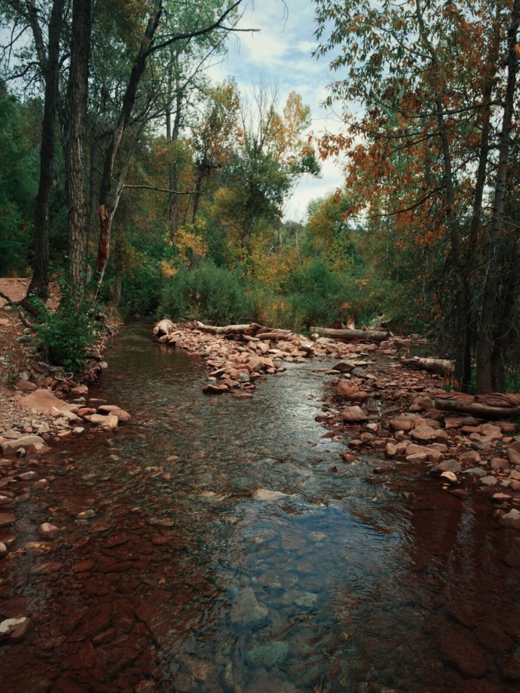
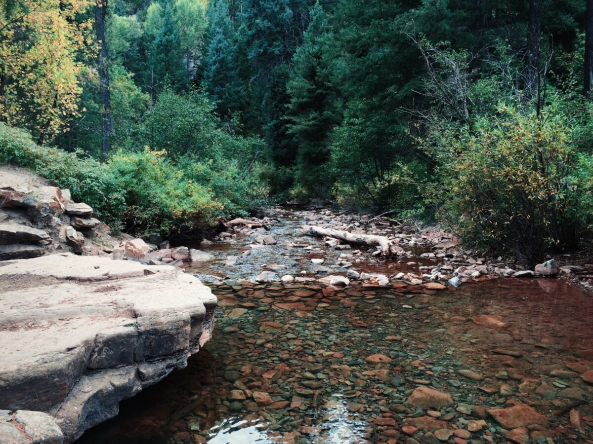
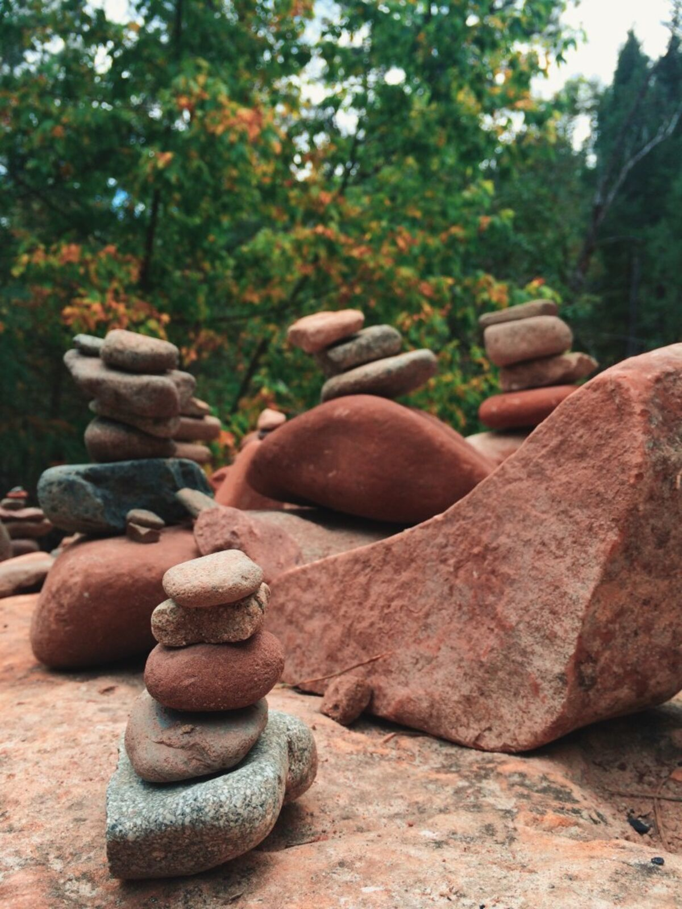
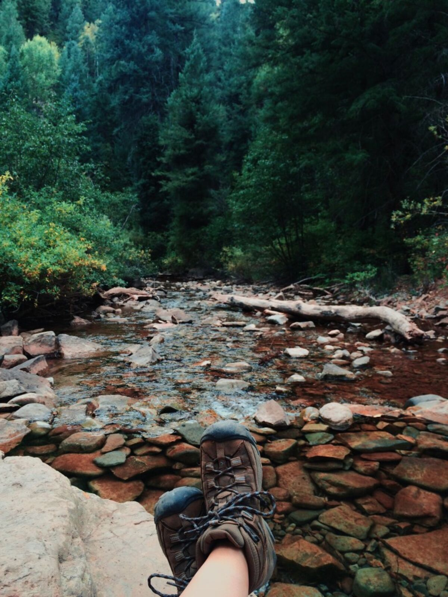
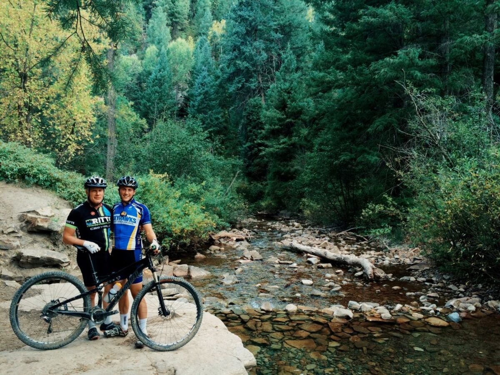

+++
date = '2015-09-21'
title = 'Where Two Rivers Meet'
author = 'Monica Multer'
authors = ['Monica Multer']
tags = ['story']

[cover]
image = "09.jpg"
+++

Today was a slow day of learning how to live life like a local rather than a
tourist. One of the few luxuries of a road trip is taking as much time as you
want to explore the places you learn to love. Durango is such a surprising
town that really impressed and captivated me. Since my little brother had
class today at Fort Lewis College my dad and I decided to explore the cafes in
town. We worked for several hours at The Steaming Bean, an adorable cafe full
of hip young 20 somethings and brick walls covered in vibrant art. I spent the
time writing in my journal and on some postcards I had gathered on the way
over to Colorado. It was a great chance to relax and do something normal in a
new place.

We also wandered around the residential streets in town and found blocks lined
with trees with little gnome homes built at their bases. It was charming and
one of many little things that consistently surprises me about Durango.

Today was the first time I was able to get some alone time and I took advantage
of my solo time to go on a hike while my brother and dad took a bike ride
together. Hiking is one of the fastest ways to the true heart of a place,
especially in places like Colorado where adventure and the outdoors are the
life blood of the state.

I drove outside of Durango to the San Juan National Forest and picked up the
Colorado Trail at Junction Creek. It felt great to put on my hiking boots and
head out alone into the woods not knowing what I would find. The trail was
framed by autumn colors and wove through a canyon next to a crystal clear
river.

I hiked to where two rivers met and found autumn at the crossroad waiting for
me.

After hiking for some time I made camp and sat on the river’s edge and read my
book. Listening to the river running by as it cascaded over a series of small
waterfalls I sat with my feet dangling over the water as rainbow trout swam
underneath me.

Sitting in silence out in the woods is one of the most peaceful experiences and
I treasure that time dearly. Hiking in Colorado is such a lovely
(and surprisingly different) experience than hiking in California. The people
in the woods are so incredibly friendly, everyone says hello and always are
happy to help out with spotting cool things or sharing wise advice on the
trails. The silence out in the woods or out on any trail is so much more
complete than anywhere else I have ever visited except Yellowstone in the
winter. Even the back country trails in California are filled with noises and
people who refuse to acknowledge your existence. It is so different here and
amiable, it feels like we are an unspoken community rather than individuals
inhabiting the same space. It is hard not to love every second of being out on
the trails in Colorado, it makes me never want to leave.

The only time my peace was (happily) intruded upon was when my brother and dad
rolled down the same trail I was on and stopped to say hello and check out the
fish swimming in the river below us.

It was a peaceful day and a much needed one at that to recenter everything that
is important to me. When so much is in flux and changing around you it is easy
to get caught in the riptide of life, and a good hike out in the forest along
a river is the best remedy for reorienting yourself against the pull of the
strong currents of the world.
