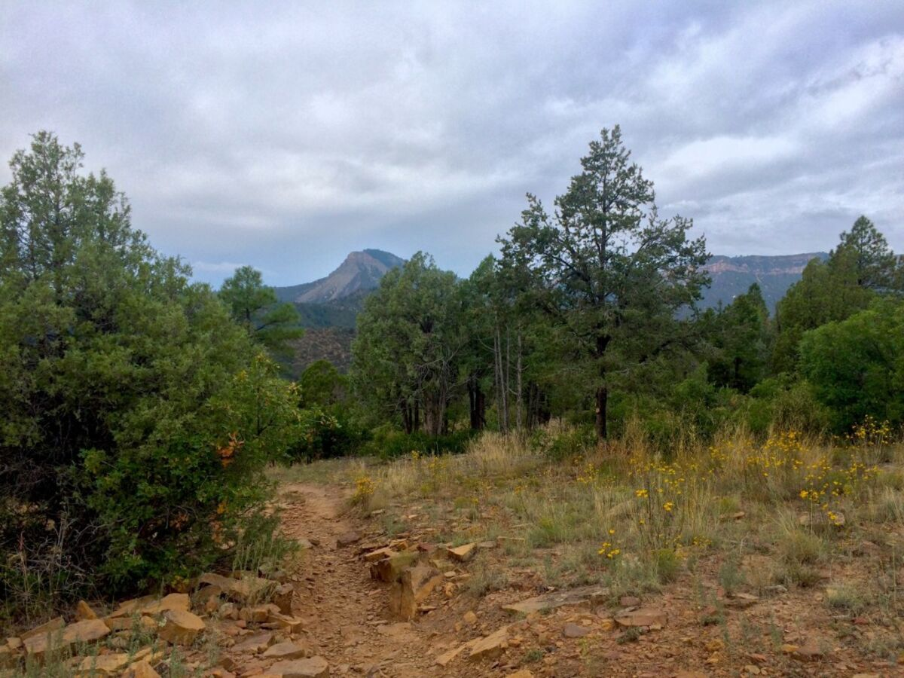
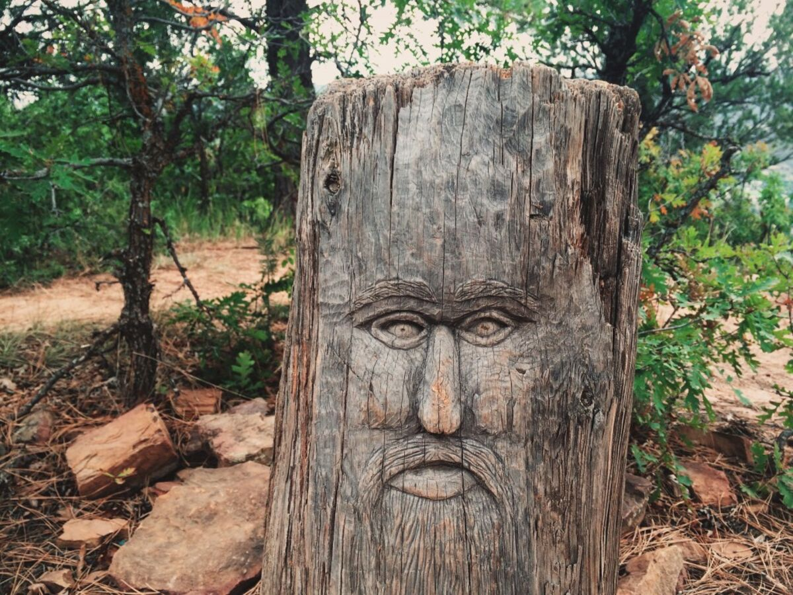
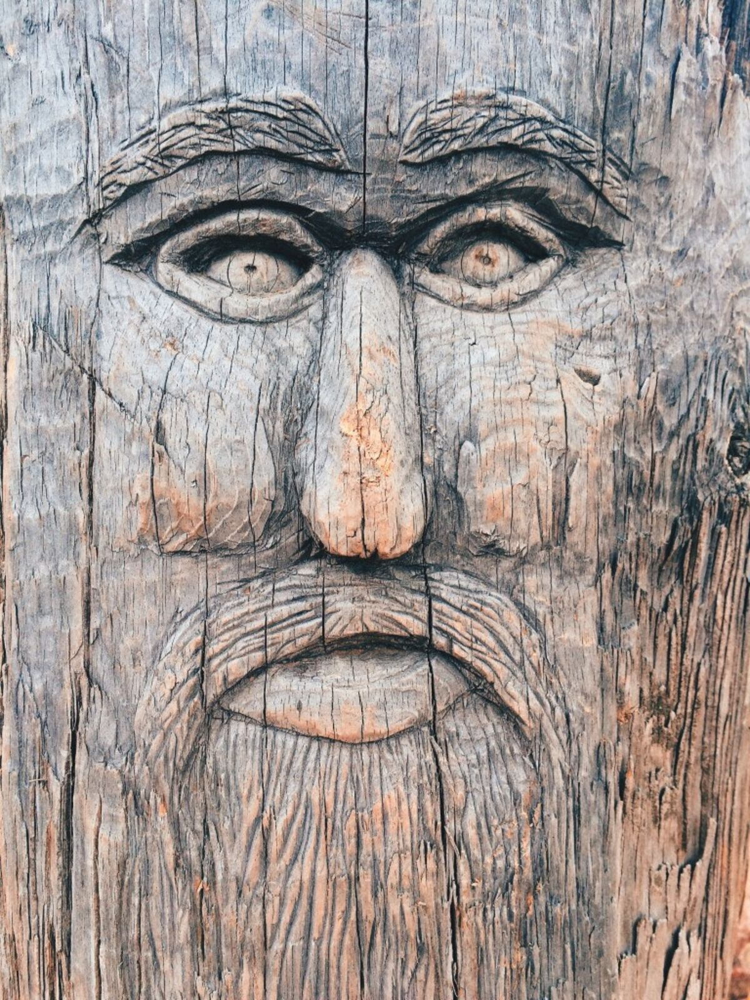
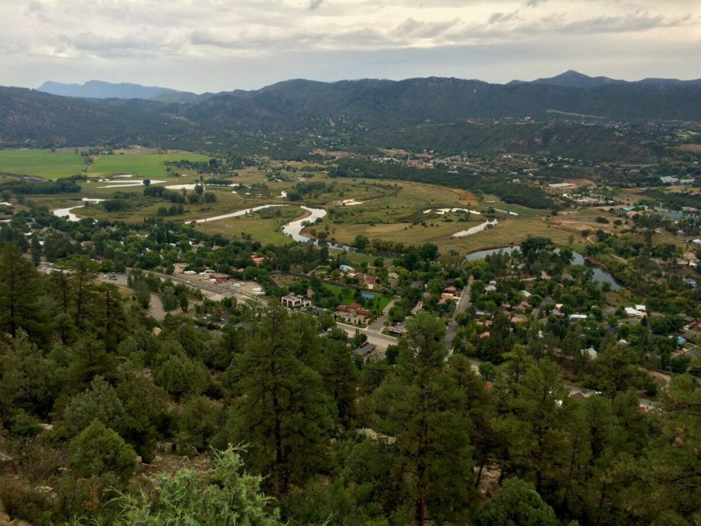
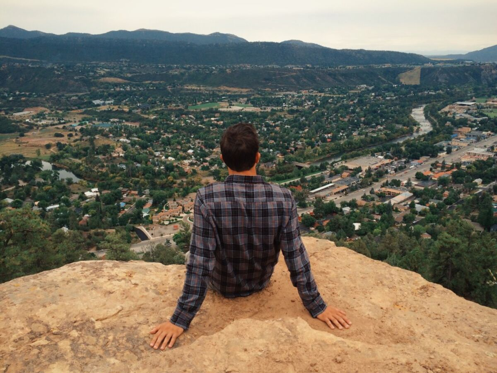
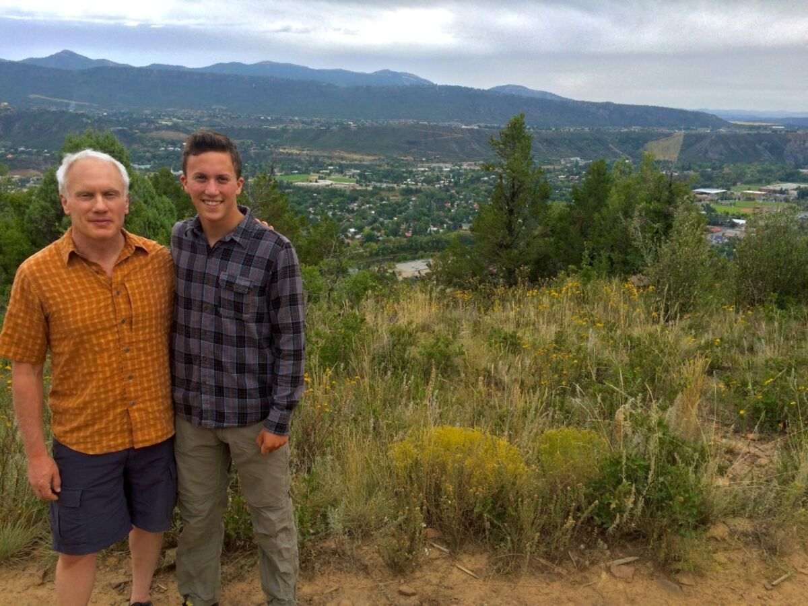
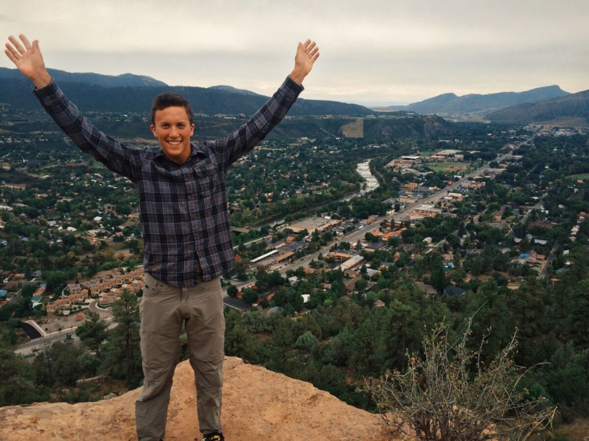
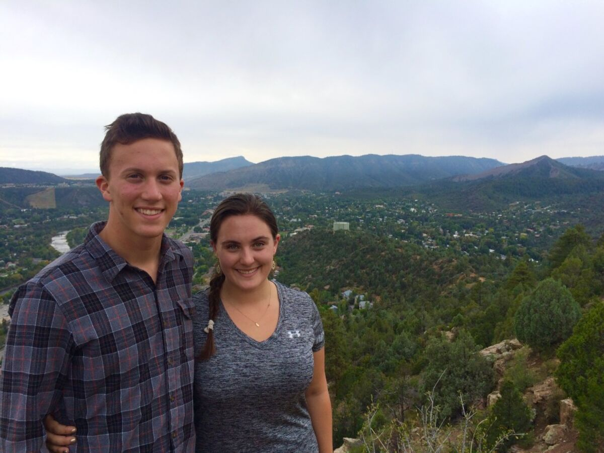

+++
date = '2015-09-22'
title = 'The Face in the Forest'
author = 'Monica Multer'
authors = ['Monica Multer']
tags = ['story']

[cover]
image = "03.jpg"
+++

The rain against the window pane sounds like chimes in the wind; a sound I have
not heard for quite some time in California where the land is dry as old bones
being bleached in the sun. Soothing and persistent the rain falls here in
Durango as I sit in a coffee shop called the Steam Bean in the historic
downtown of Durango. The crowd has slowly multiplied as the sidewalks become
drenched in water and the awnings drip continuously. I have missed this. Rain,
no matter where I am, always makes me feel instantly like I am home. Maybe it
is the smell of the earth that rises when the rain falls, petrichor, that
rattles around in my brain like a phone call from a friend you have talked to
in ages. Maybe it is the feeling of being unabashedly alive as the cold water
hits your face and stings with the freshness of new life springing from dry
soil. I am not sure, I have never known why or how the rain can make any place
feel like home, all I know is that it does. So I sit in this cafe full of
college students studying, businessmen working, women chatting of chai lattes,
a woman in black making jewelry, and a group of weary backpackers joyously
reunited after a month on a backcountry trail and feel like I have always been
here.

Before the rain there was a cloudy morning out on the trail. We began our day,
after Gabe finished class, with a hike up Animas City Mountain. We climbed up
the switchbacks in a very different sort of setting than the previous hikes
that were enveloped in the branching arms of colorful aspens. This trail was
more arid with cacti, bare twisting trees growing out of boulders, and small
but colorful wildflowers.

Amongst the scenery we found a hidden gem that we almost passed by: a face in
the low lying forest skillfully carved into a tree stump.

We then continued on along the trail and made it to the viewpoint that
overlooked the entire city of Durango and the Animas River snaking out of town
towards the surrounding mountains.

We sat on the edge of the mountain enjoying the view and reveling in the beauty
that this amazing town has to afford.

This is my brother’s city, his home and I am so grateful that I have been able
to see it through his eyes and experience the things he has grown to love
about his new home. It has been almost a week since I left California and soon
I will be moving on from Durango to continue on my way. I have only been here
a short while and I wish it didn’t have to end, but there is still so much to
see and do.

But for now, I am here, right here with the rain on the window even though my
mind is already a thousand miles away. Being present is something I have
always struggled with and now is when it means the most to be in the moment
and I won’t let this experience pass me by. Here I am, I am Here.
