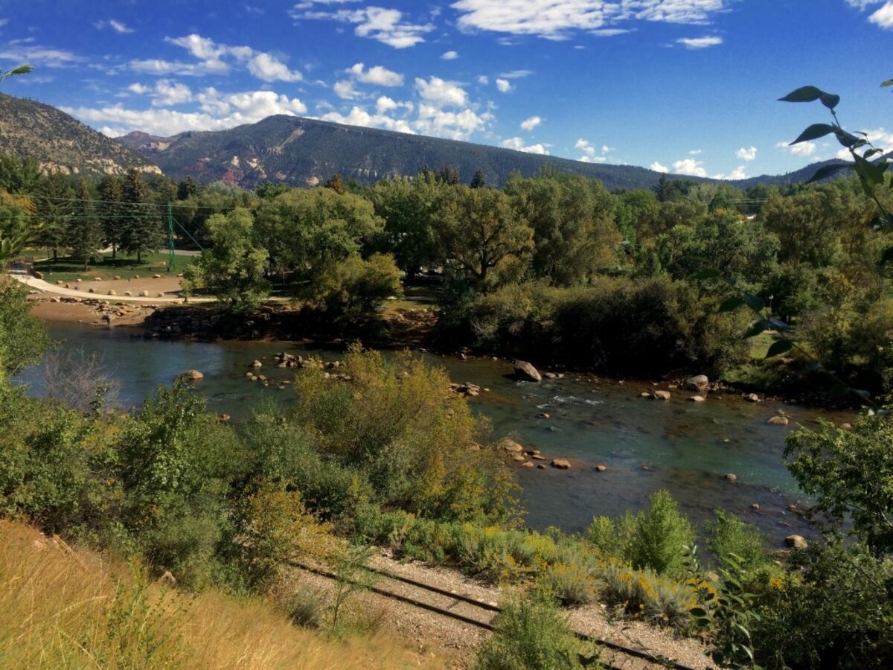
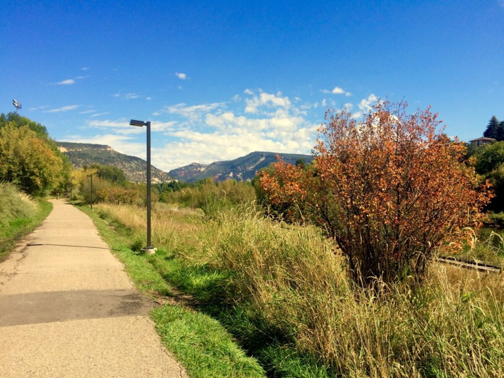
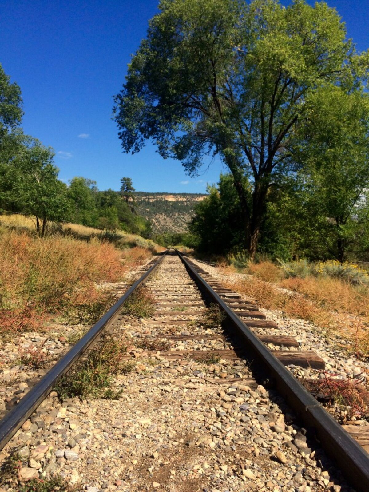
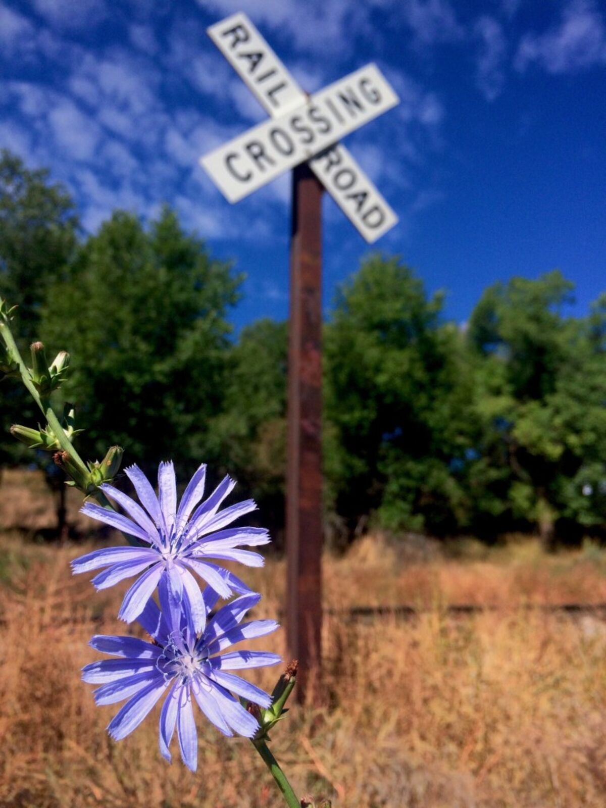
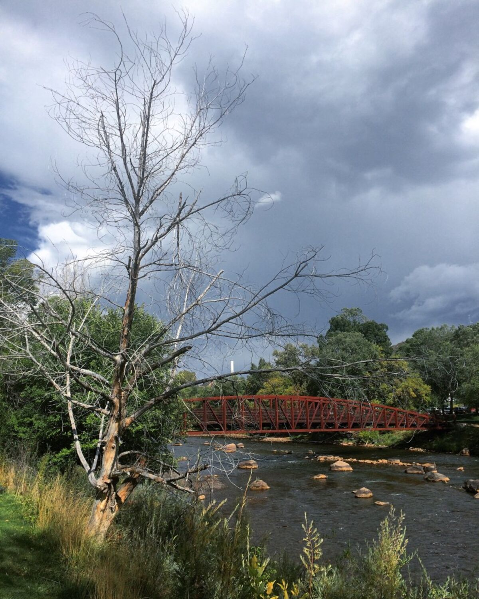

+++
date = '2015-09-23'
title = 'Final Day in Durango'
author = 'Monica Multer'
authors = ['Monica Multer']
tags = ['story']

[cover]
image = "04.jpg"
+++

It has been a long final day here in Durango that started out horribly and got
better as it went along, which is normally the opposite of what happens.
Normally as the day progresses it deteriorates into a nervous mess of unpacked
bags, future travel plans, and unfinished business. However, this time the day
began at 2am in the bathroom with food poisoning. After spending a few lovely
hours wrapped around the toilet throwing up everything I had in me, I finally
got a few precious hours of sleep (on the day I was supposed to be able to
sleep in) only to wake up a short time later to try to start the day.

After recovering somewhat and rehydrating I decided that the best remedy was a
calm walk along the Animas River and some fresh air.

My dad and I meandered along the river next to the railroad tracks for quite
some time savoring the thin crisp Colorado air that he would be leaving later
in the day.

Clouds hung in the distance looming with thunder held close to its chest, ready
to out pour rain on the mountains of Durango. The ominous clouds began to
gather and we out ran the clouds to the airport to drop my dad off at the tiny
Durango airport. It was a bittersweet moment watching him walk away behind the
security screen feeling so happy that he was able to accompany me on the first
leg of my long journey, but also deeply saddened that he couldn’t continue
with me any farther. It was a strange moment as I walked away knowing that the
next part of my journey was beginning, but this part I would have to do
alone.

Now the solo trip truly begins. I leave early in the morning for Boulder, CO
where I will be staying for a few nights by myself to finish my adventure in
Colorado, a state that I have come to love dearly. I am nervous, excited, and
not sure what to expect in the days that lie ahead on the beginning of this
truly solo adventure.
