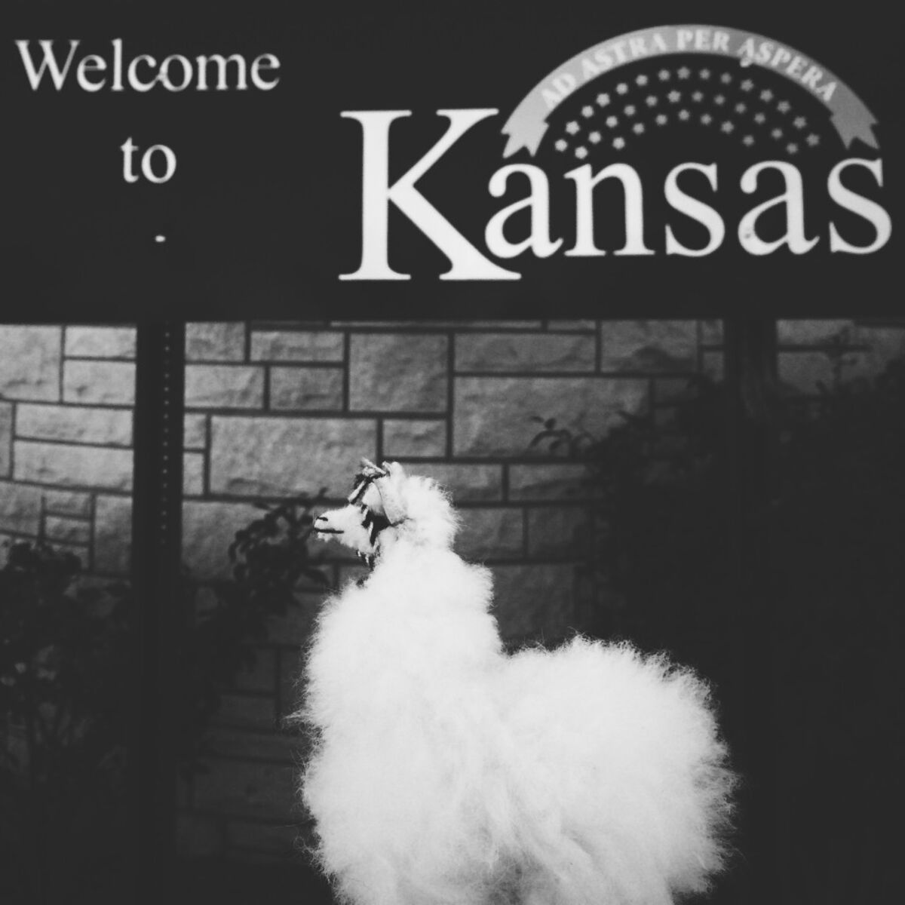
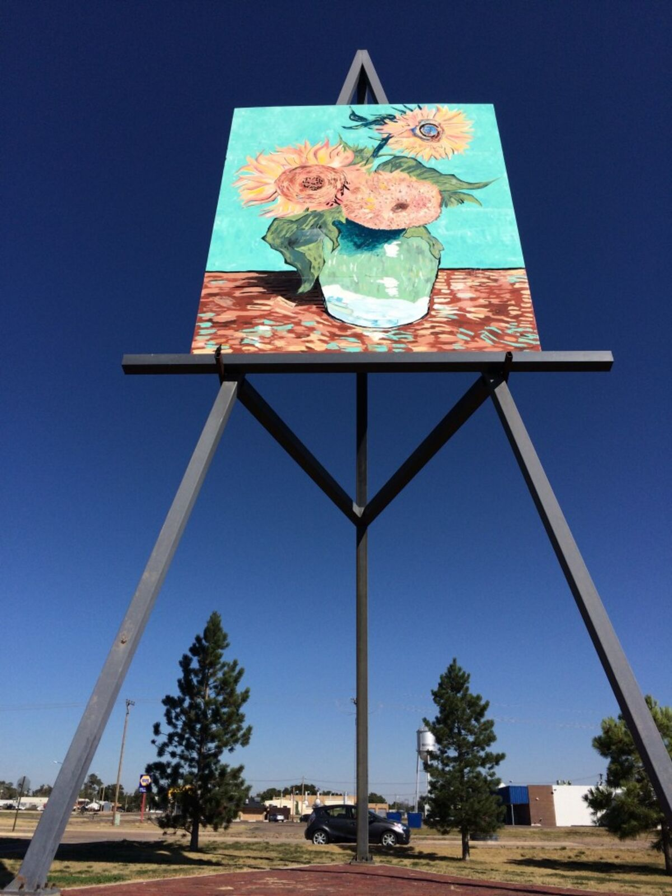
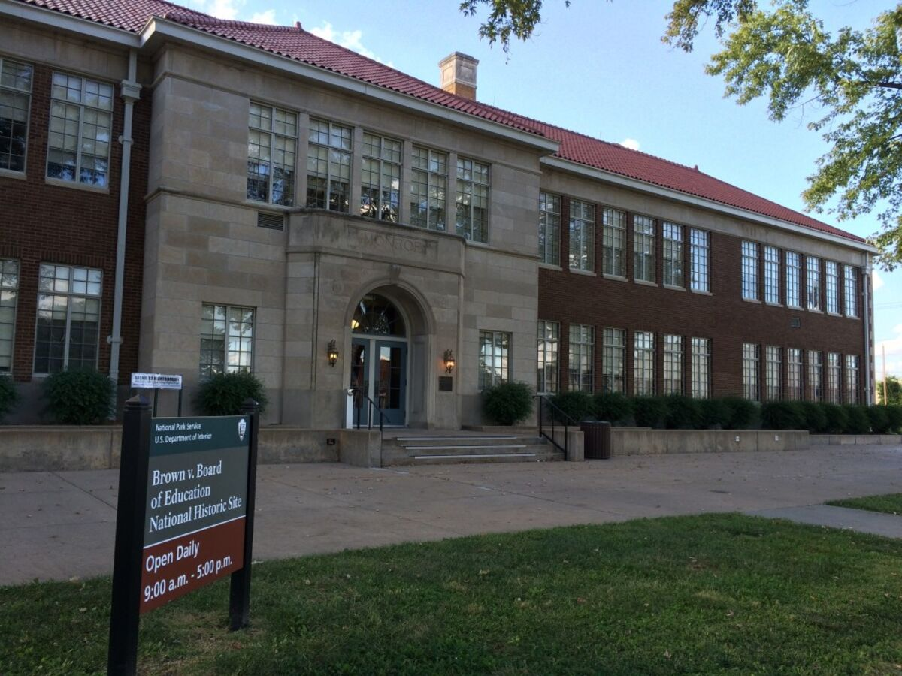
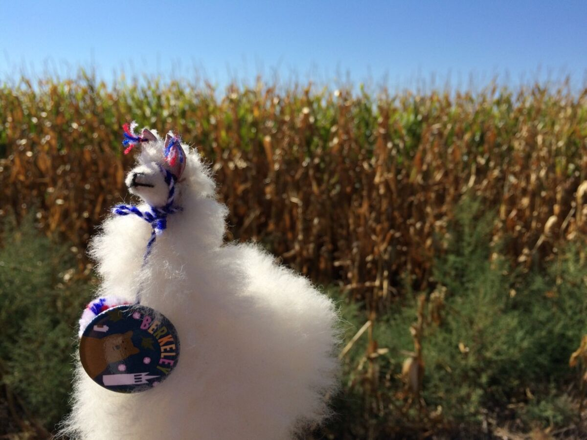
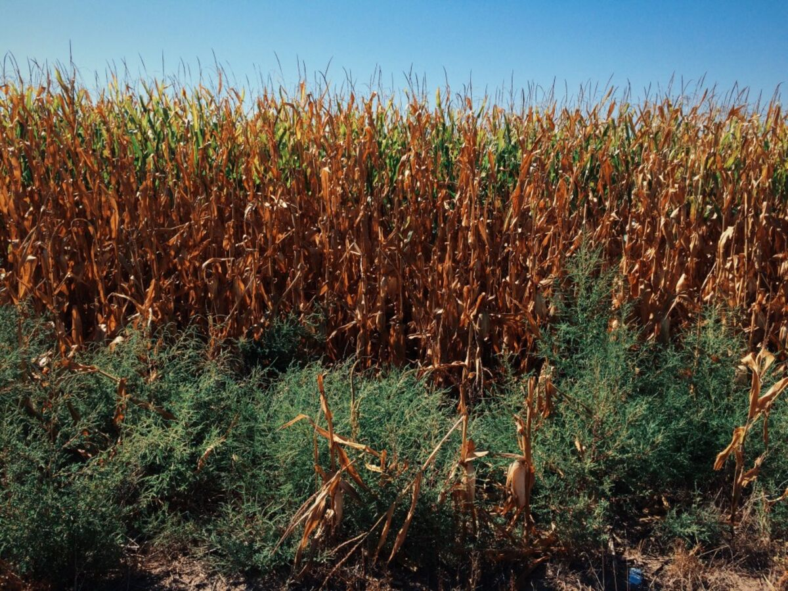

+++
date = '2015-09-28'
title = 'We’re Not in Kansas Anymore…'
author = 'Monica Multer'
authors = ['Monica Multer']
tags = ['story']

[cover]
image = "01.jpg"
+++

Literally. Yesterday I drove all the way across the width of Kansas from
Colorado to Missouri. It was a long day of solo driving, just me, Mama the
Llama, the Serial podcast, and corn. Lots and lots of corn.

I drove away from Colorado with the Flatirons of Boulder in my rearview mirror
and my heart in my stomach as I left behind the state I had grown to love over
the last week or so. I traded in my grand majestic views for two lane
interstates, the loss of beauty exchanged for ease and speed of
transportation. Sometimes I think that places like Colorado have such
wonderful single lane roads in order to force you to drive slower through all
of the beautiful scenery, while places like Kansas and Nebraska offer speedy
roadways so you can get the hell across them as fast as possible.

While I will admit, I actually didn’t hate Kansas like I thought I would, it
was still a really long day of somewhat monotonous landscapes. It was still
better than my old road trip nemesis Nebraska. There were at least some nice
rolling hills across the state and every once and a while the sea of corn
fields where swapped with some lovely fields of a red colored crop
(possibly old corn?) that contrasted with the rolled hay bales resting like
giant marshmallows across open fields in a rather photogenic manner. There
were also some impressively large energy wind mills that almost seemed to be
stirring the clouds like cotton candy as the gusty winds whipping across the
open plains sent the clouds speeding across the horizon. My little prius did
not care much for the high winds that kept jerking my car across the roadway
like a toy.

But the journey, though long, went quickly with a few fun stops like the Kansas
welcome center, the World’s Largest Easel, and the historic landmark of Brown
vs Board.

But mostly it was just me and wide empty expanses of road heading off into the
flat horizon and my own thoughts. I had thought a lot about how this day would
go, considered whether I would be able to make it all the way by myself or
not. This was my big trial day where I was either going to be able to prove to
myself that I was capable of so much more than I thought I was, or I would
crash and burn. I will jump past the long anxious hours of ruminating about
whether I could do it and tell you that I did. I made it in one piece and
feeling fine.

This might not seem like a big deal to most people but this was a huge deal for
me. Time for some honest talk. For those of you who don’t know me and even for
those who do know me but don’t know about this, here it is: I am sick. No, not
sick in some horribly dramatic, I am terminal and will never recover sick, but
not in a cough cough I just have a cold way either. I have been plagued by
chronic pain, migraines, and unknown illnesses almost my entire life. I have
some names to label my pain like Hashimoto’s Thyroiditis, Fibromyalgia, and
Alopecia Areata but even they do not encompass what is wrong with my body. The
baseline is this: I am an adventurer in my mind and heart, but most of the
time my body physcially disagrees with me. I cannot predict or know when I
will feel bad (and usually what accompanies feeling bad is headaches, painful
muscles, extreme and sudden fatigue, and nausea) so I live in a constant state
of anxiety about whether I will feel well enough to do the things I want to
do.

Most of the time, there is no physical or external symptom that others can see
so it is hard for a lot of people to understand this fear and these feelings.
I have an invisible illness that even I don’t fully understand. It is unseen
yet dictates most of my every day decisions and actions. This is why this road
trip means so much to me as a solo adventure. I am so constantly worried about
being incapable or handicapped by my illness and this is my big middle finger
to not feeling well. That might be strong, but I have a lot to prove to myself
and each day at a time on this solitary adventure I am learning to trust in my
own abilities and stretch my capabilities.

So to drive for ten hours by myself is a huge obstacle surrmounted that has
lingered in the horizon for quite some time for me. Despite how flat Kansas
is, it has seemed like Mount Everest to me. This long day was my veritable
mountain to climb, just to show myself that I was capable of anything, no
matter my illnesses, no matter my fears.

So driving across the Missouri River into Kansas City where I was staying the
night with some incredibly generous and hospitable family friends was like
crossing the finish line of my own personal race. I was tired, but it was a
well earned exhaustion that was soul satisfying and only bodily tiring.

I had the great treat of trying out a local Kansas City BBQ joint called Gates
where your ears are constantly ringing with the sing-songy cry of “How MAY I
help YOU?” as you enter into the building. It was the perfect end of a long
day filled with conversations with old family friends and good food. I was
only stopping for a night and would then be continuing on to Madison,
Wisconsin the following day. One step closer to Michigan, one step closer to
my next major stop. I am almost halfway done with my trip now, Michigan is the
next major stop and I will be there for about a month and then continue onward
to the East. My mind is being pulled in a thousand directions towards memories
of what I have seen and imaginings of what tomorrow will bring, but all of it
boils down to the road, the pavement beneath my tires and the miles speeding
past my eyes. I am right where I need to be.

