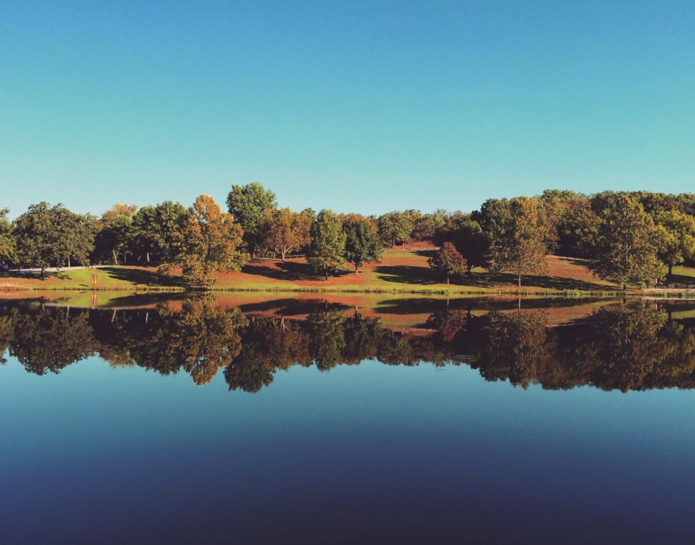
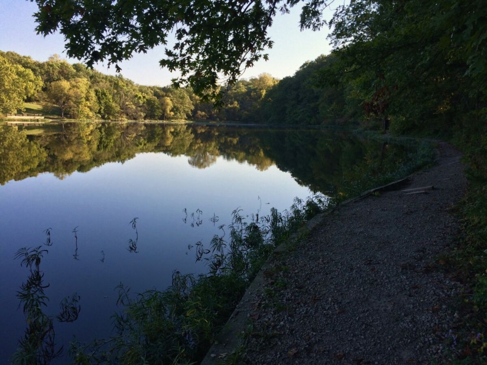
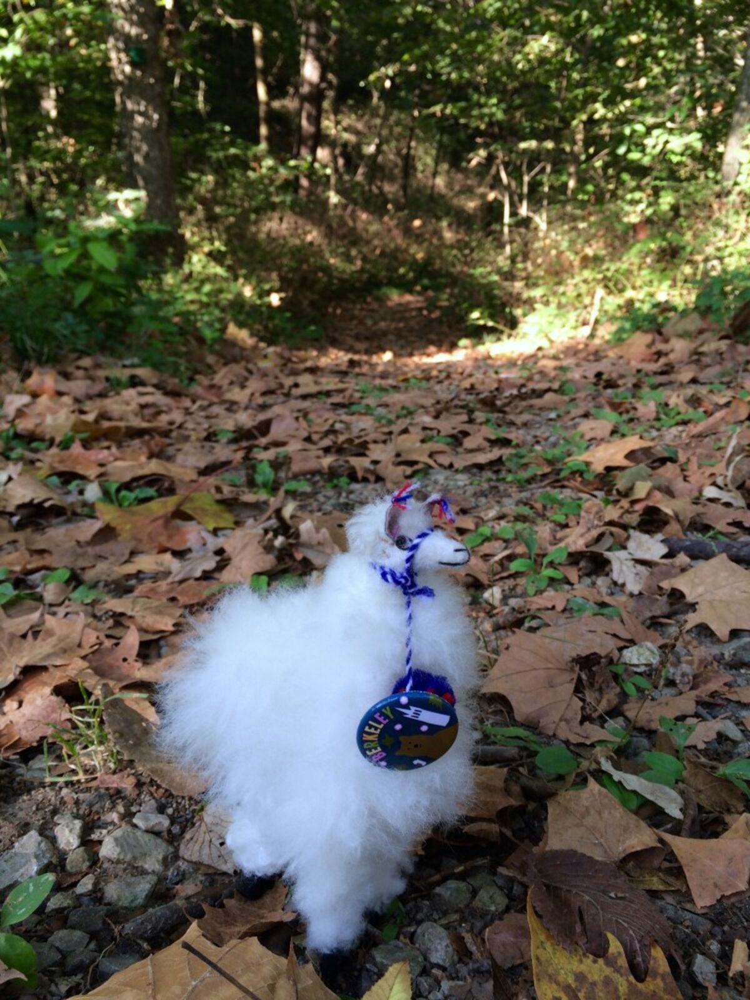
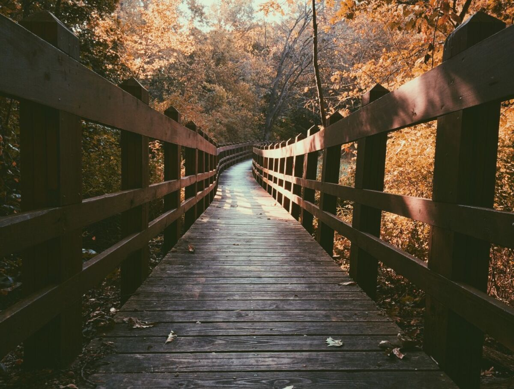
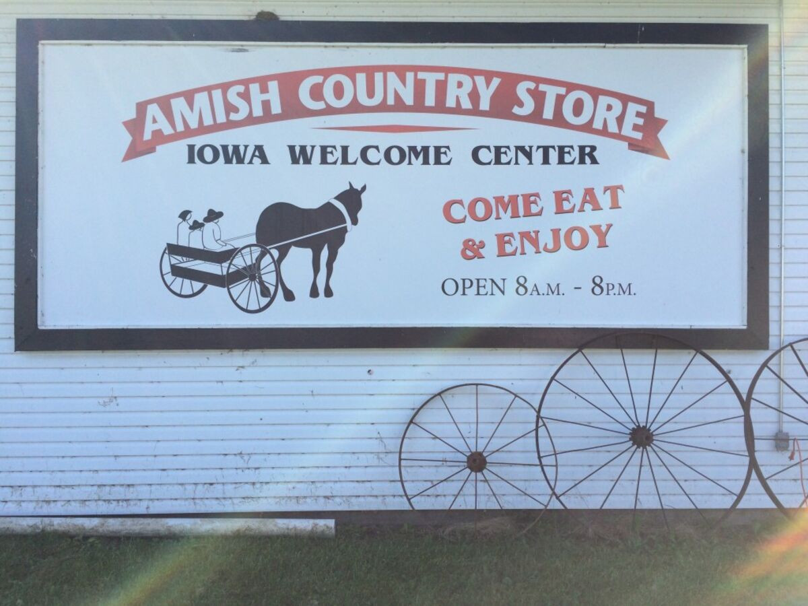
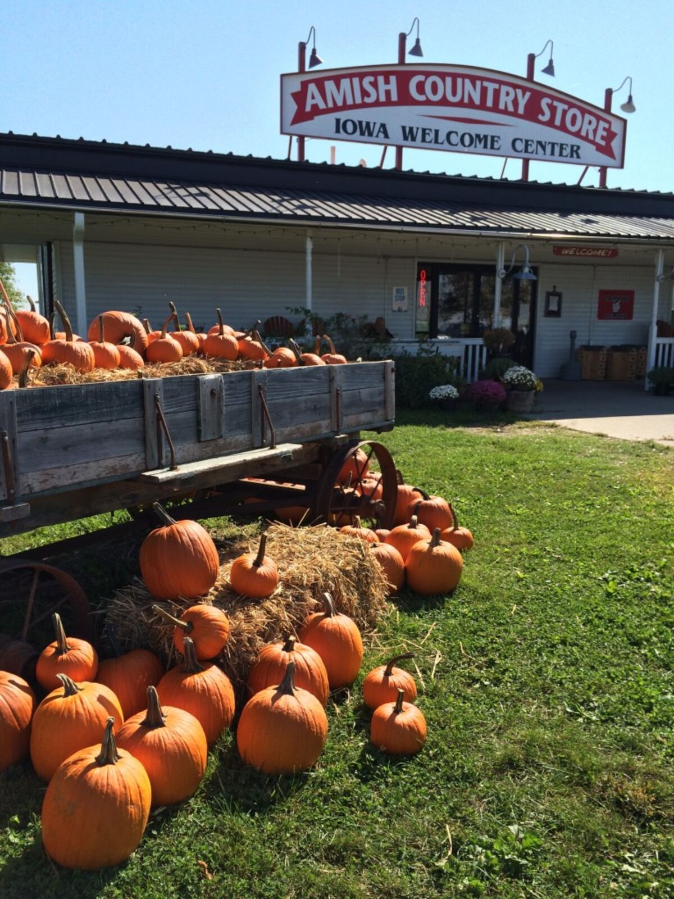
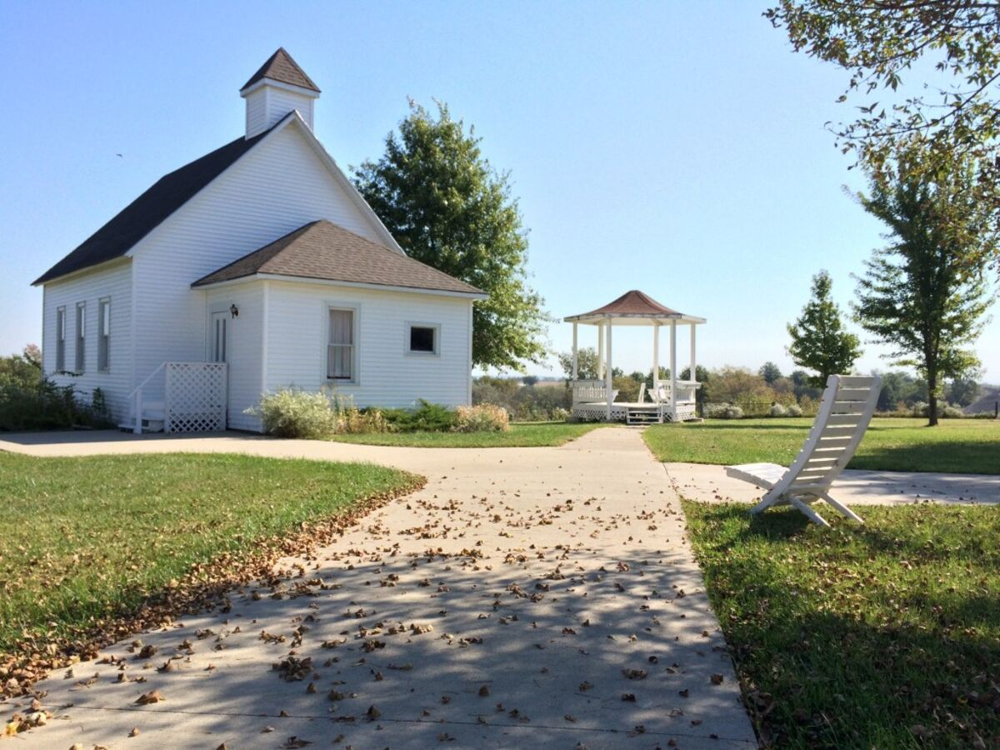
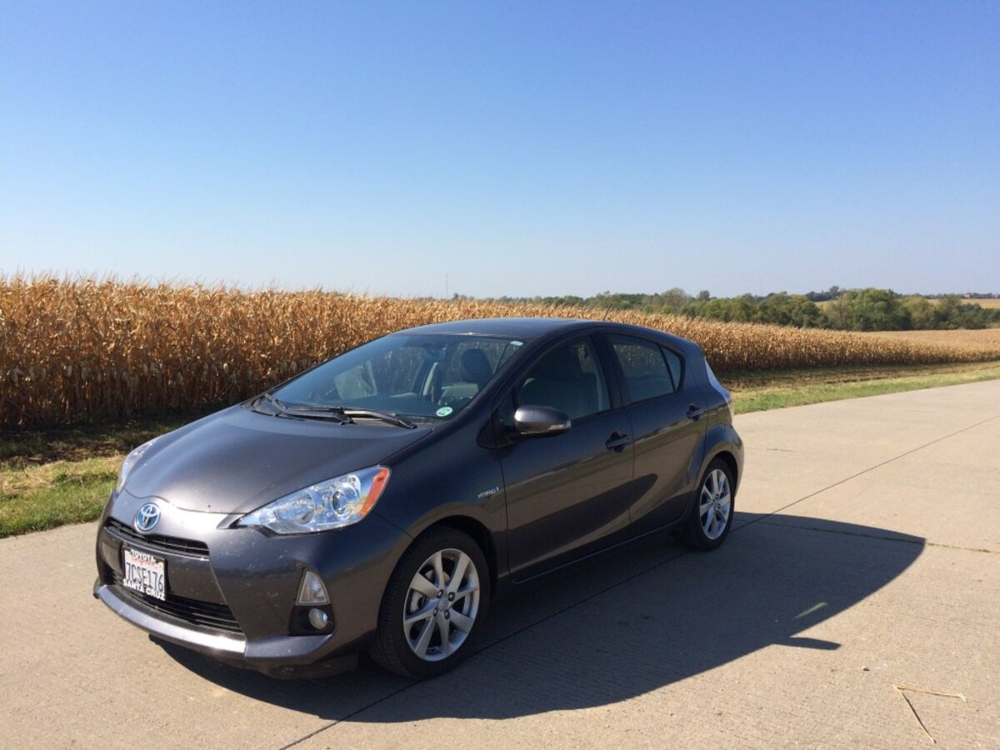
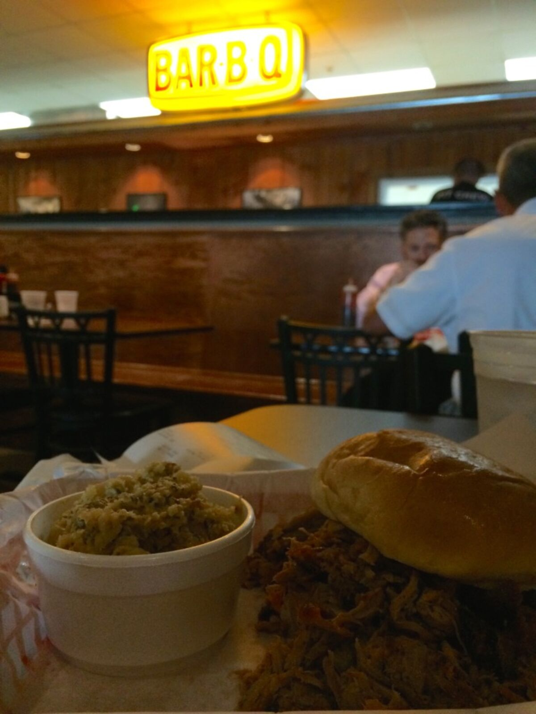
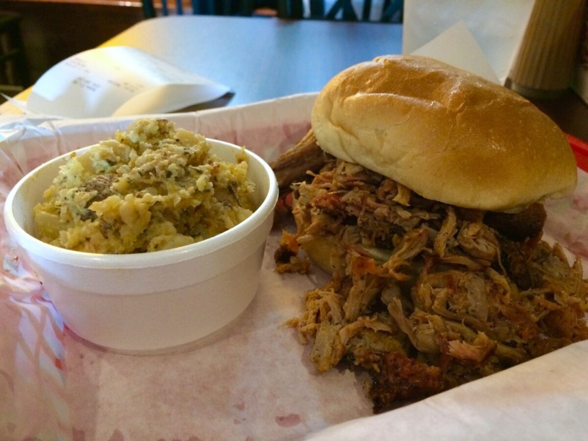

+++
date = '2015-09-29'
title = 'Missouri Tried to Kill Me'
author = 'Monica Multer'
authors = ['Monica Multer']
tags = ['story']

[cover]
image = "01.jpg"
+++

Kansas City, Missouri to Madison, Wisconsin; day two of my long days to come.
To break up the monotony of corn I decided to make a quick stop in Wallace
State Park, a small natural park about an hour outside of Kansas city, to take
a hike and get out of the car. It was a great idea but also turned into
somewhat of a nightmarish experience that I could never have predicted.

I exited the main drag of interstate and entered into a wonderfully windy and
hilly back country road that wove its way deeper into forested countryside.
The road was pleasnatly meandering through farm houses and red barns
disappearing from my fast paced world into obscurity behind me.

As I found the enttrance to the park I was pleasantly surprised by a doe and
her little baby deer grazing calmly on the roadside. I took a few pictures,
kept my respectful distance, and continued on my way just as they did theirs.

There was no one else in the park, so I had the stillness of the lake and the
chittering of the woods all to myself. The forest seemed alive and vibrating
with wildlife that remained unseen but well heard. The lake was so still and
serene, the perfect reflecting basin for the world that surrounded it.

I laced up my hiking boots and headed out across some wonderful foot bridges,
but I did not get very far before things started to get weird. First of all, I
was slightly on edge because there were so many noises all around me that I
had never heard before, be they bugs, birds, or small mammals, the noises they
made were somewhat haunting and remotely sounded like a child crying or a
wounded animal screaming. Not a great start. So I tried to ignore the noises
that were far off but present in the mysterious woods around me. I tried not
to let it get to me, but being a woman hiking alone and having no one else in
the park put me too on edge. So after a short bit I returned to my car and
decided to drive around instead of hike because I was sort of freaked out.

Once I went back to my car I drove to a separate trail away from the strange
noises of the forests I originally started by and found an amazingly beautiful
boardwalk.

Again, I didn’t get far before everything went down hill. I didn’t even get
onto the boardwalk, I was just taking pictures of it, when all of a sudden
there was a wild frenzy of cracking twigs and rustling bushes coming from the
hill behind me on the other side of the parking lot. I turned around with my
heart in my throat and the horrible thought in my mind that it was going to be
a bear charging at me out of the woods. A thousand things go through my mind:
I don’t have a weapon, just my camera, I can use my telephoto as a
(very expensive) weapon if I have to defend myself, if it is a black bear I
have to stand my ground and get angry, big, and scary fast, there is no one to
yell for if I need help, my car is so close but whatever is coming at me is
between me and my car, and a bunch of other gut reaction thoughts about
whatever was making that horrible ruckus in the woods.

When I turned and found the source of the frenzy I was relieved but also deeply
shocked and confused: it was a deer. A very angry deer. I don’t know why or
what was going on except maybe there was a baby nearby it was trying to
protect, maybe even the same mom and baby deer I had photographed early about
a mile away, but I didn’t know. It was a very angry doe running out of the
woods kind of hunched over, straight legged, and kicking every which way and
coming right for me.

Luckily, I was already on edge so I was able to react quickly and jumped up
onto the banister of the boardwalk above the reach of the deer. I don’t know
what I would have done if it had reared up because it could have possibly
reached me, but thankfully it stayed roughly on its four feet. It ran up to me
on the boardwalk and started battering the post I was standing on with its
front legs and angrily snorting. I started yelling loudly at it to scare it
away and weilding my telephoto in one hand, ready to use it to defend myself,
tried to scare away the pissed off deer as it attacked the boardwalk posts I
was perched atop.

After this back and forth went on for a little bit the deer seemed to calm down
and kind of ran off back towards my car and away from me. Warily eyeing it I
waited until it seemed distracted and jumped from the banister to run off into
the woods the other way since it was still between me and my car. I had
planned on taking a hike, this was just not necessarily the way I had wanted
to do it.

It didn’t come after me and all I can assume is that it left and whatever
spooked it was gone (including myself). So I calmed down from the scare and
tried to enjoy my hike. Then things got weird again. Yeah, I know, again.

I was walking through the forest when I started accumulating a few more spider
webs getting caught on me than I was comfortable with. So I stopped to wipe
them off and kept going only to get even more. Feeling the hair on my arms
rise, I stopped again, wiped them off and tried to peer forward into the
wooded pathway I was taking and was horrified: there were spiders everywhere.
So naturally I almost threw up, ripped my coat off my back and yelled

**FUCK THIS PARK**

And ran as fast as I could out of woods, frantically clawing the webs from my
body and trying not to imagine all of the possible spiders crawling on my
body. I made it back to my car, the devil deer was gone but my car was COVERED
in spiders and webs. COVERED.

I ripped the door open and jumped in as fast as I could and took off. I kept
trying to wipe the spiders away with my windshield wipers and couldn’t stop
twitching I was so freaked out. Once I was a safe distance from the park I
pulled over, screamed at the top of my lungs at a corn field and thoroughly
checked myself for spiders. I flipped off the park behind me, hopped back into
my car and continued on my way.

I’m sure it was a perfectly nice park, it just hated me. It was a misadventure
to say the least, but at least I got some nice photos of the beautiful
scenery.

I pulled into a McDonalds to wash off my hands, ordered the largest coffee I
could get and looked like a mad woman pulling twigs out of my hair as I waited
for my drink, being watched by a tour bus full of old women with questioning
eyes.

I had finally calmed down after I crossed the Missouri state line into Iowa and
was glad to have left it all behind me.

To further soothe my rattled nerves I took an innocuous stop at an Amish
Country Store in Iowa. I sat on a curb for a while and pet a little Amish
Corgi that had popped out of a bale of hay covered in straw and wagging its
entire body like only a Corgi can do. I spent some time there just enjoying
the sunshine, the endless fields of corn, which suddenly seemed strangely more
appealing than the woods to me after that morning , and my little Corgi
friend.

The rest of Iowa was more of the same, endless corn that swayed in the wind
like the undulating waves of a dusty amber sea. After a while of this I
decided to take a break because I was getting pretty tired at this point. I
felt like a person who has been on a boat for a long time who then steps foot
on shore and feels like everything is still rocking, except I felt like the
world was still whizzing by me at 80mph despite everything moving at its
normal speed. It was disorienting and I figured it was time for a breaking
from the mind numbing monotony.

I just so happened to pull off in Des Moines, Iowa at a BBQ place called Smokey
D’s BBQ Joint, which had been featured on the Food Network’s Diners, Drive-ins
and Dives. So I got some good ol’ Iowa BBQ and enjoyed my break.

The rest of the drive was a blur, nothing between Des Moines and Madison except
corn, corn, and more corn. I do enjoy the silos though that break up the
continuous fields. But aside from that, nothing.

I made it to Madison totally exhausted, toast. But I got to relax in my Aunt’s
backyard who I was staying with and watch cardinals flit about a bird feeder
dancing like little red ballerinas about one another. It was a peaceful and
restful way to end the day, watching the sun set over the green backyard of
Madison.
