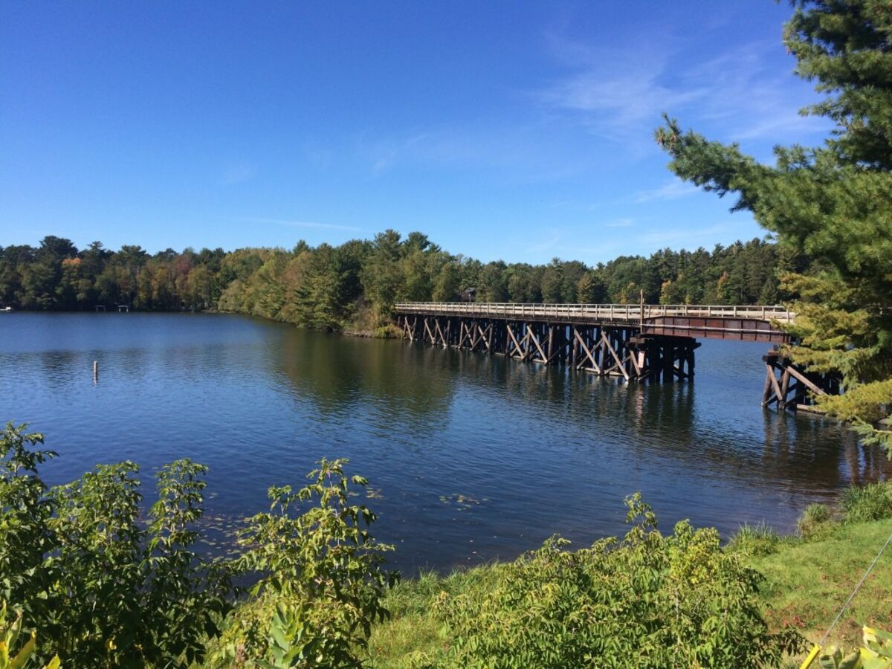
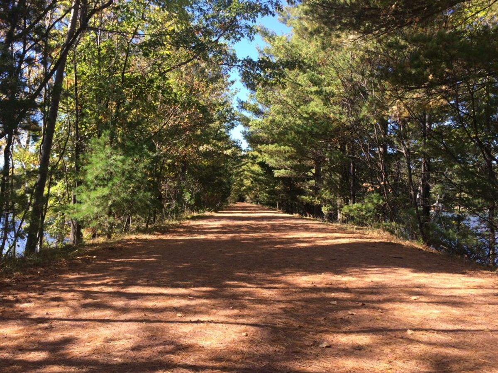
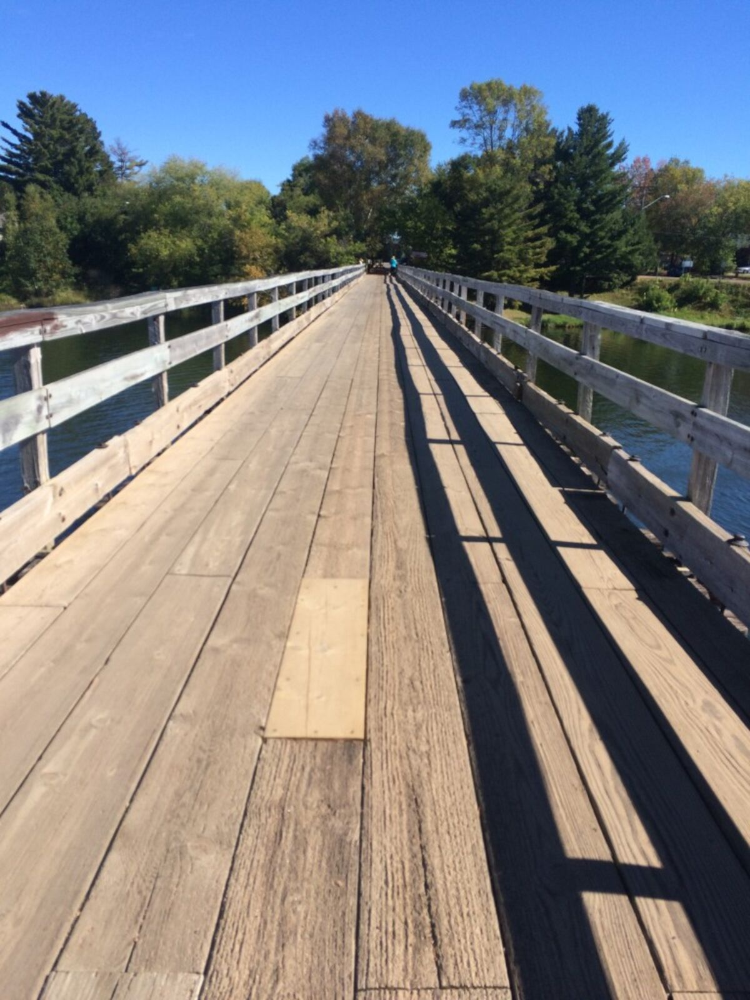
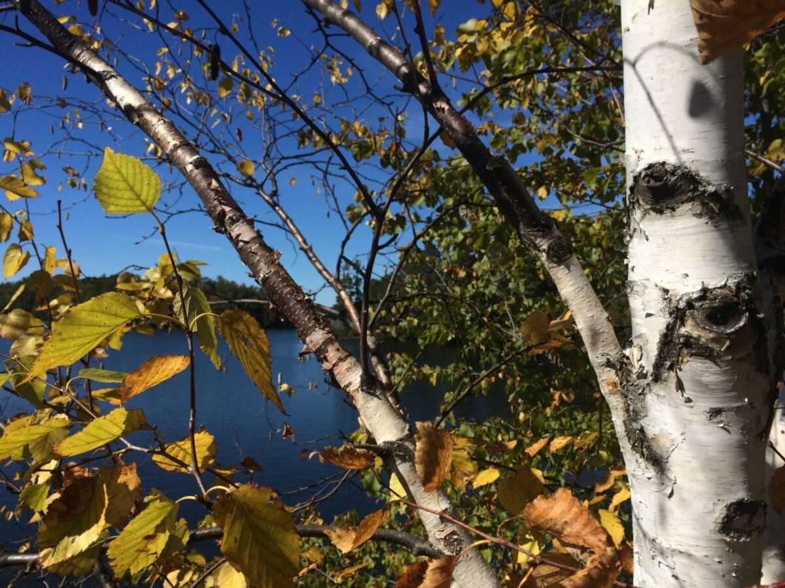
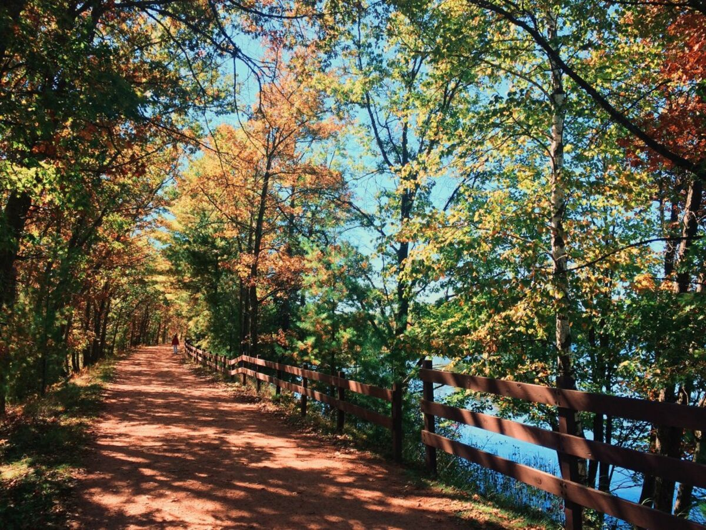
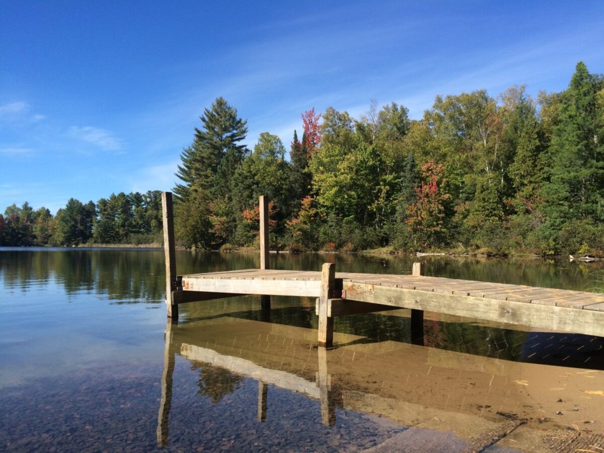
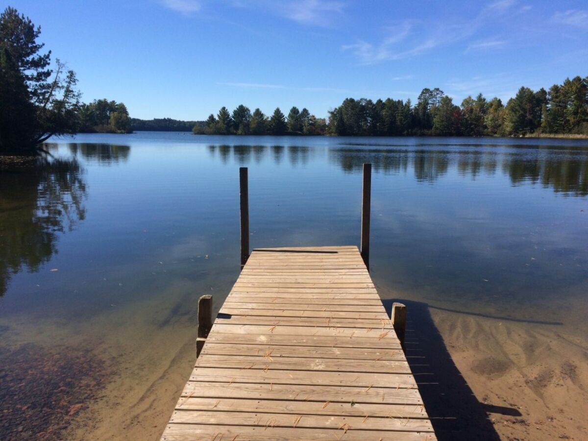
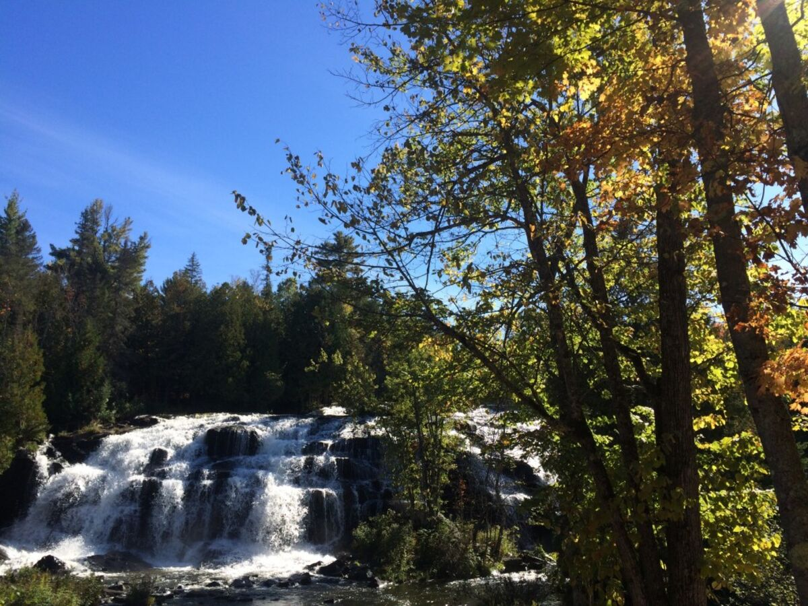
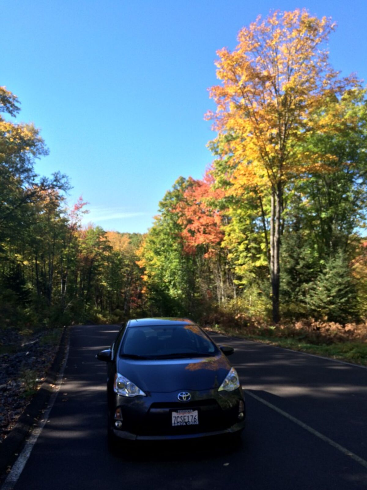
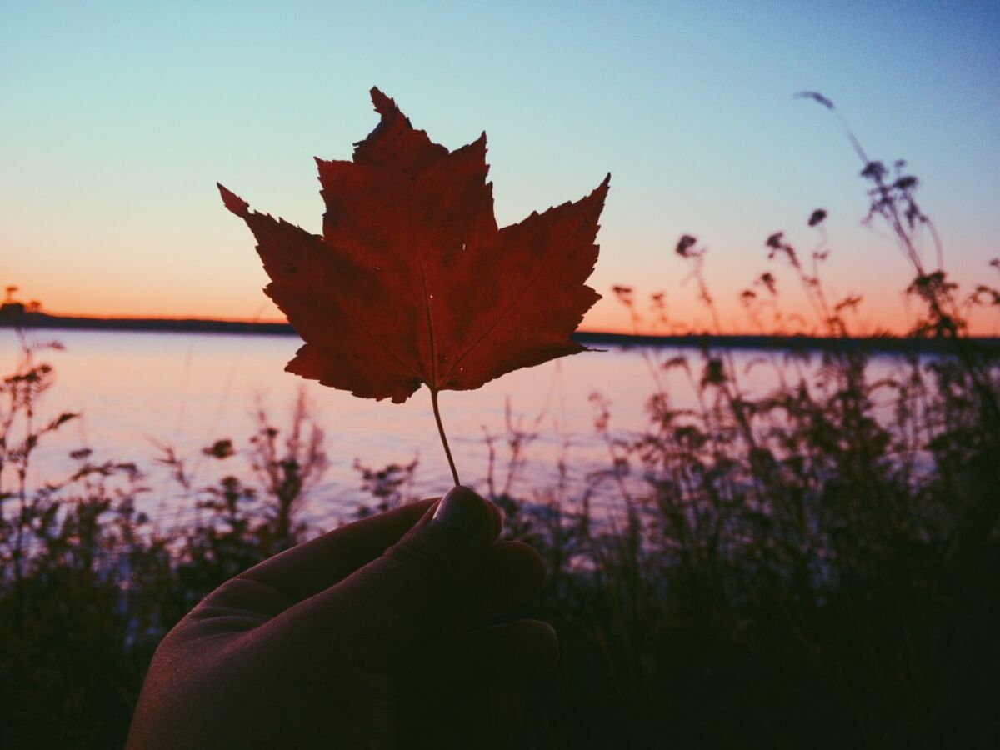

+++
date = '2015-10-06'
title = 'Made it to Michigan'
author = 'Monica Multer'
authors = ['Monica Multer']
tags = ['story']

[cover]
image = "01.jpg"
+++

I am caught somewhere between way to busy and being too tired to reflect to put
my thoughts on the page, or, in this case, on the internet. I know I have
neglected my blog the last couple of days, so here is the update: I made it. I
had one last final day of driving after I finished my time in Madison. But I
had to have one last breakfast in this wonderful city (which is somewhat of a
foodie heaven, especially for the midwest!) and stopped just outside of the
captial building grounds for a great chai latte and a dark chocolate, caramel
sea salt crepe from Bradbury’s.

Driving away from my amazing aunt who was gracious enough to host me for my
time in Madison and with the gorgeous capital building in my rearview mirror,
I hit the road one last time.

I drove through Wisconsin up into the Upper Peninsula of Michigan where I will
be staying for the next month. I saw a couple of really amazing places on my
way up like Minocqua, Wisconsin. This little town surrounded by a series of
wonderful lakes, crisscrossed by trestles and interwoven by a state hiking
trail. How amazing is that? I totally stumbled upon it on accident while
trying to take a picture of a trestle. 

The trail was a long and winding stretch of covered pathway, framed by trees
and surrounded by lakes. I felt like I was weaving my way through a wonderland
of lakes. 

The trail took my breath away between the aqua green waters and the fall
colored leaves. It was a great accidental side trip before I crossed over the
state line into home territory, Michigan. 

I also took a few random side breaks to campgrounds, lakes, and boat launches
just to sneak off the main road and find some water or fall forests to
explore. 

The fall colors from Minocqua upwards were unbelievable. Colorado was a land of
golden trees but here were so many shades of oranges and reds, trees the color
of wine and cinnamon. I couldn’t help but laugh at the rush of exhilaration I
felt every time I turned around the next corner because each view was more
amazing than the last.

My final stop was at Bond Falls, a great stop that I always make on my way in
or out of the UP (Upper Peninsula for all you non-midwesterners). The
cascading waterfalls at Bond Falls compounded with the fall colors was the
last step in total and uncontrollable excitement about being back in
Michigan.

I had made it, driving in along the rainbow of fall colors I rolled down my
windows, blasted my music, and felt the cold crisp air of impending winter,
knowing all the while that my heart had come home again. There is no home to
me quite like going up North to the Keweenaw Peninsula. No brighter colors or
stiller lake, no calmer heart to be had than when I sit on the dock next to
the gentle lapping waters of the place I call home. And of course, there are
no sunsets quite like the sunsets in Bootjack because every day is a beautiful
day out here. There are many beautiful days to come and hopefully I can post
more now that life is beginning to settle down a touch more, but for now I am
staying put. No more open road for a little while but there is still adventure
to be had in this quiet land. And I have every intention of not wasting a
single second of my precious time up here in my home away from home.

