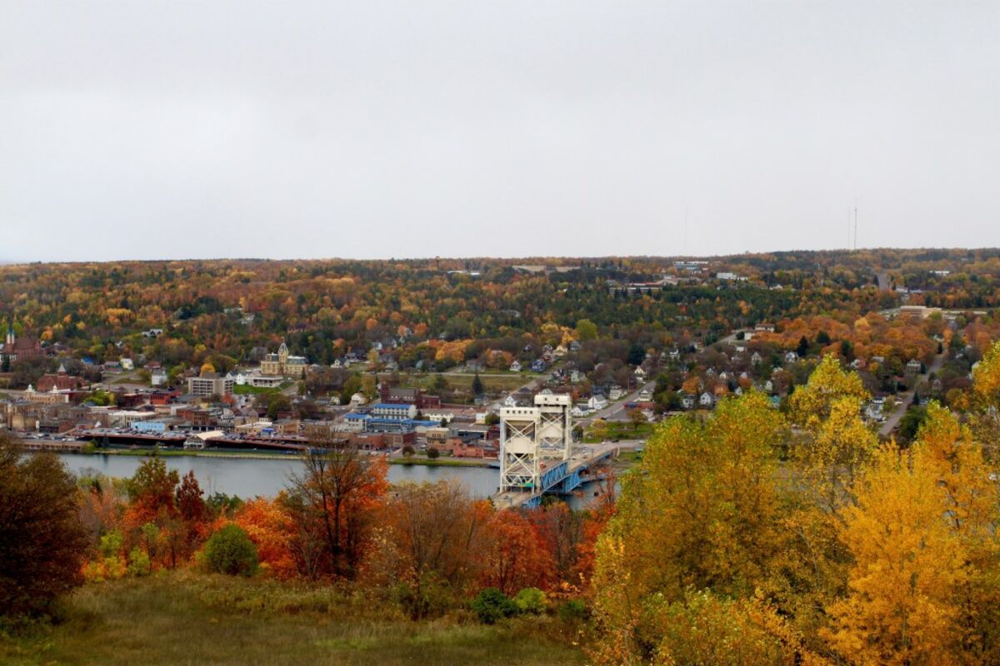
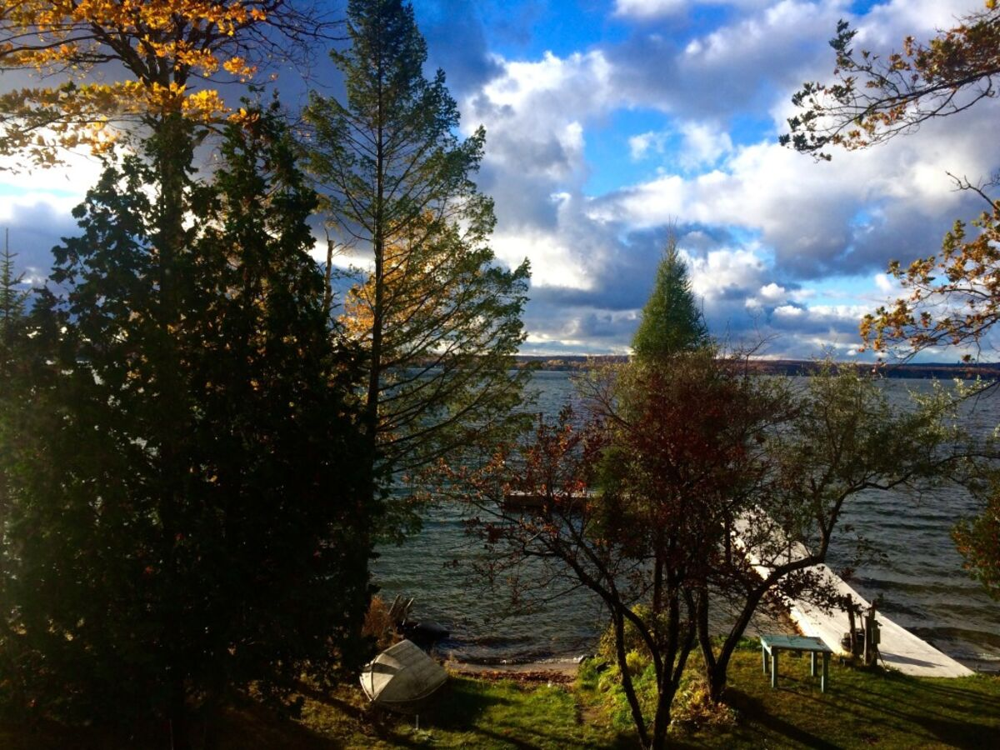
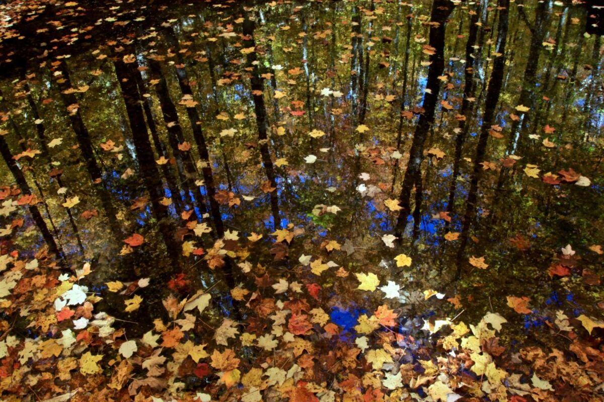
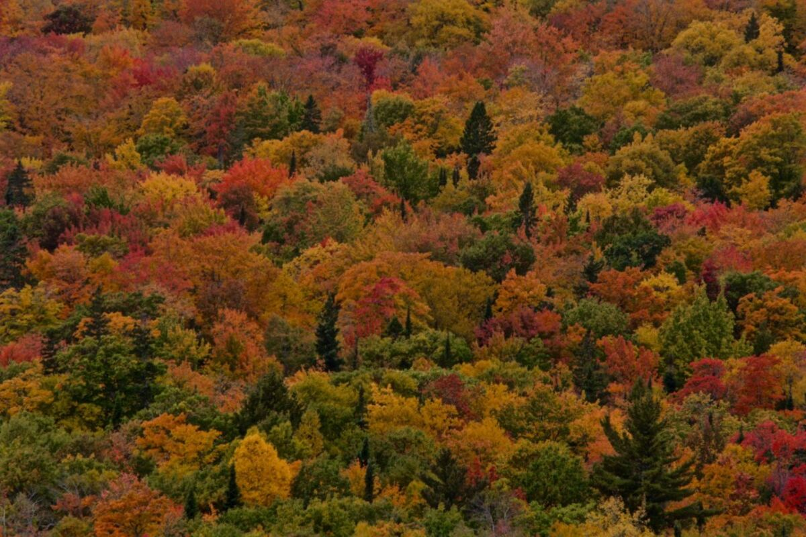
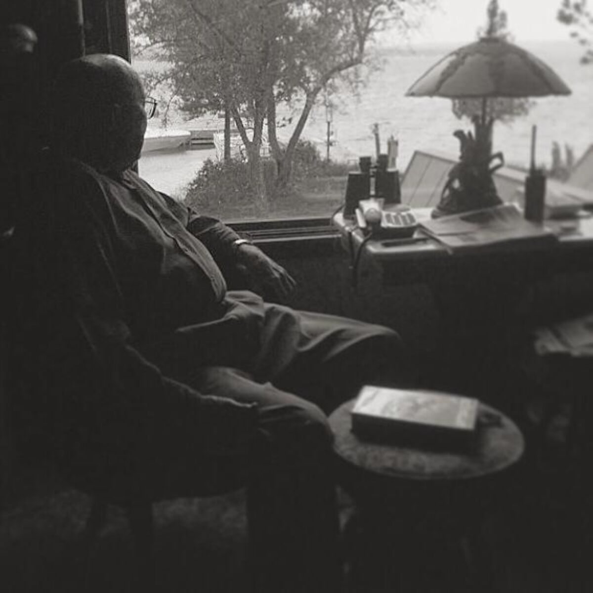
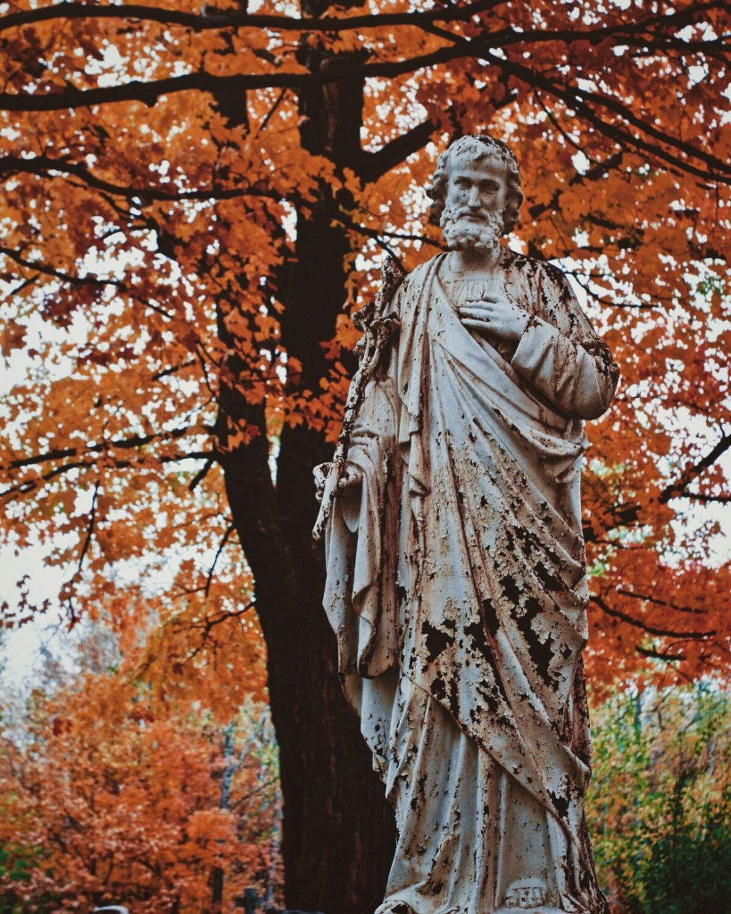
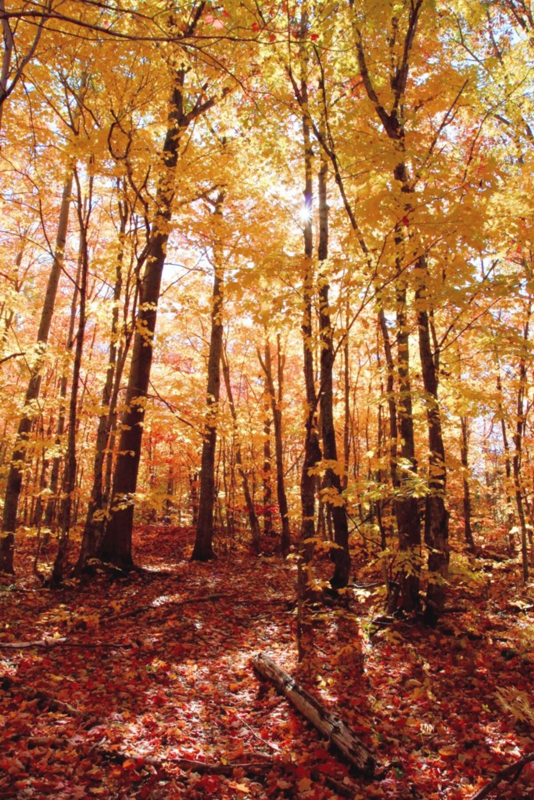

+++
date = '2015-10-18'
title = 'Life in the UP'
author = 'Monica Multer'
authors = ['Monica Multer']
tags = ['story']

[cover]
image = "01.jpg"
+++

Even though I have a home once more, I have found myself taking to the road.
Not to get anywhere in particular, I have no grand destination at the end of a
long road anymore, but I take to the road all the same. Somedays I drive just
to feel normal again, the road has become my home in more than one way. But
most days, I drive to watch the fall leaves twirl in the air of my car’s wake
as I devour mile after mile of empty roadway. This is my now, after the colors
turned, after the winter winds began, and after the leaves began to fall. But
this isn’t where I want to begin, I want to go back when the trees were still
green and the lake lay still. I want to tell you where I have been, how
strange life has become, but in the best of ways.

3,354 miles and a little over two weeks on the road. The space between me and
everything I once called home. Now it is over a month since I left the sunny
west coast behind me and I have been living in the Northernmost tip of
Michigan where the sky meets water and the land ends.

This place is not unfamiliar to me though, it is not a strange, exotic and
unknown location; this is my home away from home. However, I have never seen
it quite like this before. The closest city to me is Houghton, a drawbridge
city with cobblestone streets and old brick buildings lining the downtown
stretch of road. But every morning this is the view I wake up to.

So many things are different now, things I have never seen before because I
only ever visited in the summer time. I feel like my world has been turned
topsy turvy, everything is so similar yet just different enough to disturb the
normalcy of everything I had grown accustomed to since I was a very young
child. Small things are off, like leaving a book on your desk and returning to
find it on top of your bed with no one around to have moved it.

Small things like seeing acorns on the ground. The entire ground is littered
with them but since I have only ever been here in summer I have never seen an
acorn here. Or watching fog lift off of the lake in the early morning or
funneling down the channel when I have only ever seen sun, rain, and lightning
in the sky before now. Or realizing that the shadows fall differently because
the sun is in an entirely different position. The sun sets so far south and
instead of 11pm sunsets, the sky gets darker earlier and earlier every day.
There are endless things that entirely transform this place I have visited
almost every single year since I was born. I feel like I have found myself on
the other end of the looking glass and everything is slightly distorted.

There are two not so subtle changes that have really transformed this once
familiar place into a mysterious and new experience. The first of which is
obvious, it is Fall. I have never seen the once verdant ubiquitous green burst
apart into such an array of beautiful colors. It makes me look at everything
with new awe struck eyes.

The land around me has become its own sea of colors. Amber, wine, violet,
peach, rose, and so many other colors have transformed every tree into a color
palette of startling fiery colors. Every day the world around me looks
different. Every day it transforms a little more, becomes a little more
beautiful, or looses a few more leaves. This ceaselessly protean landscape has
dug its beautiful fingers into my imagination and lit my eyes aflame with the
possibilities of fleeting life. There is such a desperate beauty in imminent
perishing life.

The other difference is the life that already perished. The loss of my
grandfather, one year after his passing, is thick in the air everywhere I turn
up here. It is not necessarily a bad or sad feeling, just a very persistent
one. Memories are the greatest ghosts we could ever conjure.

I dreamt for years about coming up to Northern Michigan to see the peak of fall
colors, but I never dreamt that it would be without my grandfather. I always
thought I would walk arm in arm with him through the forest of amber and wine
colored trees. I thought we would sit in his favorite chairs by a fire, no
words passing between us, just a mutual understanding that sometimes words
aren’t necessary to know you are loved. Now I am finally here and on the one
year anniversary of his passing. I wish he could be here with me and I cannot
believe, even a year later that he is actually gone. I miss my grandpa but I
see him and feel him in the flurry of falling leaves everywhere I go.

I am staying in his home without him and every time I hear this old house creak
I always wonder if it is him. I feel like I cannot go anywhere without bumping
into his ghost. But I know he would have wanted me here. I just wish he could
have been here along side me.

I think one of the biggest things about being here by myself is how much older
it makes me feel. I can physically see the changes, the way that time has
transformed this place and myself. I have always known this place as one
filled with love, family, laughter, adventure, mischief, and growth. But now I
am here at the end of fall and the cusp of winter. It isn’t summer anymore. I
have grown older, my grandfather and grandmother are both gone, my cousins
aren’t here with me to enjoy each others company, and the leaves are falling
one by one as the water slowly recedes from the shores.

It is a beautiful death here. A beautiful transitioning between the life of one
year and the life of the next. This is where I find myself. Between the death
of an old life and the beginning of a new one. The west of my past and the
east of my future as Kerouac would say if his journey had been reversed. I am
moving slowly towards something, but I know not what yet. For now I sit and
watch the world around me changing, wondering what will come when the color is
gone.

