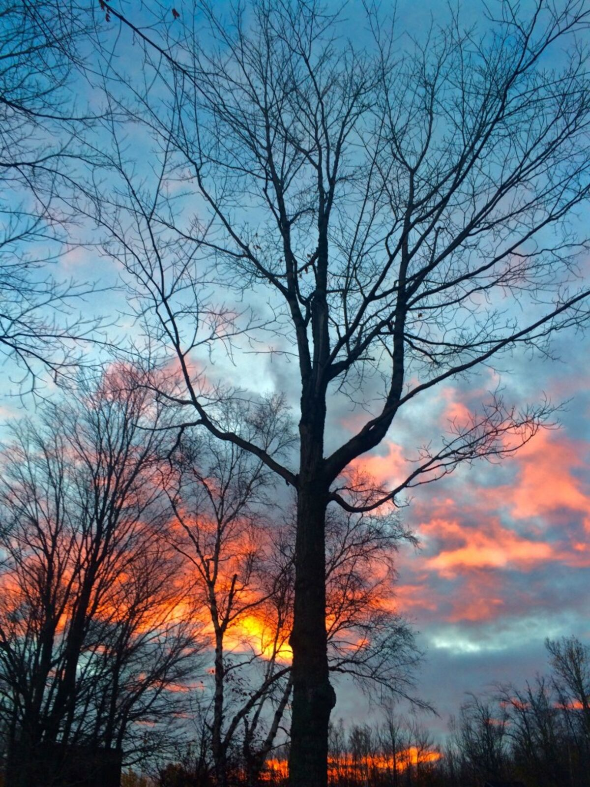
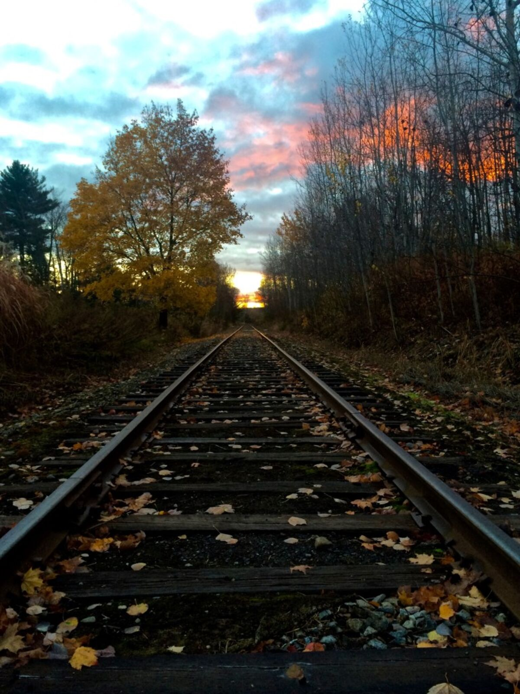
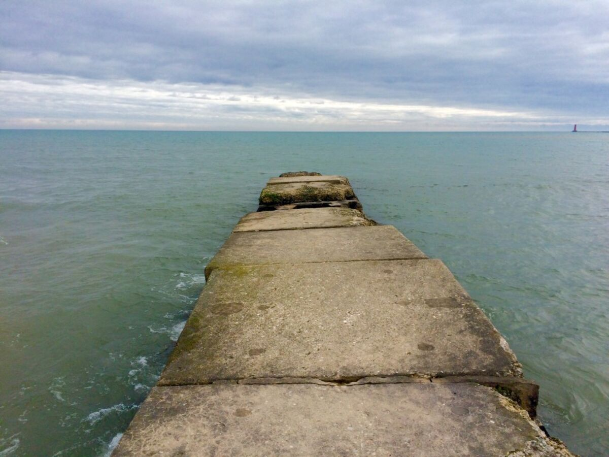
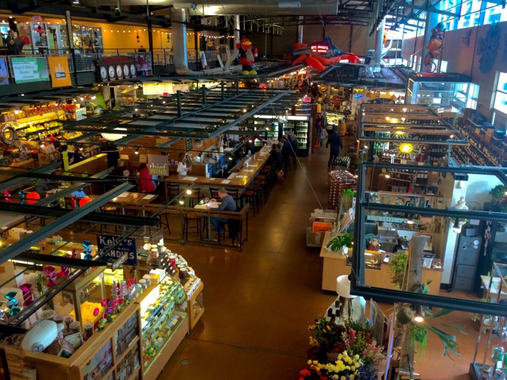
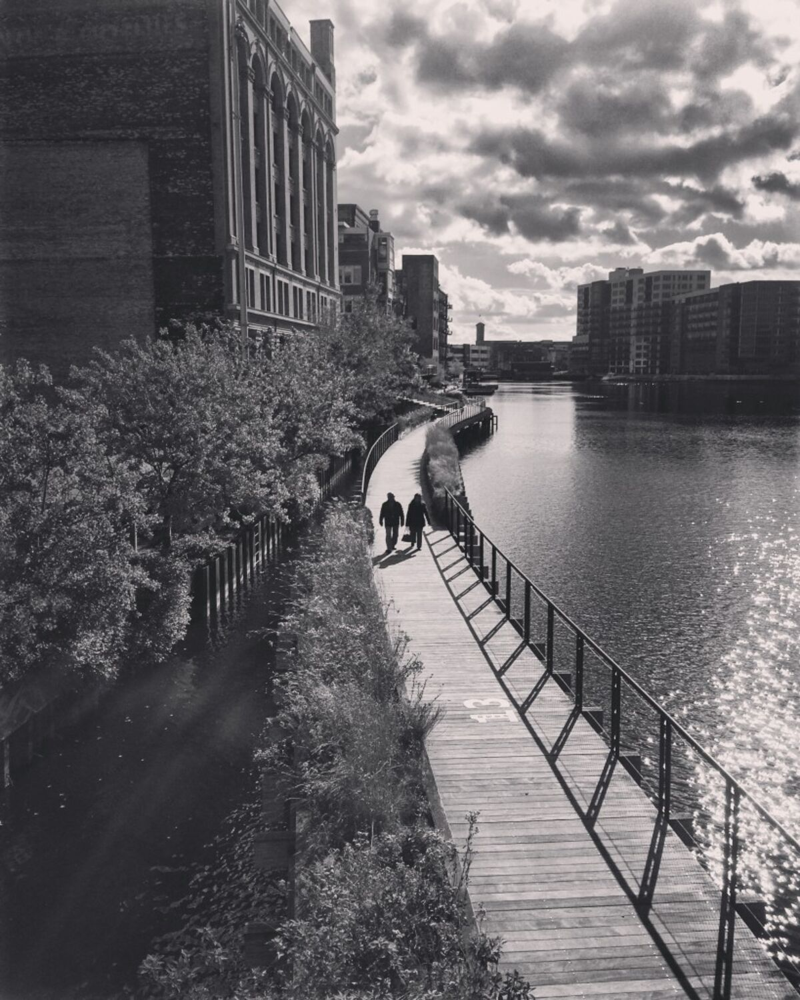

+++
date = '2015-10-31'
title = 'Trees to Skyscrapers'
author = 'Monica Multer'
authors = ['Monica Multer']
tags = ['story']

[cover]
image = "01.jpg"
+++

I have exchanged my endless forests with city streets and skyscrapers; swapped
Lake Superior with Lake Michigan, and found more family along the way. If
there is one thing that I have learned on this journey thus far, it is that
even on a solo road trip, I am never truly alone. The are so many people who
take part in this journey with me, friends, family members, and strangers that
become friends. Even when I think I am truly alone there is always someone on
the end of a phone or at the end of a long day of driving. There is a peculiar
feeling of desolation that I have grown familiar with, that clings to me like
a shadow and sometimes eclipses my vision. However, the desolation is only as
real as I make it.

So here I am, another city, another loving family that has taken me into their
home. Bootjack to Chicago. The difference a day can make is astounding. I left
behind my comfort, my home away from home and my family once more in Michigan
as I did in California and then Colorado. I am constantly moving away from the
places, people, and things that I love only to realize that not only can I
never truly leave them behind, but there is always someone else waiting with
open arms. I love my family, everywhere across the United States and I have
never known so securely that I am loved and not alone.

So even though it was hard driving away from my home in Michigan after one
final look across the still waters of Portage Lake at the end of the frosted
dock, I knew it had to be done. It was time to move on and begin again. In the
dark of early morning, long before the sun rose I drove away down Bootjack
Road.

Its funny, I have been in so many big cities on this trip and somehow managed
to avoid rush hour traffic jams in all of them except for Houghton. Tiny
little Houghton, the gateway that literally bridges the upper peninsula to the
rest of the world. I got stuck there in traffic (as I would find out later
this would be the motif of my day) for quite some time and finally made it out
just as the first light of day was creeping into the dark skies. I reached the
Bishop Baraga Shrine, the snowshoe priest, at the southern end of Lake
Superior to watch the sunrise and say goodbye to Lake Superior one last time.

The sky turned such a vibrant pink for a moment and it felt like Lake Superior
was bidding me farewell. It is so hard for me to leave that great lake behind
because for some reason I feel so lost without it when the sting of fresh
remembrance is so clear in my mind. I feel disoriented without its waters to
guide me and driving away from it feels like I am setting out into the world
without a compass. But leave I did.

I stopped in L’Anse to buy a giant cinnamon roll the size of my head but that
was really my only stop (besides a lot of detouring since so many of the roads
I had planned to take were closed due to construction) until I reached
Sheboygan on the coast of Wisconsin’s Lake Michigan.

I said hello to Lake Michigan for the first time on this journey but did not
linger long at the water’s edge.

I made a major stop in Milwaukee, which is a surprisingly wonderful city! I had
no idea it was so interesting and I ate lunch at the Milwaukee Public Market.

It was a great break before heading into the stressful heart of Chicago
traffic, which was completely overwhelming after a month of living somewhere
where your only roadside companion is the occasional tractor. Being back in a
big city is baffling to me and very stressful but I finally made it to my Aunt
and Uncle’s home where I will be staying for the next little bit. It is so
great seeing my family again especially since it has been a long time. We went
out to a wine bar called Bascule where we drank wine, ate delicious food
(I tried octopus for the first time), and caught up on the space between all
the years since we had last seen each other. It was a long day but overall a
good start to my life back on the road again.
