+++
date = '2015-11-01'
title = 'Family fun'
author = 'Monica Multer'
authors = ['Monica Multer']
tags = ['story']

[cover]
image = "01.jpg"
+++

Getting to visit family is priceless, especially family that I haven’t seen for
some time. Long talks over drawn out meals or nights spent laughing next to
warm fireplaces together are the foundations of memories for years to come. I
have loved being with my family here in Chicago, we have had a lot to catch up
on and what better place to do it than this beautiful city. Yesterday we
explored the Pilsen district in the rainy Halloween weather, and ate delicious
food (I got chicken and waffles for the first time) while talking for a long
time. Today we went into Downtown Chicago since the sun was out in force and
there was so much to see. We got Dim Sum and then meandered around Millennium
Park together.

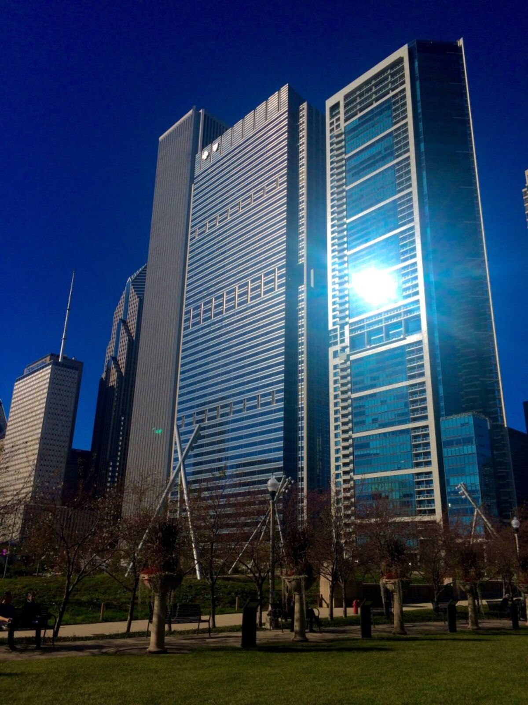
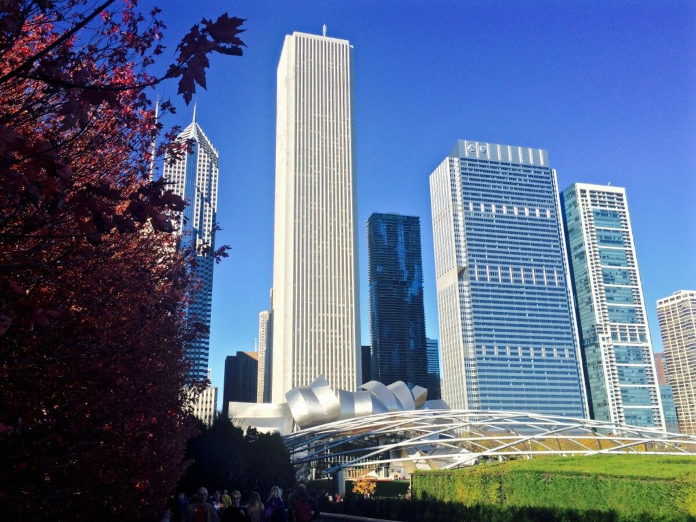

The Chicago skyline is exquisite; the sheer variety of shapes, widths, colors,
and materials that compose the rugged ups and downs of this city’s outline are
unbelievable. I could stare up at these buildings forever. Cities have a way
of making people feel small but in a good way; the fact that people
conceptualize and then materialized these structures is humbling and exciting
at the same time, a living monument to the capacity of man.

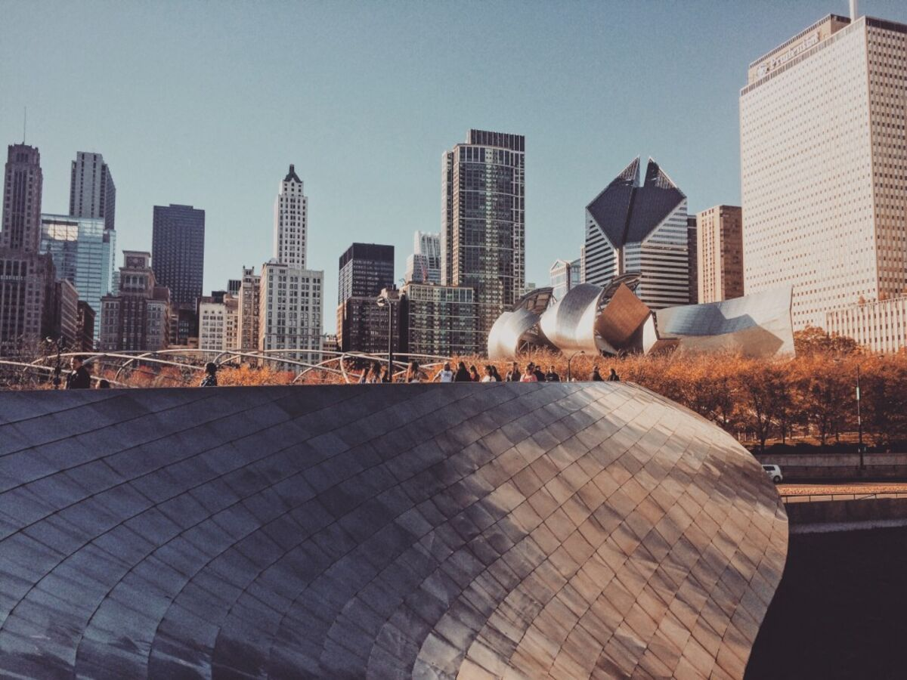

It was such a warm day and after so many cold days in Michigan it was a breath
of fresh air. Even the trees still had color! It is amazing to have witnessed
an entire month of autumn in Michigan only to come here and start at the
beginning again. So many trees here are still green and it is a marvel to me
that not everything is dead. Regardless, we wandered around the park and then
returned home for a short break. I then ventured out alone to the Wicker Park
area of town which is full of quirky life and graffiti. Both Pilsen and Wicker
Park had some great work like these I found.

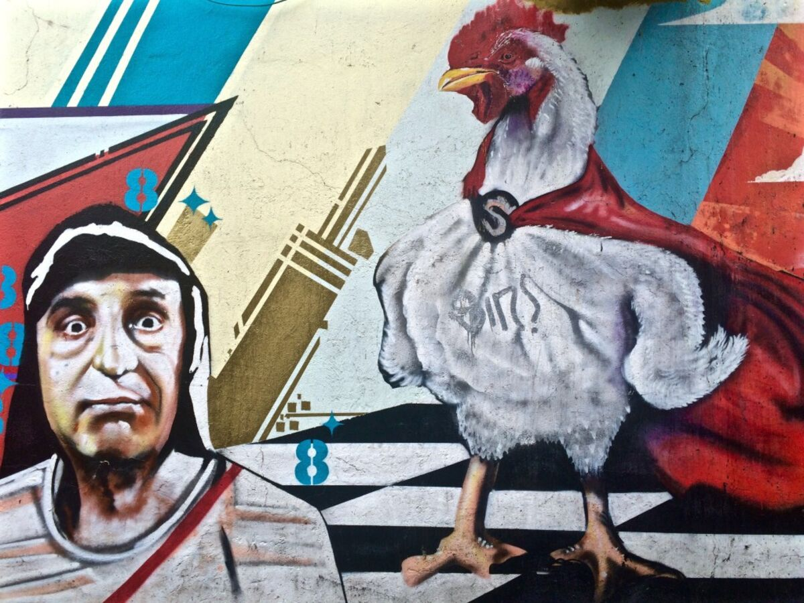
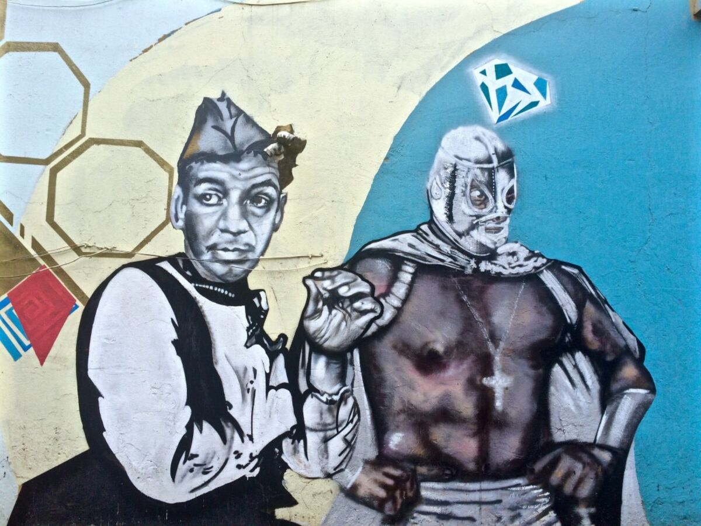
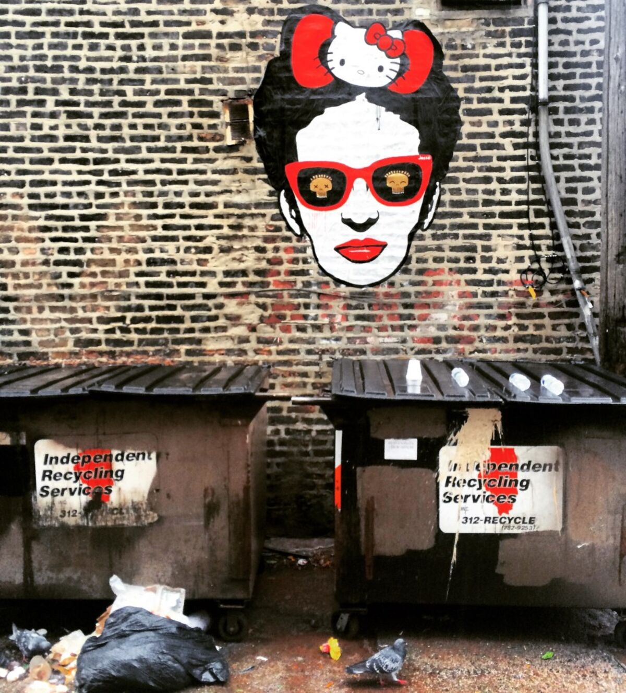
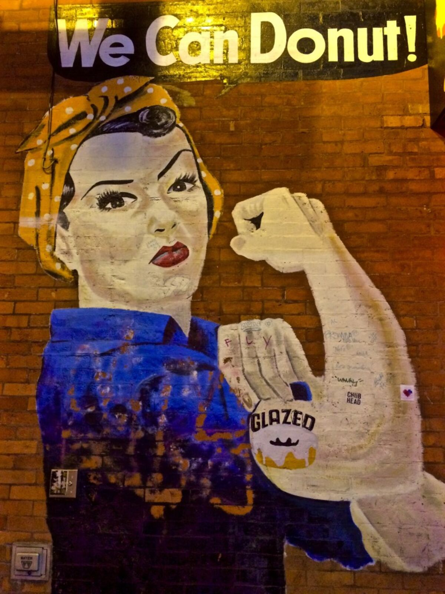

I went and got some coffee at the Wormhole, which is an offbeat and fun study
cafe squeezed between vintage thrift shops and bars flashing with neon lights.
I sat and read my book for a little while only to realize that the sun had
already disappeared. Darn daylight savings time. Stealing all of the sun.

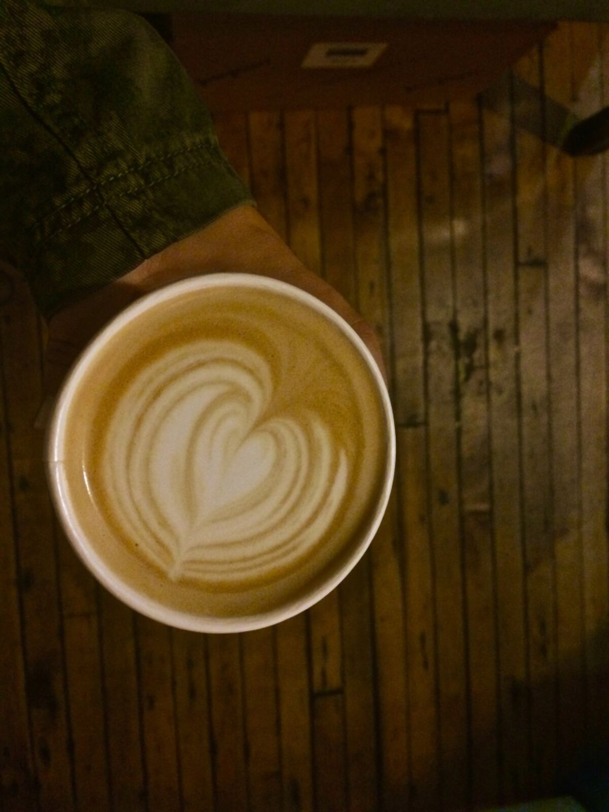

But I happened upon a bookstore I had been hoping to visit without even trying
called Myopic Books; this collection of over 70,000 books is an astoundingly
awesome second-hand bookstore. I could get lost in this store for hours. It
was a great coincidence that made my nerd heart very happy.

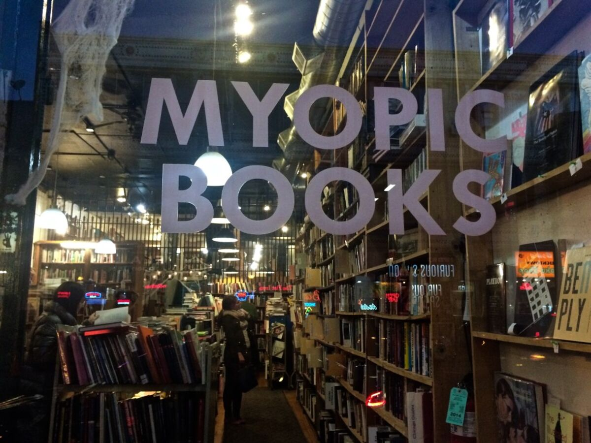
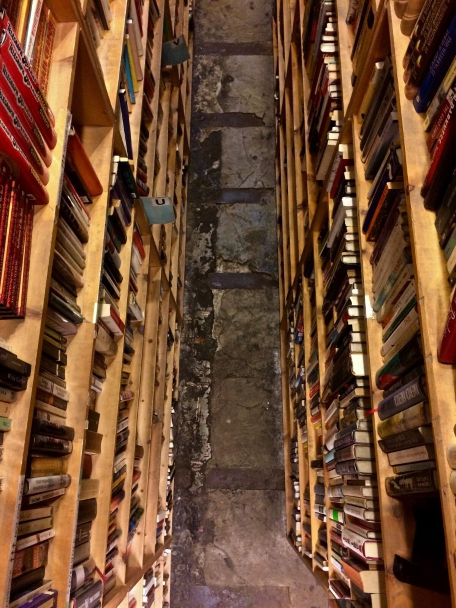
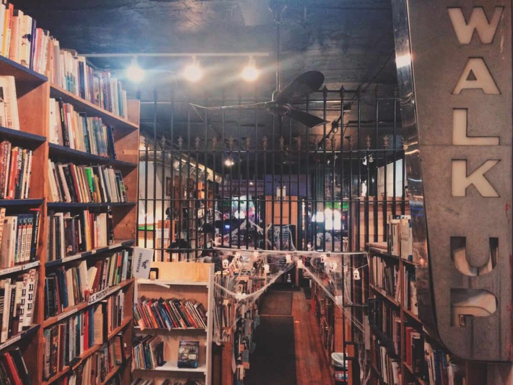

I wandered around the warm city streets taking in the glittery shops and
shining street lights amidst the cacophny of car sounds and found myself
beginning to readjust to city life. There is a specific brand of beauty in big
cities, I have not yet fully discovered the nature of that beauty but maybe it
will be more clear to me in the weeks to come as I explore more major cities
on the east coast.

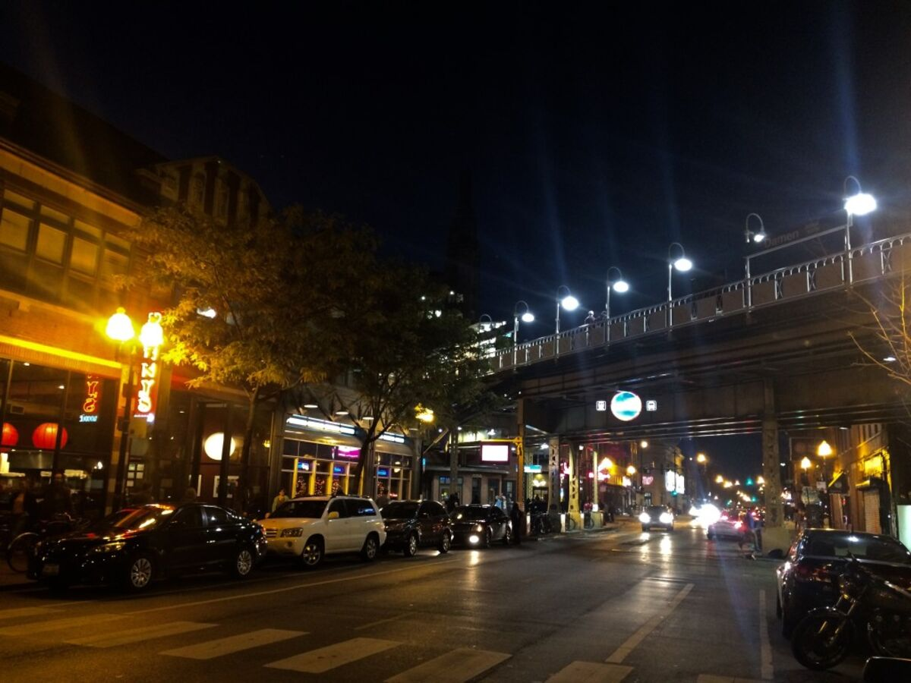

For now the night time streets of Chicago are more than enough for me.

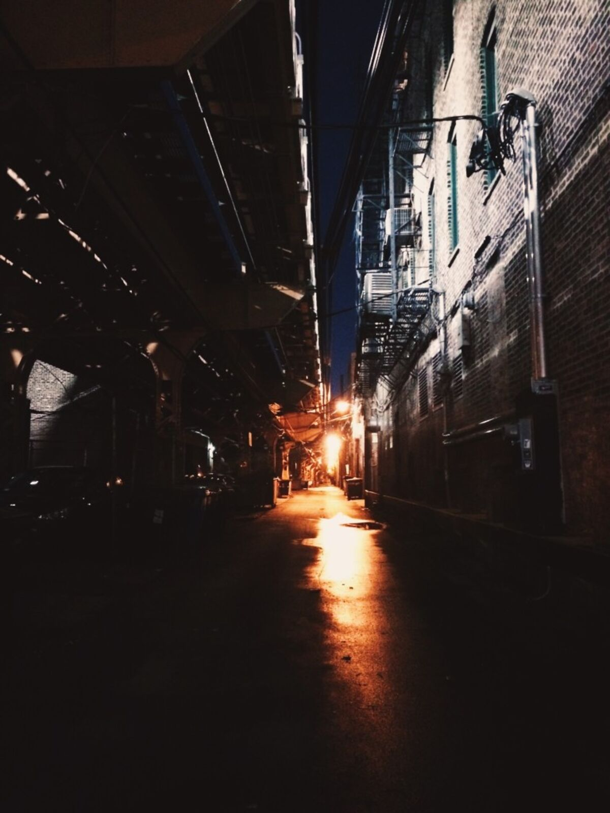
