+++
date = '2015-11-12'
title = 'Final Days in Chicago'
author = 'Monica Multer'
authors = ['Monica Multer']
tags = ['story']

[cover]
image = "01.jpg"
+++

My final full day in Chicago was a blur of car horns, books, helicopter noise,
cracks in the pavement, and good food. I dedicated my day to simply walking
everywhere in the city. The only way to know the heart of a city is to walk
the streets that pulse with people like the lifeblood pumping through the
veins of this vast entity. Before putting my feet to the pavement and letting
the sole of my shoes meld with the soul of this city I visited a place that
brings my heart great joy, a library. The day was long and the journey longer
to get to the center of the city.

I woke up early in the morning to grab the train only to learn that they were
not running at the moment. Helicopters swooped over the train line towards the
cityscape of towering skyscrapers. Apparently a man tried to end his life by
throwing himself in front of the train. It was horrible to hear and I felt the
sadness drift upon me as I realized that when I did not know the reason for
the delay, found myself angry about the traffic and the non-functioning train.
For a moment I had felt that this man’s death, his misery, his trapped and
hurting heart and mind where simply an obstacle to my forward movement. That
is a horrible thing to think but I hadn’t even realized I had felt it; when I
realized my own unconscious thinking it felt like a punch to the gut. A man’s
death, his suffering, to a stranger trying to get to work or a tourist trying
to tour the city only felt the delay of his actions, not the truth or pain
behind them. It was a hard morning and I hope his family has some peace in
this. I had lost sight, in my mania of exploration, of the people around me as
real people. I felt like I had woken up when I heard over the cab radio what
had happened. This road trip in many ways is a very selfish endeavor, it is
for me and me alone, maybe to be enjoyed by others in the stories to come, but
as a result I had forgotten to actually look into the eyes of the people
around me as real humans with personal agendas and personal pains. It was a
contemplative morning for me to say the least and I walked away hoping to
never forget to value each person on the street as someone who deeply mattered
in their own special way.

I took a cab to the Newberry (the rare books and archive library I planned on
visiting) instead of the train but was further waylaid when my cab got hit by
another cab. The accident wasn’t bad, the two cars simply slid alongside each
other and took off the side view mirror with a loud bang. I sat with wide eyes
in the back of the cab as my driver got out and started to yell at the other
driver. It was a very strange incident, I was just happy to get out of the car
and rely on my own two feet for the rest of the day.

The Newberry was impressive and I felt pretty special getting my visiting
scholar badge and my own little personal desk where they spread out the books
I had requested in little pillow displays. I spent the majority of the morning
pouring over old Milton books and William Blake paintings. It was enough to
make my little english major heart implode.

I emerged from the library with a mind full of poetry and paintings onto the
urban streets of Chicago, ready to get lost in between the towering
buildings.

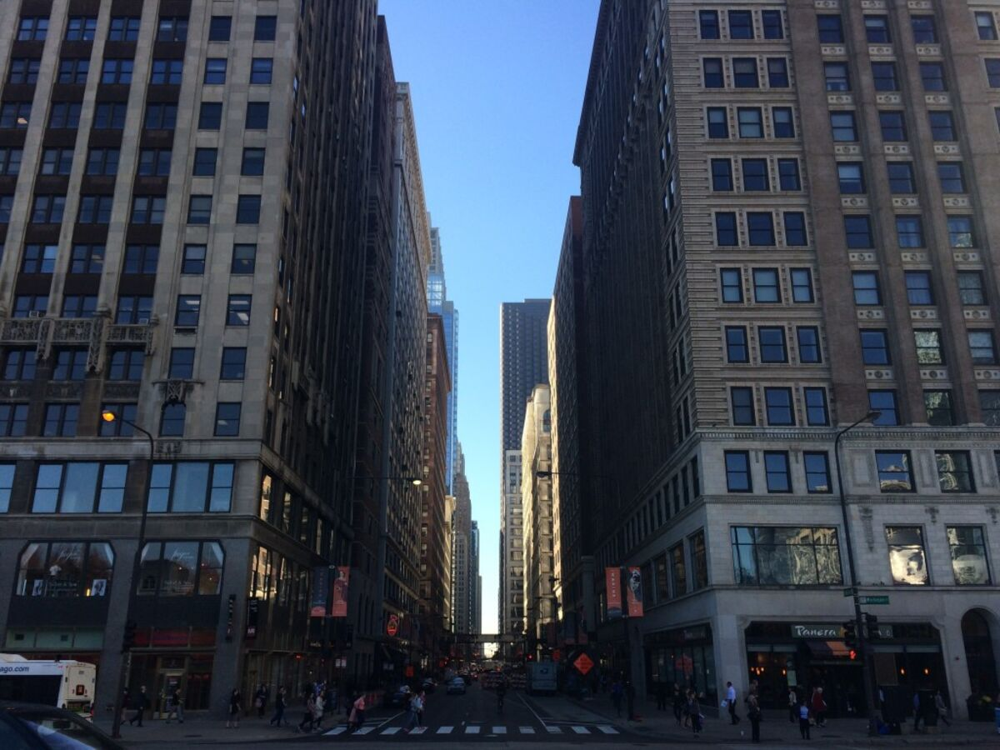

After getting some coffee at Bowtruss, I wandered all over the place but the
riverwalk was definitely my favorite. The different bridges and the sun
reflecting off of the glass buildings like the scales of some enormous fish
onto the grey streets below. The noise of this city is somewhat overwhelming,
yet beautiful. The clinking of change in a cup, the thudding of tires on the
slates of the bridges, the horns of passing tour boats, and the chittering of
people all around me. Chicago truly is a beautiful city, there is so much for
the eyes to feast upon everywhere you look. Everything vibrates with energetic
life.

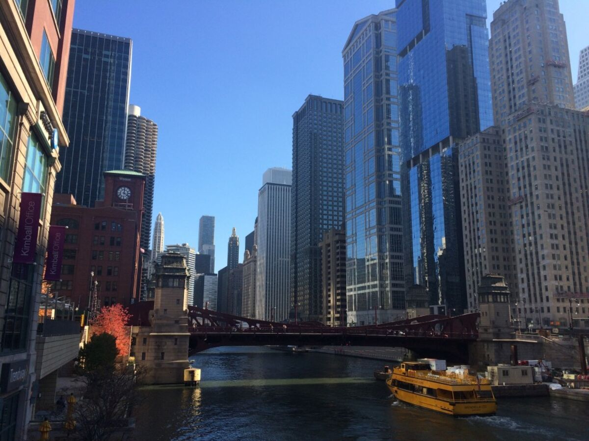
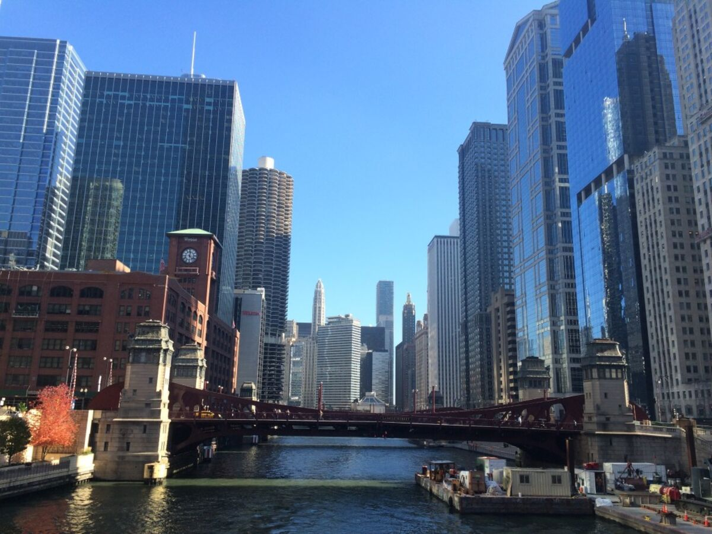
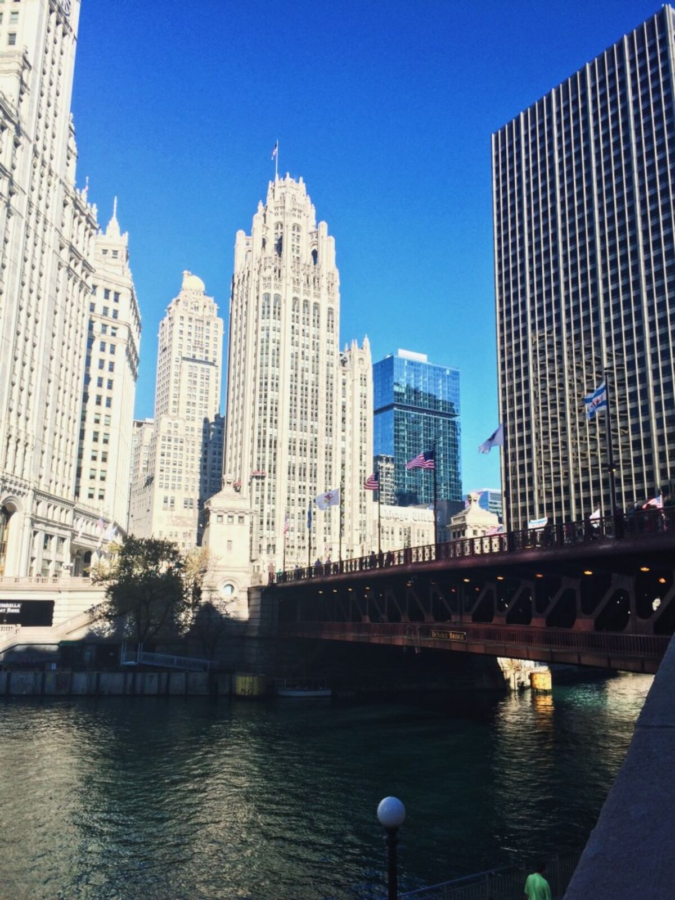

I took a break at Do-Rite Donuts where I got a delicious maple bacon donut. It
blew my mind. I had never had a donut like this before and I sat down by the
river to enjoy the view and the food.

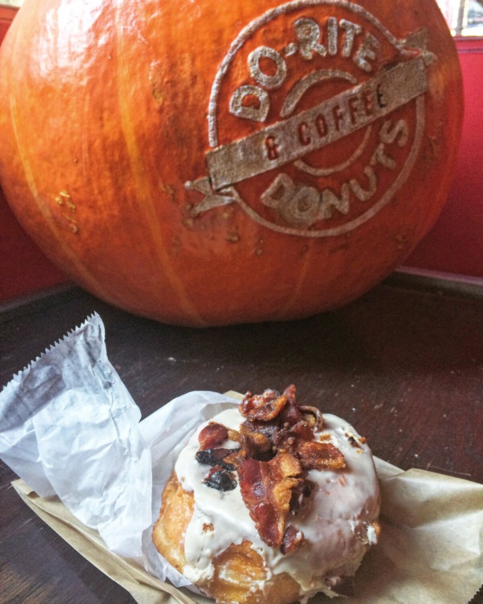

I also had to see the iconic sights like Cloud Gate or as it is commonly called
The Bean.

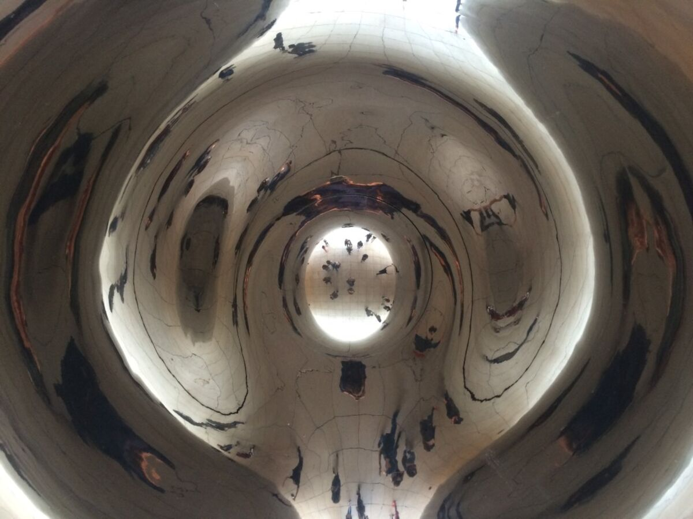
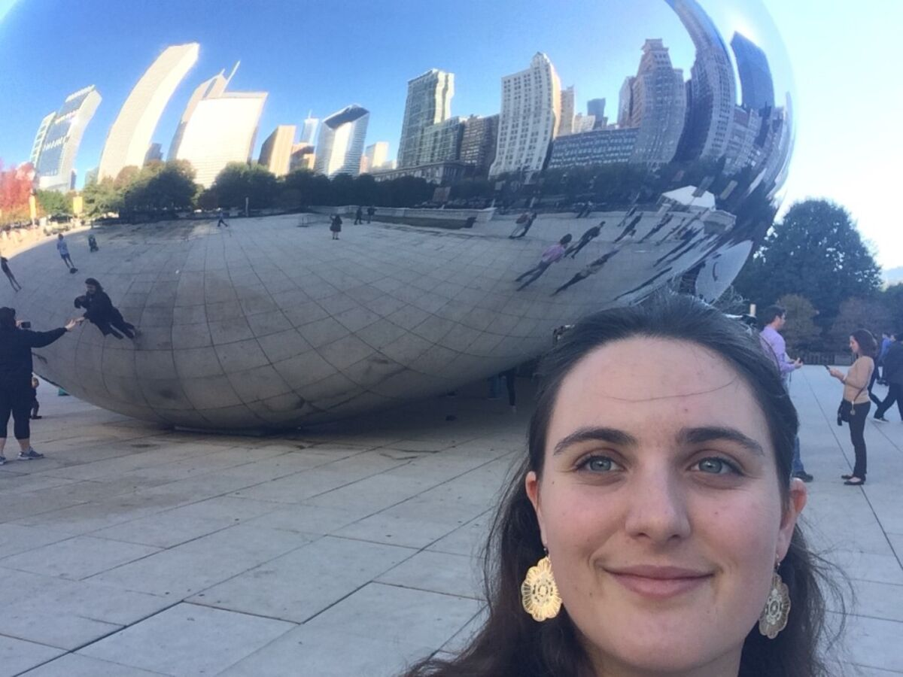

My obligatory Bean selfie.

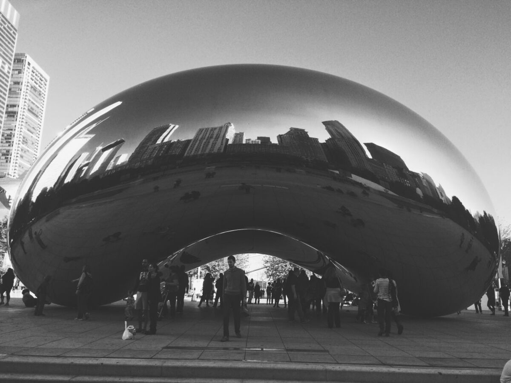

After my touristy stops, I wandered back down the Magnificent Mile or Michigan
Ave shopping streets where I stumbled upon a food truck. Right in from of the
NBC building was this bright yellow truck with a long line. Long lines usually
equal good food so I decided it must be worth while. It was Pierogi Streets, a
pierogi food truck serving up tasty dumplings with some amazing toppings. The
food was unbelievable; I had braised beef and spinach/feta pierogis topped
with spicy grilled onions, sauerkraut, and bacon. It was heavenly.

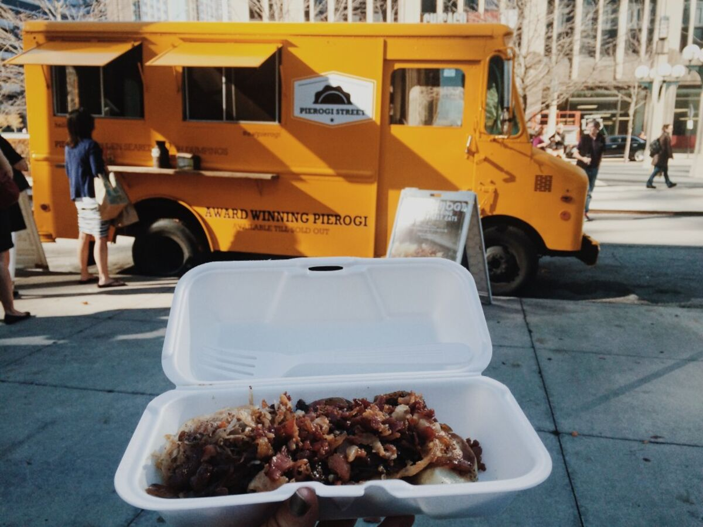

It was a great day of wandering, but by the end my feet were tired and the sun
had set on the city. The shadows cast by the tall buildings created a canopy
of darkness only broken apart of slivers of light high above. In this
artificial shade I left the city behind to go pack my belongings for the road
ahead.

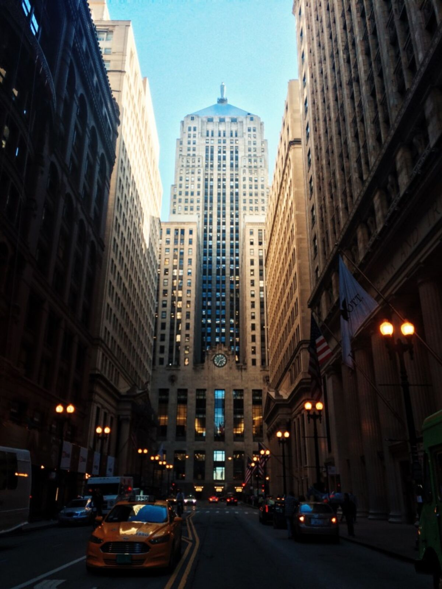
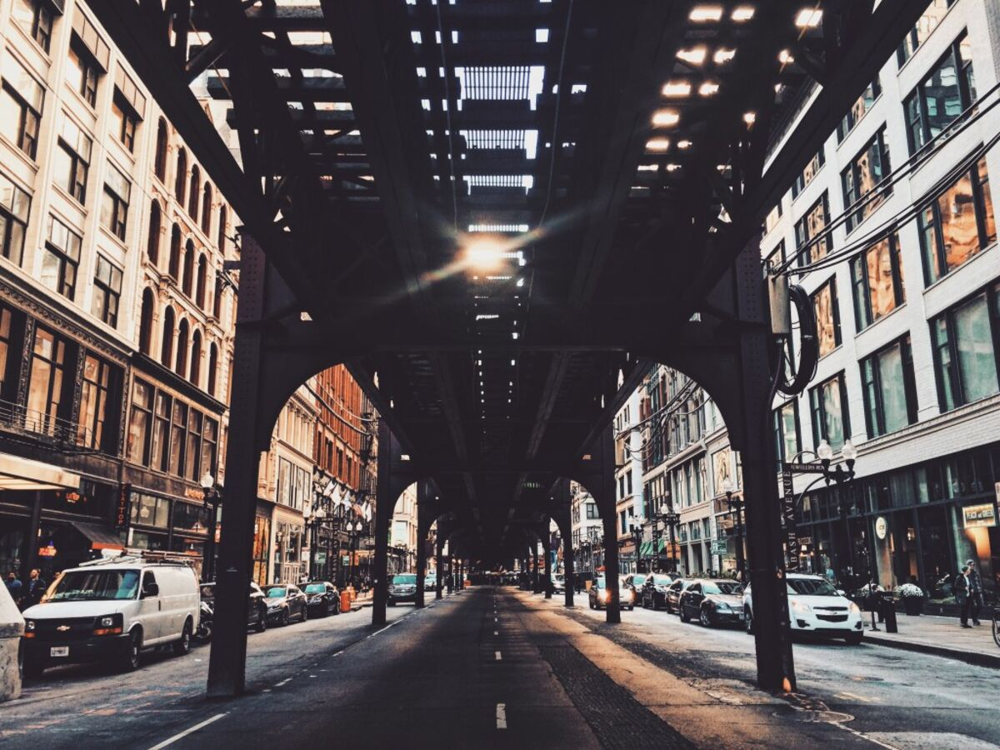

I left Chicago that next afternoon after a morning at the Ferrara Bakery, a visit to my aunt’s studio, and a fantastic final lunch at the Art Institute.

I am so grateful for my family that has helped me along the way, none of this
would be possible without them. My lovely aunt and uncle and my beautiful
cousin were so kind to me. Their welcoming love, even after so long since my
last visit with them, made me feel like I was home despite being far from it.
I love that I get to see so much of my family, but it is so hard constantly
leaving everyone behind after just finally getting to see them after so long.
I have never said goodbye so many times before in such a short period of time.
Every person I see along the way makes it harder to say goodbye the next time;
I am more reluctant to leave yet also more excited for what comes next. This
trip is one of the most challenging things I have ever done but also one of
the most rewarding. I will carry these memories and these special moments with
me forever, even when I have returned home to California. But after Chicago I
headed even farther East. I drove that day from Chicago to Pittsburgh across
Indiana and Ohio. It felt inconceivable to be moving farther away from the
world I knew and loved, but the East Coast was on my mind and I meant to reach
it as soon as possible. The other end of the country was within reach and with
it the goal of my solo road trip was within sight.
