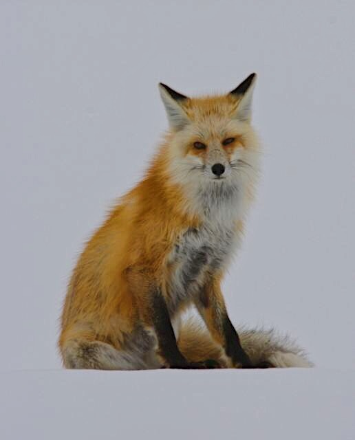

+++
date = '2018-01-07'
title = 'Elysium Red'
author = 'Monica Multer'
authors = ['Monica Multer']
tags = ['poetry']

[cover]
image = "frozen-trees.jpg"
+++

Virgin snow collapses under a heavy foot  
Like sand washed away from a steep embankment  
By waves impatient of passing time.  
Footprints dug deep below the surface  
Only to be covered by the next snowfall;  
Man lacks permanence in a place such as this.

Translucent diamonds fall from the soft blue sky  
Sharp and glinting in sunlight  
That offers no warmth or respite from biting winds.  
Tree limbs grow heavy with new white robes  
Bowing before the might of Winter  
With sideways eyes on far away Spring.

He pulls his feet from the earth  
Only to plunge them instantly back into the deep;  
An endless repetition of slow but sure  
Forward progress that breaks the line  
Between man’s land and Nature’s untouched garden.  
The trail he treads marks a boundary line  
Many have approached, but few have overcome.

A chill runs down his spine leaving his hair  
Standing at attention without reason;  
Caught between Winter’s grip and something  
More primal that calls to the heart  
Dragging the modern into the primitive mind of fear.  
How small we become when we realize  
The world is not ours to inhabit –at least not ours alone.

The twig snaps like a leg caught in a hunter’s trap,  
He halts and listens with attentive ears.  
The sound of Winter’s silence echoes loudly  
Even a breath would disturb the crisp air  
Cracking it like thin ice with the slightest exhale –  
Dead silence reigns here, disrupted  
Only by the sound of softly falling snow.

He turns again to continue down the path he chose  
Only to again feel the haunting of the unknown  
Creeping up behind him, wearing the silence like a cloak  
Shrouded in mystifying white and revealed only by instinct  
Felt acutely by the hunted when they have been marked as prey.  
He knows he is followed by the ghost of something  
But cannot name the adversary walking in his shadow.

A flash of red jumps out of the colorless scenery  
Existing only on the periphery of sight  
As the blurry edged undefined and unrelenting embodiment  
Of all that leaves man powerless and afraid.  
A phantom dancing just beyond what the eye can see  
But the mind remembers as a timeless enemy.

As the man turns once more to seek out the sound stalking him  
He is faced with the nothingness of a barren landscape  
And his own footprints marring the pristine face of the wilderness;  
Except now the first evidence of pursuit is present:  
Laid atop his tracks stood the careful footprints of another,  
But no sign of the creature that left them behind.

Whirling around to face forward once more  
Hoping to escape the encroaching presence  
Only to be confronted with the intense yellow eyes of his pursuer.  
Standing in the path before him, a red tailed fox –  
Royal coat, piercing eyes, black tipped ears keenly listening  
Blocked the man’s path with the towering presence  
Of a primal Queen who’s dominion has been challenged.

Frozen in place by the sudden appearance of this image of majesty,  
Man stands facing the wild  
Not knowing whether to continue his journey or turn away.  
The fox tilts its head from side to side with curiosity,  
Listening to the sound of one who once belong here  
But was lost to another world long ago.  
Not knowing whether he be friend or foe  
She takes a cautious step forward.

She walks atop the snow, gliding gracefully forward  
Her movements sound like the swaying of the trees.  
The man slowly reaches out his ungloved hand toward the red spirit  
She hesitates, paw hanging midair, head tilting to listen  
Hearing his heart as it beats thunderously in his chest.  
So close, the man stretches farther locked in her lightning eyes  
When just as suddenly as she appeared, into the periphery she vanishes.

Left with hand outstretched, slowly filling with snowflakes  
Gently kissing his open palm regretfully  
The man is left haunted by the red ghost that almost felt real  
If only he could have touched it and held it close  
For a moment longer than Eternity.  
Instead, the silence of winter surrounds him once more  
And the Elysium he glimpsed returns to the realm of myth.

