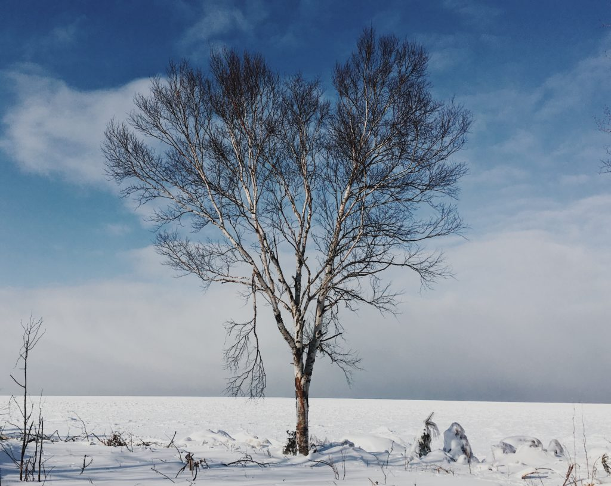

+++
date = '2018-01-09'
title = 'Jagged Edges'
author = 'Monica Multer'
authors = ['Monica Multer']
tags = ['poetry']
+++

The jagged edges of me  
Clash up against fluidity;  
Unrelenting shattering.  
Shards of ice caught  
Between land and sea  
Where lines blur to reveal  
Snow blankets everything.  
Only the tall stand above  
The war of attrition  
Between the changing tides  
And the bedrock beneath.
