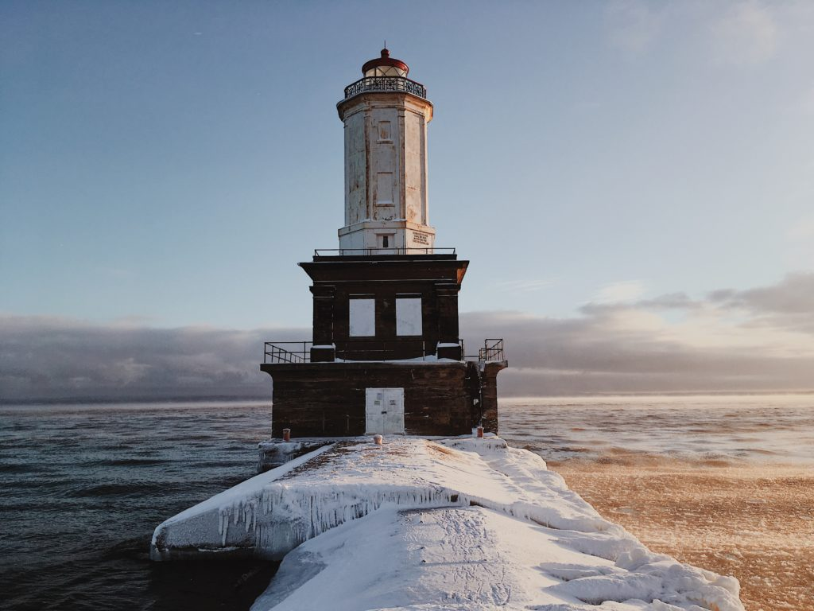
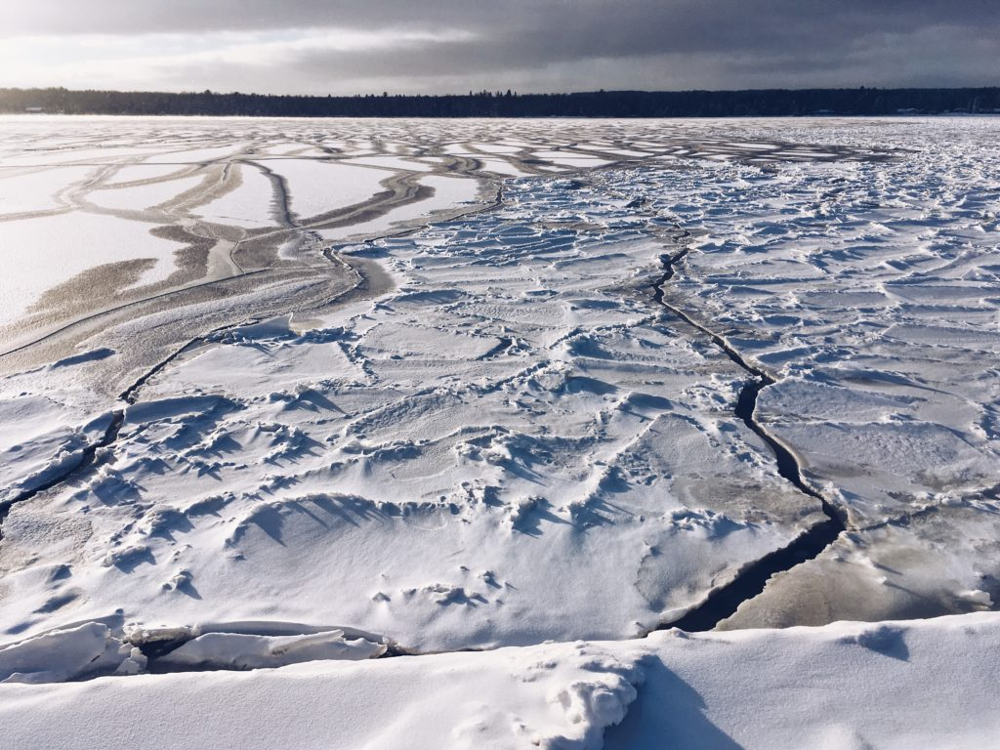
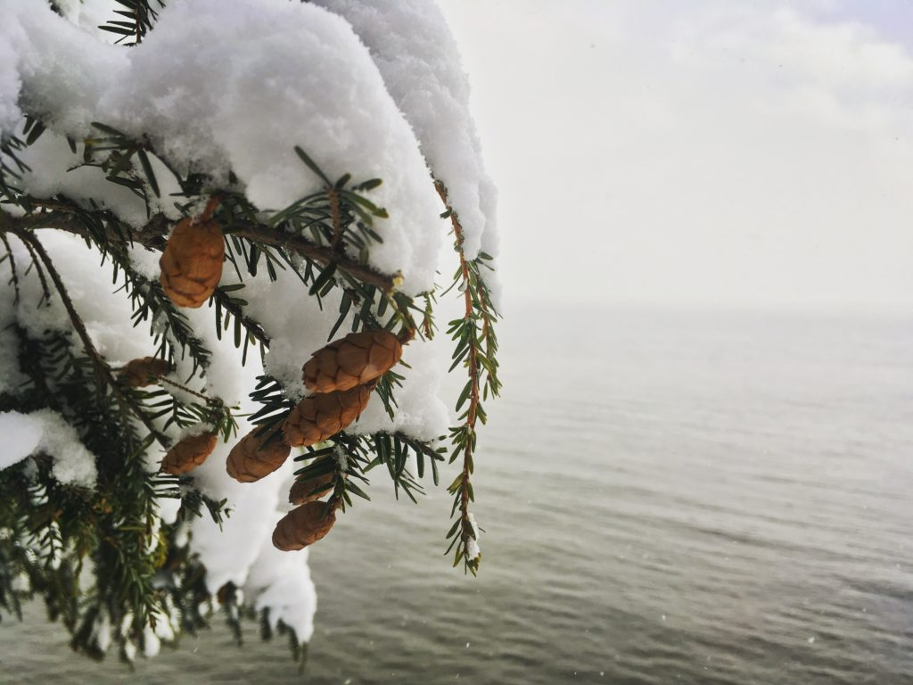

+++
date = '2018-01-01'
title = 'Becoming New'
authors = ['Monica Multer']
tags = ['story']
+++

Ever since I can remember I have been coming to the Upper Peninsula of Michigan to visit our family compound on the shores of a lake fed by Lake Superior. I never went to summer camp or a sports camp as a child, instead I gathered alongside my numerous cousins, aunts and uncles, and under the amused gaze of my grandparents to run amuck in the forests and swim in the Great Lakes. The sun never seemed to fade on those long summer nights.The memories and experiences I had during those endless summers forever altered who I was and who I would become in ways so numerous that this blog post could never even begin to contain all of them. The shores of Lake Superior will always be my second home, but standing where I have stood many times before on the Sandstone cliffs of Jacobsville as the light from the first day of 2018 fades into shades of soft pink, I realize just how unfamiliar and new familiar places can become.

The emerald shades of Lake Superior have dulled under the snow filled skies and mist rises from the surface of the gently rolling waves like warm breath on a cold winter day. This place feels alive in a way that I have never experienced before this moment. The thin layer of ice forming across the lake is marked by violent fissures where dark water breaks through the pristine whiteness of snow. The segments of ice rise and fall with the water’s movement and I swear I can see and hear the lake breathing steadily as the shards of ice gather and separate like shattered glass.

How many times have my feet stood on the red sands I can barely see beneath the ice? How many rocks sit at the bottom of the lake just out of sight from skipping rock competitions between me and my cousins? How can this possibly be the same place that once felt as familiar as the laughter lines on my face? It baffles me how quickly the old becomes the new when you are willing to inflict change on all that feels normal.

The first day of the new year is almost over and I see just how desperately I need to pull myself from routine and alter the way I see everything that once seemed repetitive to me. There is always something new to discover even in places you have already been. I want to treat all things as if they were new and beautiful because when you wake up each morning with eyes renewed, truly, the world holds surprises you wouldn’t begin to believe.

