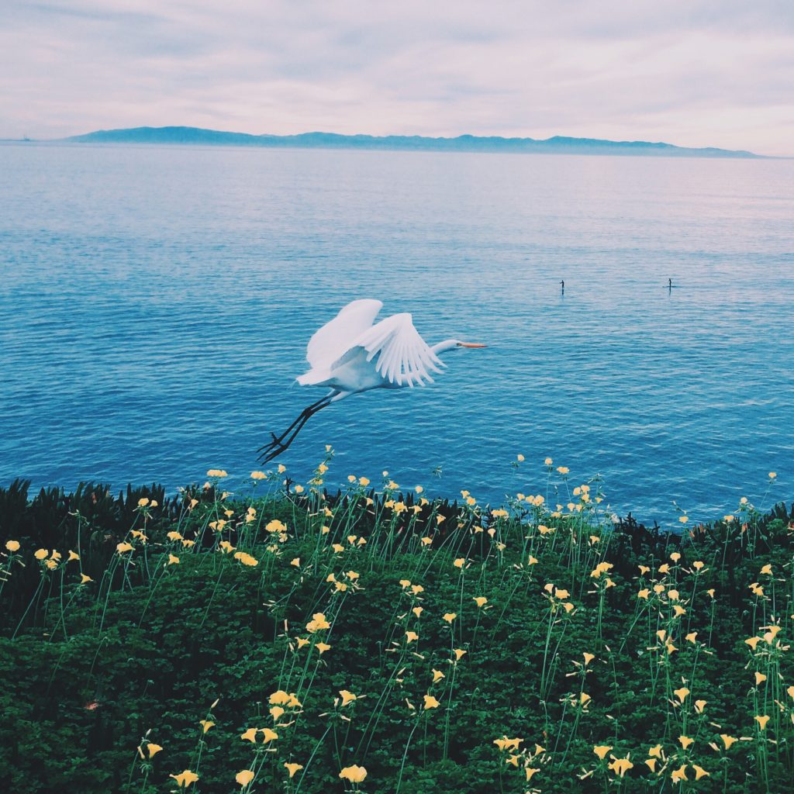

+++
date = '2018-01-16'
title = 'Feathery Hope'
authors = ['Monica Multer']
tags = ['poetry']
+++

A fragile and feathery hope grows in my chest  
It tickles my ribcage and brushes against my cheeks  
Like the kiss of a bird’s wing as it takes flight.  
The moment suspended  
Between the weight of the world  
And the unburdened sky.

Small and tender hearted  
This alien thing grows inside of me.  
At night I feed it quietly with whispered dreams  
And words I am too afraid to say aloud.  
I do not yet know whether it will become  
Friend or foe to me as it grows.

My mind crushes it slowly with sharp edges  
Predicted in the cloudy sphere  
Of crystal balls and etched lines in overworked palms.  
But still at night, when the lights have disappeared  
It is just me and the nascent hope  
Evolving to be something more than me.

I refuse to let it die but only acknowledge it  
In moments of secrecy stolen between  
Sorrow and high-soaring ecstasy.  
If I look it in the eye and declare its name  
It may just consume me whole  
Before I know how to control the chaos it brings.

I know I have been unfair to you  
Born of such happiness and light  
But forced to be a creature of darkest night;  
I made you into this monster  
Out of the fear that if I held you too tight  
You would disappear faster than a bird taking flight.

Now you are with me forever  
Etched into every bone  
Like the words of a love letter  
That never found a heart to call home.  
This ribcage you once inhabited  
Transformed into a cage you will never escape.

I feel you waking up again  
Testing the limits of your confines  
With a wingspan broader than the horizon.  
I hear you tapping against my bones  
A morse code warning of all we could be  
Or a threat that soon you may break free.

My chest creaks under the pressure of your presence  
Small yet persistent, this fragile thing  
Begins to break through my bones  
Like a flower growing through the cracks in the pavement  
Yearning for the sun’s light and fresh air.  
I can contain you no longer.

Will this creature be beautiful or broken?  
Maybe it will be a bit of both.  
Heavy with my whispered dreams and secret hopes  
Will it be able to take flight?  
My fragile and feathery hope takes wing  
Leaving me behind to wonder at our small destiny.
