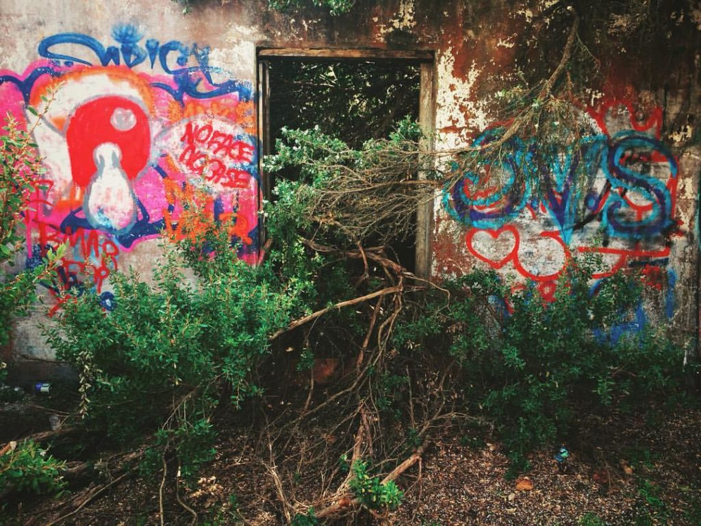

+++
date = '2017-10-30'
title = 'Gone for So Long'
author = 'Monica Multer'
tags = ['poetry']
+++

I know I have been gone for so long now  
And I was gone long before you noticed my absence;  
Long before the words stopped appearing on the page  
Life took me in and swallowed me whole.  
Before I realized that the dream was really  
A monster waiting with epic patience  
And a growling gut with my name written  
On the insides of its being, etched into its bones.  
It was born for me and I for it.

I thought this my beautiful escape but was disappointed to see  
Avoidance is a trap with a honey tongue but maggots for eyes.  
I tried so hard to be something that I am not  
But lost all that was beautiful in me along the way.  
You cannot strip back the rotting flesh of apathy  
Without carving into yourself a permanent well  
Filled to the brim with blood that becomes a scar on your being.

Who I was will always be who I am  
No matter how far I run or how often I raise my eyes to the sky  
I replaced my chains with rosary beads binding me to a book  
That weighed me down like an anchor at the bottom of the sea  
My pursuit always just out of reach  
Finger tips grazing the surface, trying to catch sunbeams  
But I only find the bubbles of my evaporating breath.

I have been gone for so long now  
I am no fool. I know I can never go back to where I was  
But I will do my best to pick up the pieces  
To build something new from the wreckage of myself.  
I was a shipwreck cracked in half out at sea  
The broken parts of me lost somewhere becoming a coral reef,  
Let my bones be the home of some new creature.  
I cannot wait to meet this thing born from the ashes of me.
