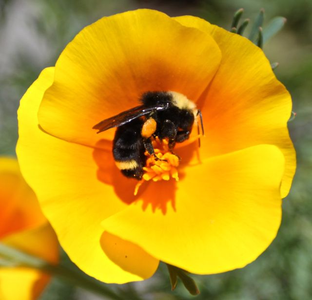

+++
date = '2018-01-13'
title = 'Hive Mind'
author = 'Monica Multer'
tags = ['poetry']
+++

The bees have infested my brain again  
Rattling around within my skull  
Like a ricochet bullet  
Unwilling to settle on damaging a single target.  
They fill my mind with vibrations  
like a tremor behind my eyes  
Like a precursor pressure  
Waiting to crack open my head  
When the real earthquake hits  
Releasing the infestation of my mind  
Upon the world that was never prepared  
For this devastation that I have lived with  
Everyday like a close companion  
Or a haunting voice whispering in your ear  
Words you do not want to hear.

The sound of silence is alien to me,  
I would not know how to live without  
The pressure built up behind my eyes.  
Living like a ticking time bomb  
Dangerous and frightening but existing  
So close to death it makes you more alive  
In the end, In the end, In the end  
The monster you live with becomes tolerable  
Because it is your monster, your pain personified  
So you can give your struggle a name.  
Transform your enemy into the tangible  
Since a battle can only be won  
When your opponent is real,  
Otherwise you are fighting an endless war  
Between you and yourself  
Where everyone loses and the fight is your life.

I am the Queen of the hive in my mind  
But my own swarm holds me hostage  
Encasing me in sweet tasting honey  
And lulling me to sleep with the rhythm  
Of their hypnotic song;  
Entranced by the foot soldiers of an army  
I never chose to lead  
I cannot escape the buzzing inside my brain  
Because we are now two parts of one entity.  
They are as much a part of me now  
As a mosquito trapped in amber  
Fossilized for all of eternity  
A trinket of mortified antiquity;  
You cannot set them free without breaking  
The beautiful creation we became.
