+++
date = '2018-01-05'
title = 'Remembering Jacob DiNoto'
author = 'Monica Multer'
tags = ['story']
+++

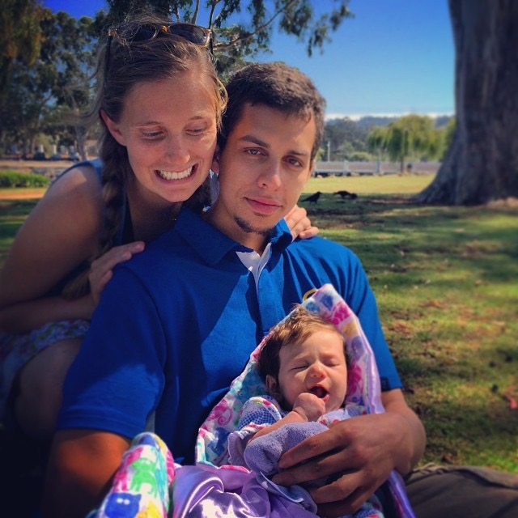

In many ways, I fail to find the correct words to describe this feeling because the pain is not my own. I cannot lay claim to this grief even though it tears at my heart and wearies my soul. I know how dreadfully Jacob’s family misses him and the grief of struggling to understand his premature death burdens both his family back in Connecticut and his new family in California. The death of a person so young cannot be justified, especially when they have so much life left to live. But I cannot speak for his family, I cannot speak for Mackenzie or her children, I can only share my memories of Jacob in the hopes that my own struggle to comprehend the incomprehensible may help others facing the same uphill battle. My words cannot be sufficient to encapsulate the pain of Jacob’s death, but I hope they can bring back a piece of the light that Jacob shared with everyone he encountered in life.

When I first met Jacob, honestly, he frightened me. He was dating my best friend who meant the world to me and I would do anything to protect. I did not know him, he was from an entirely different world than mine (or so I thought), he was blunt, intense, and unknown to me. I worried for my dear friend who felt like the closest thing to an angel this world has ever seen, but only because I didn’t realize then what I know now: Jacob was a breathe of light just like her but encased in a different coating.

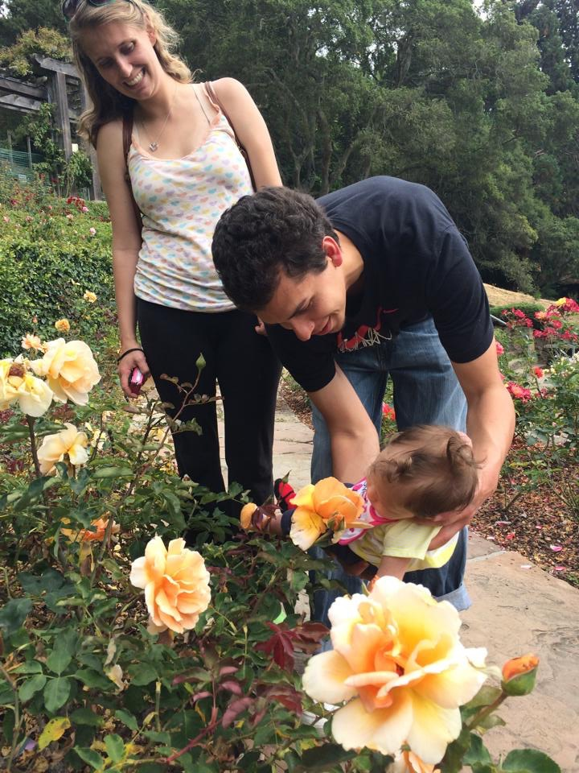

After I got to know Jacob I realized the truth, that he was an intense man, but only because he loved so fiercely. He loved Mackenzie with an intensity that inspired me. Not only that, but he loved everyone who came into his life with a strength unparalleled. Both he and Mackenzie taught me how to be a good friend by providing a perfect model to follow. Their kindness, generosity, honesty, and genuine passion for the people around them inspired me then and will always motivate me to try to love others with the same ferocity they showed me.

If I can do one thing as an honorary auntie to Jacob’s children, I hope that it is to show his girls the same love both he and Mackenzie showed me.

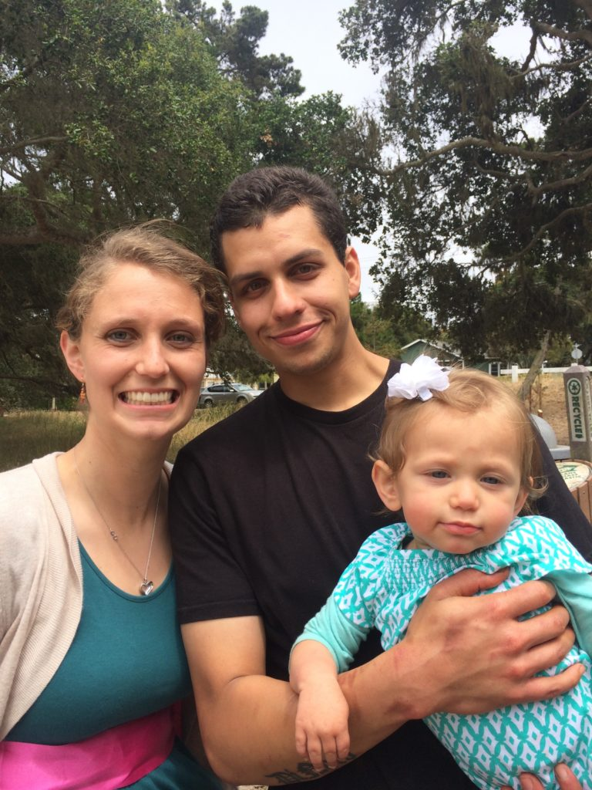

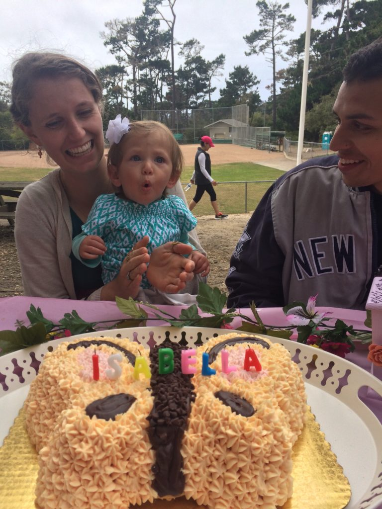

I want them to know how hilarious and genuine he was in everything he did. Like when he dressed up fancy just to go to different bakeries in San Francisco on the hottest day in the city’s records. Or how we would stay up late into the night discussing conspiracy theories and laughing the night away over games of Scrabble. 

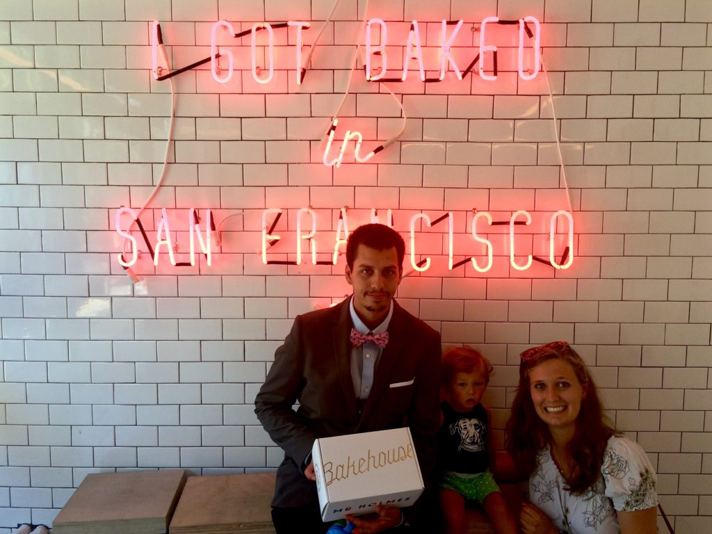

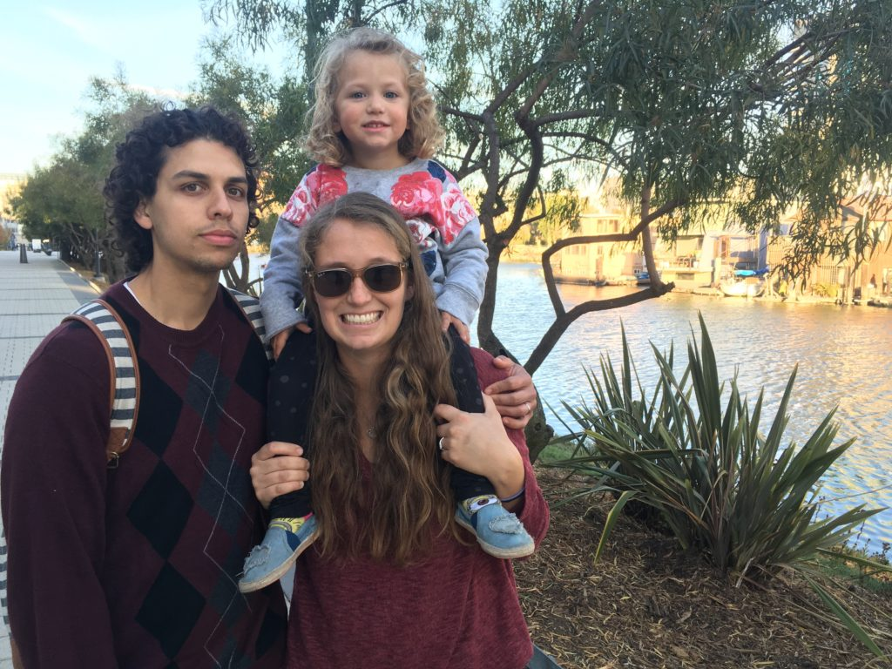

The last time I saw Jacob was his wedding party just short of a week before he passed away. We all had so much fun that night celebrating Jacob and Mackenzie’s love, their future, and their children’s future. Even after the party was over, we spent the night laughing and singing Queen on the karaoke machine. We had so many plans, so many conversations about adventures soon to be had, places we had to visit, and things we were going to do together that would never happen.

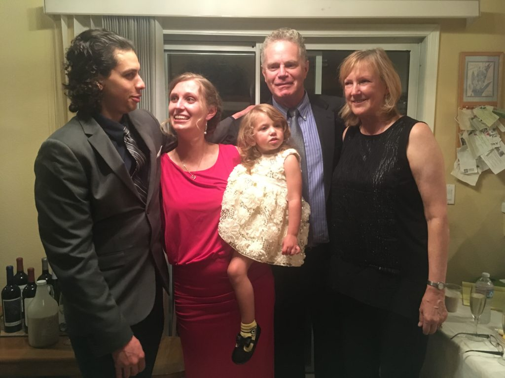

The night he died I heard the news while I was sitting in a bar in Berkeley, just a few doors down from where we had once shared drinks. I took the train home like a zombie with tears streaking down my face. I didn’t care who saw me, I don’t even remember walking home from the train station, all I could think of was how could this possibly be?

I sat in my car and cried so hard I got sick. I beat my hands against the steering wheel and the ceiling screaming at how unfair, how impossibly unfair this was to him, to his family, to his wife, his children, and all of the people he would never get to meet. I have never been so angry before in my life than the night I learned Jacob was no longer a part of this world. I was angry at him, at God, at Death for daring to take him, and at everyone else in the world, including myself, for getting to live when someone as desperately in need of living as Jacob, was robbed of his life at only twenty four years old.

I am still mad. I sometimes sit in my car looking at the dents in the steering wheel where my nails cut into it and feel that grief rising up in my throat like bile. Now, however, the anger never lingers long. Because after all of the sadness and the pain, I remember his two little girls. I remember how much he gets to live in them.

When baby Rosemary was born I spent the night with Mackenzie in the hospital and held Rosie all night long. Late that night when Mackenzie was asleep, and it was just me and Rosie awake under the soft light of a hospital TV, I spoke to Jacob. I told him how much Rosie looked like him, especially when she furrowed her eyebrows just like he always did. I told him how his children would always know what an amazing man he was. I told him how much it hurt me that it was me there at the hospital holding his daughter instead of him. I told him how grateful I was that he came into our lives even though he left us too early and how grateful I was that he was able to have two wonderful daughters who would carry a piece of him everywhere they went.

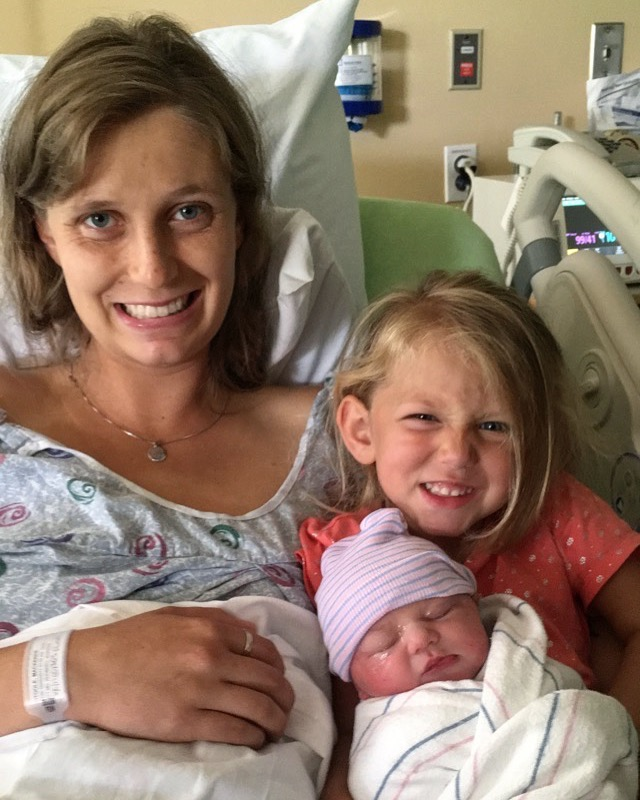

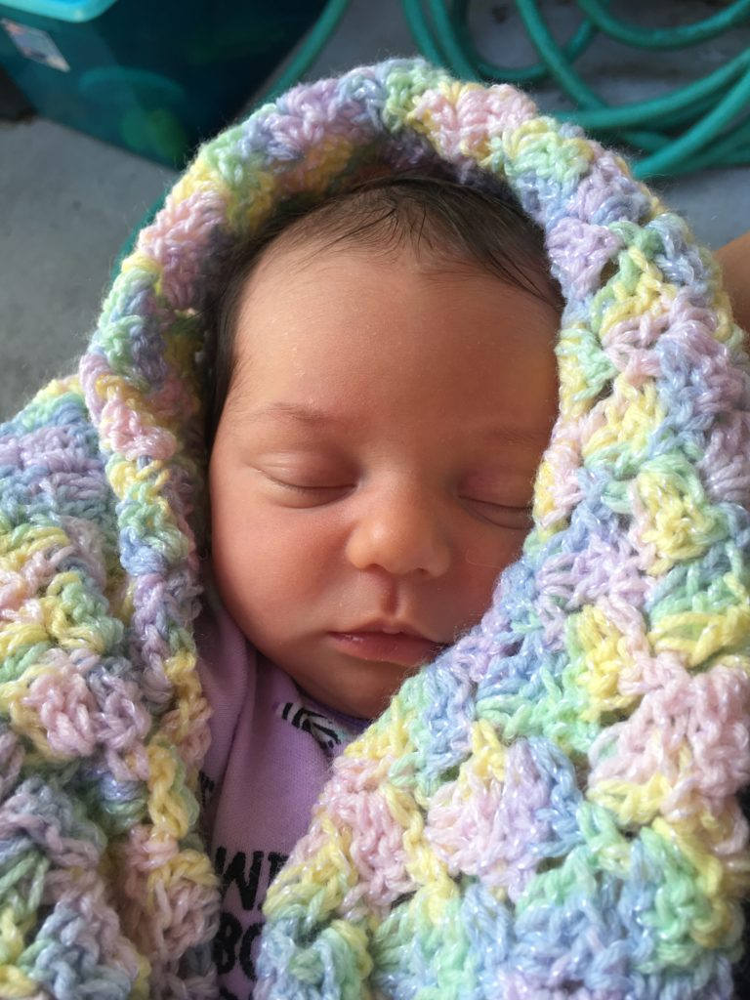

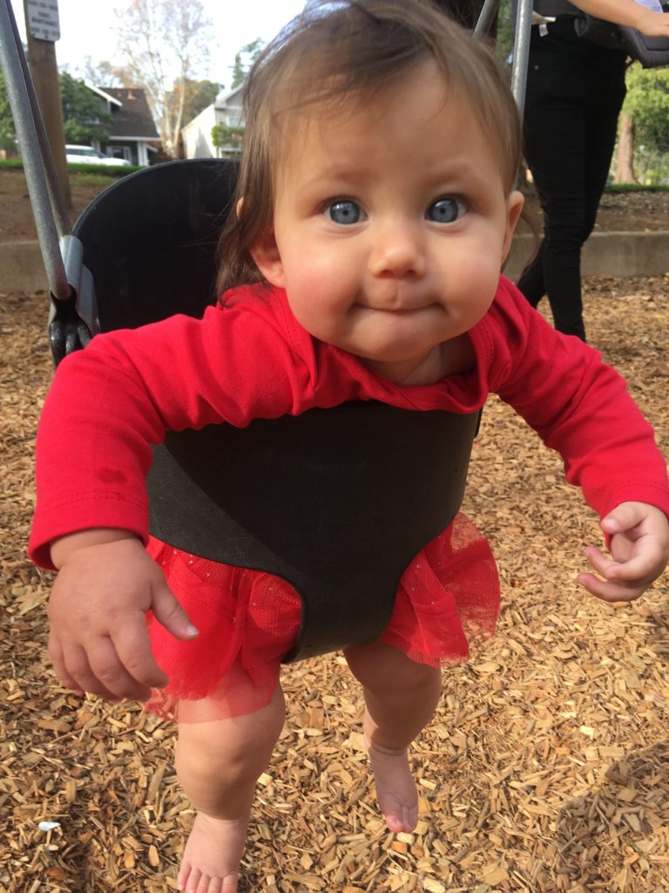

This last year has been so incredibly hard, but in so many ways, Mackenzie and Jacob and their children have been the only thing that got me through some of my darkest times. The joy they bring me is ineffable and the love they have taught me will always be in my heart.

Even though it has been a year since Jacob’s death, I feel like I get to see him every day in some small way whenever I get to see his kids. The pain may never fade and my heart breaks for Mackenzie and all of those he left behind, but I am just so incredibly grateful to have ever met him.

I miss you every day my friend, thank you for the gift of your presence, and I hope to show your girls just a little bit of the love I know you would have given them.

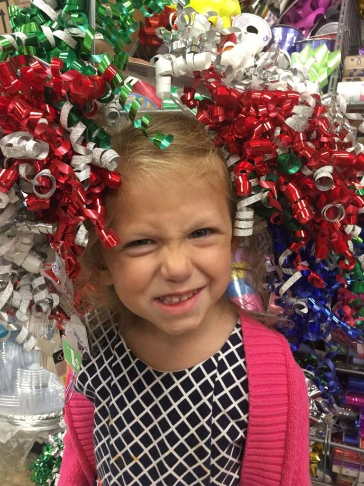

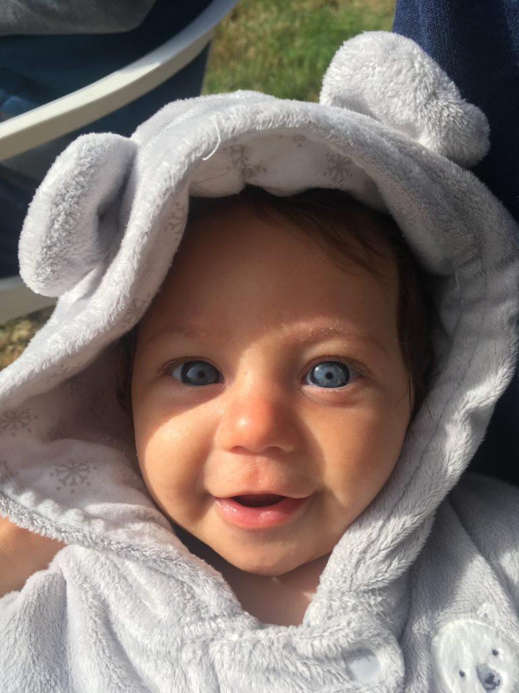

If you are interested in donating money to help Mackenzie and her two young children live life after the loss of Jacob feel free to contribute to the GoFundMe page dedicated in his memory: [In Memory of Jacob DiNoto](https://www.gofundme.com/jacobdinoto)
