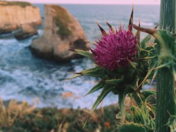
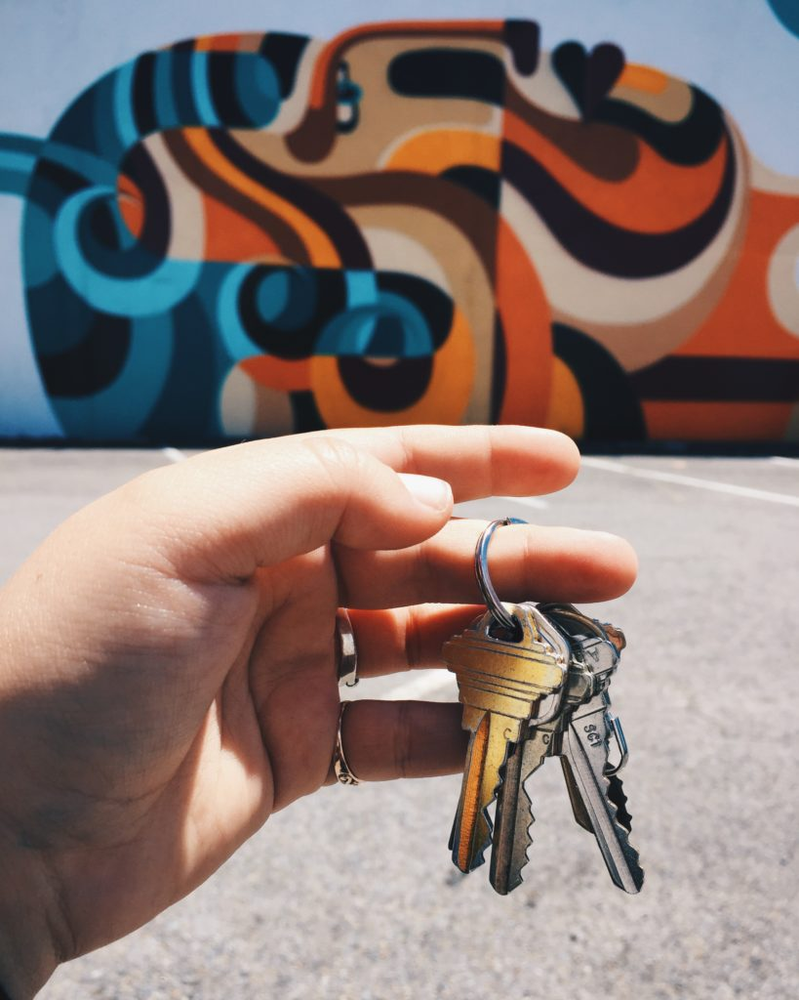
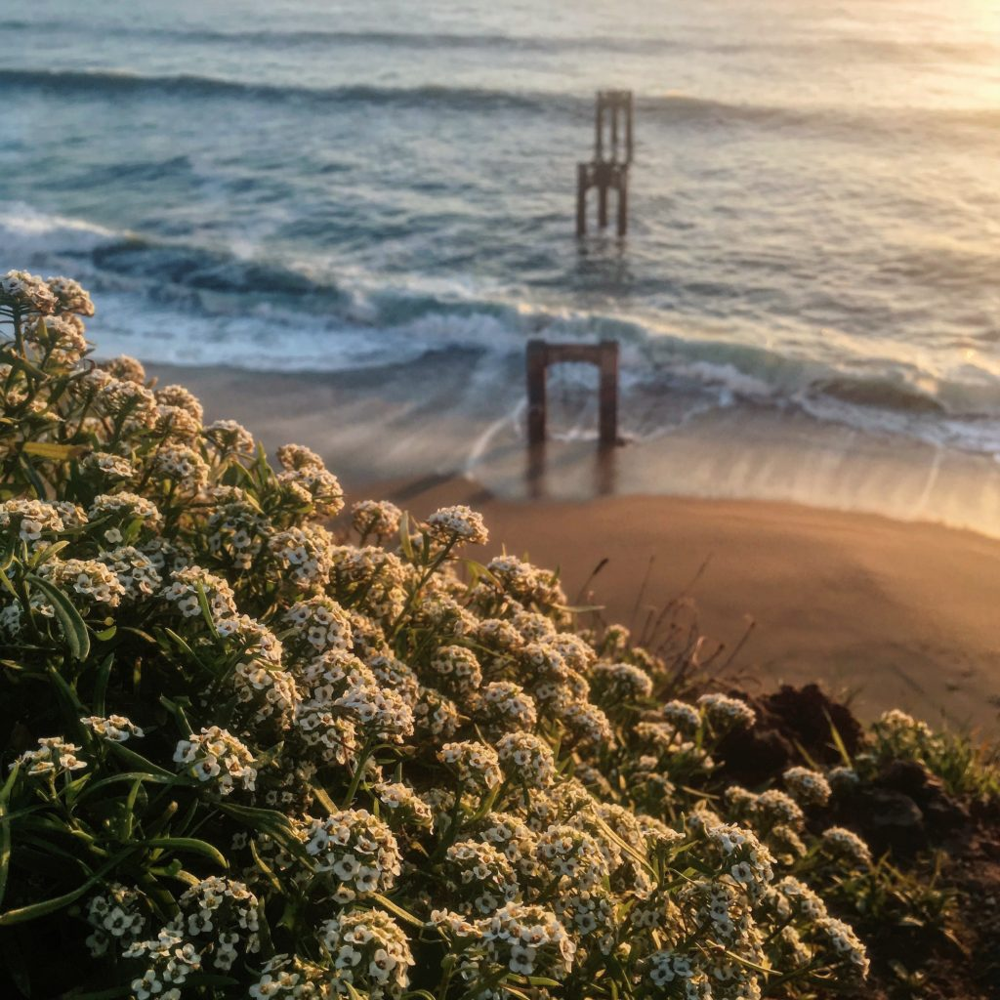

+++
date = '2017-12-31'
title = 'Renaissance'
authors = ['Monica Multer']
tags = ['story']
+++

Honestly, I do not know how to begin again. This space was my home for so many years when my words could find no ears to fall upon with quiet urgency. For those who have joined me on my journey either part way or all the way back eight years ago from the very beginning, and for those who are starting today, know this: the last two years my words have been nonexistent. I could name a thousand reasons that left me hesitating with my fingers hovering above a dusty keyboard, but none are sufficient to strip the guilt away from my heart. Writing has always been the life-blood of my being and to halt the progress of pen on paper is to bring my heartbeat to a startling stand still. However, that isn’t even true. It was more gradual than that, there was no jarring day where the words stopped coming, it was a slow, drawn out decay of all that made me, me.

The words never stopped coming, they were always there and still remain within me petrifying on the tip of my tongue and on the edges of mymind. Ossified and neglected, I chose to let my words transform into fossils instead of living breathing beings. I put down the pen and stepped away from the computer screen in pursuit of other things. I am not proud of my choices that drove a wedge between my purpose and empty shiny things. I felt I owed you this honesty, this courtesy of explaining to you why I walked away before anything could become of me. I suppose it was out of fear, fear that my words were not good enough to be consumed by another’s mind and transformed into something entirely new. Or perhaps it was just my attempt to escape what I felt was a fate cemented in time and progressed without me whether I ceased to act or not. Scared of change, I halted everything in the hope that I could also stop the world from spinning along with me. Futility does not even begin to describe the time I spent refusing to write, it was simply nothing. I did nothing, lived nothing, felt nothing, and hoped for nothing.

Nothing is a strange companion and for a time it seemed to suit me just fine, but soon nothing became everything. Everything was all hope, all fear, all anxiety, all sadness, and all paralyzing. Frozen in everything yetliving in nothing.

On the eve of a New Year, I decided to begin chipping away at the fossil of my being and slowly stretch the atrophied muscles of my writer’s mind. I wanted to begin here, with the truth so we could move into something new together without questions to fog our path. I will tell you briefly what became of me with the hopes of elaborating more in writing yet to come in the new year.

These last two years have been the most difficult years of my life thus far. After I returned from my half-year road trip across the country by myself the transition from nomadic wayfarer to stable breadwinner was painfully slow and full of yearning for the open stretches of road and the feeling of standing on the edge of a world that was mine to own. When I finally landed an impressive job at an up-and-coming tech company, got the apartment I always dreamed of with one of my best friends, and moved to San Francisco to live out the life I felt was the epitome of my dreams, it quickly collapsed into an unrecognizable nightmare.

I had two weeks of this perfect life. Two weeks until the world came crashing down around me. To make a long story short, after a sudden and drastic change in my health I was left weak, confused, scared, and without a name for a mysterious illness that plagued me. I spent six long months running from doctor to doctor, test to test, and hospital to hospital trying to find out what was wrong with me until I was tentatively diagnosed with a rare Neurological disorder called Mal de Débarquement Syndrome (MdDS).

By the end of 2016 and partway through 2017 I had lost my fancy job, had to leave my beautiful apartment, and had to move away from the city I had come to love. Most devastating of all, I lost what it felt like to benormal. Severe illness has a way of stripping away everything that is not essential to living. Life is no longer about thriving, it is about surviving. My life became one long series of days spent struggling to get by. In all of this darkness though, my fight to survive illuminated in me the most essential parts of my being. I realized how important writing truly was to me despite having neglected the creative parts of me for so long. I could feel the words pushing up against my sealed lips and the jittering feeling in my finger tips of a story begging to be born. But I found I no longer knew how.

Time does not heal all wounds, but it does normalize the pain of even the most devastating injuries. This last year has been my gradual realization and reclamation of the most important parts of me. I am slowly adjusting to life with my illness and reacquainting myself with the petrified words lodged in my mind. If 2017 was the year of painful loss and slow recovery, then I hope that 2018 is the year of new beginnings for old passions. My resolution for this upcoming year is to undergo my own personal Renaissance. The New Year will be a space not for a new me, but the rebirth of who I was. Will you join me?

