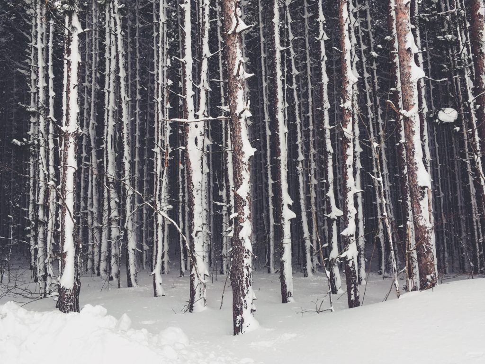
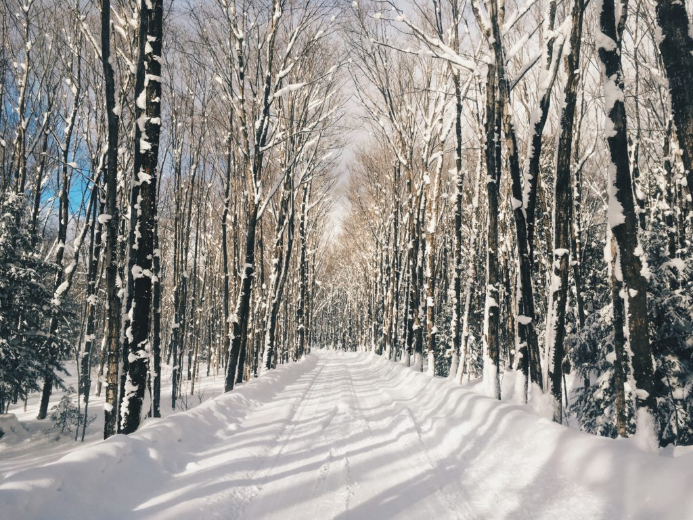
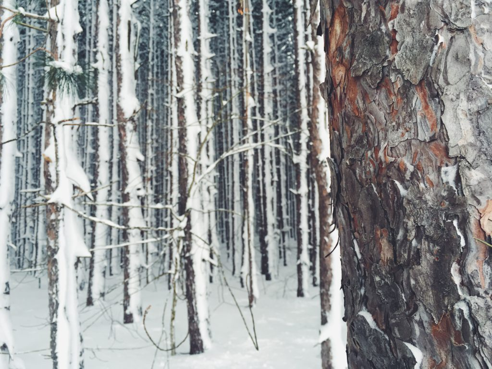
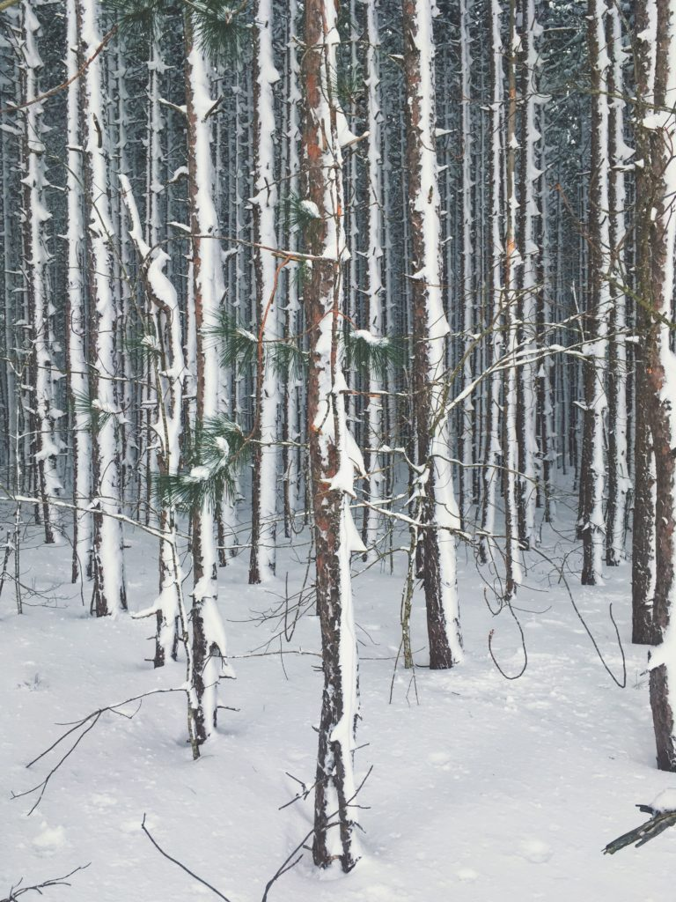
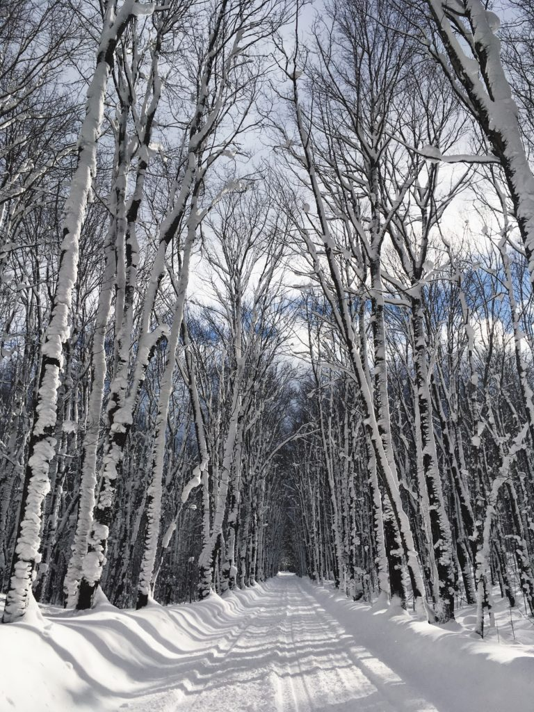

+++
date = '2018-01-02'
title = 'Silence Awful and Sublime'
authors = ['Monica Multer']
tags = ['story']
+++

> “The clearest way into the Universe is through a forest wilderness.” – John Muir

Fewer words ring truer in my mind than John Muir’s transcendental musings on nature, the wilderness of this world, and the triad connection between man, the outdoors, and the universe.

For me, Winter arrives with a contemplation as a companion every year. There is something about snow, the coldness of winter, and the stripping down of life to its raw bones that always leaves me in awe. In many ways I am gladly forced into this state of introspection during this time of year; it is during these times that Muir returns to me again and again as I confront the devastating beauty of the natural world.

Places like this tree tunnel in the Upper Peninsula of Michigan near Houghton humble me to my core. Standing beneath the tall pines and snow covered trees listening to their moaning cracks as they sway in the breeze, I feel so small yet emboldened by the proximity to such grandiosity. The creaking song of wind blown trees is the only sound I can hear for miles. Silence reigns supreme when the world is held in Winter’s grasp. The power of this silence is both terrifying and awesome to experience; Muir himself described it as “awful and sublime” to behold.

If you lean in close and rest your ear against the wood grain of the trees the only sounds you hear are the winter winds and an almost inaudible rustling like the sound of exhaled breath coming from every living thing. Like a whisper too soft to fully understand you find yourself leaning closer and closer, desperate to capture its meaning; a whisper that would say

> We are the sound of life unwilling to succumb to the conditions of this world. Strip us barren, take our beauty, and leave us barely alive, but still we keep on living for the broken are those that shall never die. 

Listen to the trees, they hold valuable lessons even when they do not bear leaves. Muir was right in so many ways, and especially in his observation that forests provide the fastest gateway to the universe and all of its mysteries. These trees existed long before me and will continue their stationary existence long after I am gone. You can gain no greater perspective in life than that which you can find suspended in the canopies of trees.

> “Between every two pine trees there is a door leading to a new way of life.” – John Muir
